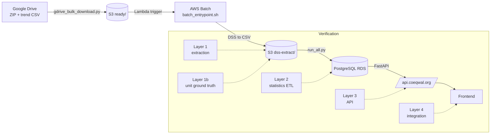

# Verification and Auditing

How we make sure the COEQWAL pipeline produces correct data, and what record we leave behind when it does.

This is the stakeholder / new-hire orientation. For the ETL-developer-facing walkthrough of each layer's tolerances and commands, see [`etl/verification/README.md`](../etl/verification/README.md).

---

## 1. Framing: verification vs auditing

Two related but distinct activities:

- **Verification** answers "is this data correct right now?" by re-deriving a value through an independent path and comparing. Examples: re-opening a HEC-DSS file and comparing its units to the extracted CSV, recomputing a reservoir percentile from S3 CSVs and comparing to the database, hitting the public API and comparing its response to a direct database query.
- **Auditing** answers "what happened, when, and to which bytes?" by leaving a tamper-evident paper trail. Examples: SHA-256 hashes on every ZIP, sidecar JSON records on every uploaded artifact, per-orchestrator-run `pipeline_state.json`, the `audit.md` that summarizes a download / upload pass.

Verification is the active check; auditing is the passive record. Together they give us forensic traceability from a number on the website back to the modeling team's original DSS file.

---

## 2. Pipeline at a glance



---

## 3. Verification layers

Five layers, each independent. Each can run alone; together they answer "is everything correct end-to-end?"

| Layer | What it verifies | Where it runs | Command |
|---|---|---|---|
| **Layer 1** | DSS extraction: extracted CSV vs modeling team's trend report CSV (column-by-column, with tolerances) | Inside every Batch job (automatic) | `validate_csvs.py` in `etl/batch-container/python-code/` |
| **Layer 1b** | Units in CSV header row 6 vs units reported by re-opening the DSS file with `pydsstools` | Inside every Batch job (automatic) | `verify_dss_csv_units.py` in `etl/batch-container/python-code/` |
| **Layer 2** | Statistics in PostgreSQL vs values recomputed from S3 CSVs | Cloud9 (developer) | `python etl/statistics/verify_all_sections.py --scenario <id>` |
| **Layer 3** | Public API responses vs direct database queries | Cloud9 (developer) or CI | `python etl/statistics/verify_api.py --scenario <id>` |
| **Layer 3-tier** | Tier results in DB / API vs the team-supplied staging CSVs | Cloud9 (developer) | `python etl/tier_data/scripts/verify_tiers.py` |
| **Layer 4** | Frontend status page at `/verification` shows the per-scenario PASS / FAIL grid | Browser | n/a (visualization of layer 2 + 3 reports) |

Default tolerances: `abs_tol = 0.5`, `rel_tol = 0.01` for human-scale magnitudes; `1e-6` for unit-checked passthroughs. See [`etl/verification/README.md`](../etl/verification/README.md#validation-framework) for the tolerance rationale.

Layer 1 and 1b run automatically on every ingest. Layers 2, 3, and 3-tier are developer-driven today and are the typical bottleneck for releasing a new scenario.

---

## 4. Audit artifacts per stage

Every stage leaves something on disk or in S3 that a later reader can use to reconstruct what happened. The chain:

| Stage | Artifact | Location | What it contains |
|---|---|---|---|
| Ingestion (Drive -> S3) | `ingest_state.json` | `etl/ingestion/audit_reports/` (gitignored) | Per-row scan and download outcomes for the most recent `gdrive_bulk_download.py` run |
| Ingestion (Drive -> S3) | `ingest_record.json` | `s3://<bucket>/ready/<scenario>/` | Per-scenario provenance: source spreadsheet row, Drive file IDs, SHA-256 hashes on the ZIP / SV / DV / trend CSV, spreadsheet row, ingest timestamp |
| Ingestion (developer-facing audit) | `audit.md` | `etl/ingestion/` (gitignored) | Cross-references `ingest_state.json` against S3 evidence. The "What needs your attention" section is empty when everything succeeded |
| Batch extraction | `extract_record.json` | `s3://<bucket>/dss-extract/<scenario>/` | Per-scenario extraction provenance: DSS basenames, extracted CSV sizes, `validate_csvs.py` summary, unit verification results |
| Batch extraction | `validation_mismatches/<scenario>_extract_record.json` | `audits/validation_mismatches/` (gitignored) | Local mirror of `extract_record.json` for developer review |
| Orchestrator | `pipeline_state.json` | `etl/ingestion/audit_reports/pipeline_runs/<ts>/` | Stage outcomes per scenario for one `run_full_pipeline.py` invocation. Used for `--resume` |
| Orchestrator | `pipeline_summary.md` | `etl/ingestion/audit_reports/pipeline_runs/<ts>/` | Human-readable end-of-run summary for that pipeline invocation |
| Statistics | `stats_audit_<ts>.csv` | `etl/statistics/audit_reports/` (gitignored) | Per-scenario row counts written by `run_all.py` |
| Verification (layer 2) | `<scenario>_layer2.json` | `audits/verification_reports/` (gitignored) | Per-check pass / fail / skip from `verify_all_sections.py` |
| Verification (layer 3) | `<scenario>_layer3.json` | `audits/verification_reports/` (gitignored) | Per-endpoint pass / fail from `verify_api.py` |
| Verification (tiers) | `tiers_<ts>.json` | `audits/verification_reports/` (gitignored) | Per-tier-code OK / mismatch / missing from `verify_tiers.py` |

The S3-resident records (`ingest_record.json`, `extract_record.json`) are the ones that survive a fresh Cloud9 checkout. The local artifacts under `audit_reports/` and `audits/` are gitignored on purpose: they grow per run and would otherwise pollute git history.

---

## 5. Hashes and provenance

Every ingested scenario produces five SHA-256 hashes, recorded in `ingest_record.json` and the spreadsheet-row block. These let a developer answer "is the byte stream on the website still the byte stream the modeling team delivered?"

| Hash | Hashed bytes | What it verifies |
|---|---|---|
| `zip` | The entire downloaded ZIP from Drive | The ZIP we stored matches what Drive had at download time |
| `sv` | The state-variable DSS file inside the ZIP | The SV input we extracted from matches the upstream SV |
| `dv` | The decision-variable DSS file inside the ZIP | The DV output we extracted from matches the upstream DV |
| `trend_csv` | The modeling team's trend report CSV | The reference we compare against in Layer 1 has not drifted |
| `spreadsheet_row` | The full row from the WAM working spreadsheet at ingest time | The provenance metadata (Drive folder ID, basenames, notes) is pinned to a specific spreadsheet snapshot |

Practical uses:

- **Spot drift**: re-hash a ZIP from S3 today and compare to the `zip` hash in `ingest_record.json`. A mismatch means the S3 object was overwritten without a fresh ingest.
- **Re-extract safely**: a Batch re-extraction never overwrites the source DSS files. If the new `extract_record.json` references the same `sv` / `dv` hashes, the inputs are unchanged.
- **Cite a scenario**: when a downstream consumer asks "which spreadsheet row produced this scenario?", `spreadsheet_row` is the answer that survives spreadsheet edits.

---

## 6. Automated vs developer-driven checks

```
   automatic                              developer-driven
   in-pipeline                            on Cloud9 / locally
        |                                          |
   +----+----+    +----+----+    +-----+-----+    +-----+-----+    +-----+-----+
   | Lambda  |    | Batch   |    | Layer 2   |    | Layer 3   |    | Layer 4   |
   | ingest  |--->| extract |    | stats vs  |    | API vs    |    | frontend  |
   | hashes  |    | + L1 +  |    | CSV       |    | DB        |    | grid      |
   +---------+    | L1b     |    +-----------+    +-----------+    +-----------+
                  +---------+
                  CSV uploaded                run python                run python              browser at
                  with extract_record.json    verify_all_sections.py    verify_api.py           /verification
```

Today's split:

- **Automatic** (no developer in the loop): hashes on ingest, validate-csvs and unit-verification inside every Batch job.
- **Developer-driven** (run on Cloud9 after a scenario lands): Layer 2 (`verify_all_sections.py`), Layer 3 (`verify_api.py`), tier verification (`verify_tiers.py`).
- **Visual** (stakeholder review): the `/verification` page on the frontend, which surfaces the JSON reports from Layers 2 and 3.

The "developer-driven" set is the typical bottleneck for releasing a new scenario. The orchestrator (next section) bundles them so a single command runs all three.

---

## 7. Orchestrator: where `run_full_pipeline.py --verify` fits

`etl/run_full_pipeline.py` is the end-to-end driver. It scans the working CSV, downloads from Drive, promotes to S3 `ready/`, polls Batch, loads statistics into RDS, then runs verification. Each stage is independent and can be skipped or resumed.

The preset flags make the common cases one-line:

```bash
python etl/run_full_pipeline.py --scenarios s0107 s0108           # end-to-end
python etl/run_full_pipeline.py --gdrive-to-s3 --scenarios s0107  # stop after S3 staging
python etl/run_full_pipeline.py --verify --resume --report-dir <dir>  # only run verification
```

When `--verify` runs, it invokes the Layer 2 verifier under the hood and feeds its scorecard back into the run's `pipeline_summary.md`. The detailed JSON lands in `audits/verification_reports/` so it can be diffed across runs.

For a read-only snapshot of where every stage stands right now ("how stale is my latest stats audit? are there active Batch jobs? does psql connect?"), run `python etl/status.py`.

---

## 8. Known gaps and improvement candidates

Current state has rough edges worth naming.

- **Layer 2 and Layer 3 are developer-driven, not CI-driven.** A failing verification today blocks a release only when a developer runs the script. A CI workflow that runs Layer 3 on every PR is a natural next step.
- **No automatic hash re-verification on the S3 side.** We trust `ingest_record.json` once written. A periodic job that re-hashes the ZIP in `ready/` and compares would catch silent corruption.
- **`tiers_<ts>.json` lacks per-scenario stamping in its filename.** Easy fix if we start wanting per-scenario tier reports.
- **No `verify_release.py` orchestrator** that gates a release on Layers 2 + 3 + tiers in one go. The orchestrator's `--verify` preset is the closest equivalent today.
- **Layer 4 has no automated check.** The status page is a human-readable surface, not a tested one. A Playwright smoke test that asserts the grid renders would close this.

---

## 9. Cross-references

- [`etl/verification/README.md`](../etl/verification/README.md) — ETL-developer-facing walkthrough of each layer, with tolerance numbers and per-section commands
- [`etl/README.md`](../etl/README.md) — full pipeline orchestrator runbook, including the `--verify` preset
- [`etl/batch-container/README.md`](../etl/batch-container/README.md) — Layer 1 and Layer 1b details, including how to swap the validation reference CSV
- [`etl/statistics/README.md`](../etl/statistics/README.md) — Layer 2 / statistics ETL, including the per-module table
- [`etl/tier_data/README.md`](../etl/tier_data/README.md) — tier data ingest plus the `verify_tiers.py` flow
- [`docs/INFRASTRUCTURE.md`](INFRASTRUCTURE.md) — Lambda, Batch, RDS layout
