# ETL (Extract, Transform, Load)


<!-- ACTIVE_SCENARIOS:BEGIN -->

**Active scenarios (72)**: s0011, s0020, s0021, s0023, s0024, s0025, s0026, s0027, s0028, s0030, s0031, s0032, s0033, s0035, s0036, s0037, s0039, s0040, s0041, s0042, s0044, s0045, s0046, s0047, s0048, s0049, s0050, s0051, s0056, s0057, s0058, s0059, s0060, s0062, s0063, s0065, s0067, s0068, s0069, s0071, s0072, s0073, s0074, s0075, s0076, s0077, s0078, s0079, s0080, s0081, s0082, s0083, s0084, s0085, s0087, s0088, s0089, s0091, s0092, s0093, s0094, s0095, s0096, s0097, s0098, s0099, s0100, s0101, s0102, s0103, s0104, s0105

_Last refreshed 2026-05-22T16:54:19Z from `https://api.coeqwal.org/api/scenarios`. Regenerate with `python etl/ingestion/tools/refresh_active_scenarios.py`._

<!-- ACTIVE_SCENARIOS:END -->

## How to load scenario data into the database and S3 buckets from Google Drive

End-to-end loading of a CalSim scenario, from a row on the WAM team's
Google Drive spreadsheet to live data in the public API. Runs on Cloud9
(see [Cloud9 first-time setup](#cloud9-first-time-setup) the first time).

The pipeline has three phases:

1. **Ingest**: pull from Google Drive, validate, stage in S3, promote to
   `ready/` where the Lambda picks up the ZIP and dispatches Batch.
2. **Statistics**: read the extracted CSVs out of S3 and write derived
   metrics to the database.
3. **Activate**: bootstrap the scenario row, run verification, flip
   `is_active` to publish on the website.

### Prerequisites

- Cloud9 venv activated with `boto3` installed: `source venv/bin/activate`
- `DATABASE_URL` exported: `source database/setup_db_connection.sh`
- AWS credentials available (Cloud9 has these automatically)
- A row in [`etl/ingestion/scenario_listing/model_run_file_source_working.csv`](ingestion/scenario_listing/model_run_file_source_working.csv)
  for each scenario you are loading
- A row in the `scenario` DB table (write a SQL migration like
  [`database/scripts/sql/.archive/52_add_s0070_s0090.sql`](../database/scripts/sql/.archive/52_add_s0070_s0090.sql))

If any of these is missing, the one-shot preflight in
[Cloud9 first-time setup](#cloud9-first-time-setup) below tells you
exactly what to fix.

### Step-by-step

**1. Edit the working CSV and refresh `ETL_SCENARIOS`.**

Open [`etl/ingestion/scenario_listing/model_run_file_source_working.csv`](ingestion/scenario_listing/model_run_file_source_working.csv).
Each scenario you are loading needs a row with `drive_folder_url`,
`DV_Path`, `SV_Path`, and (if the Drive folder has more than one
candidate) `pinned_model_run_zip` / `pinned_trend_csv`. Then:

```bash
python etl/ingestion/tools/refresh_etl_scenarios.py
```

Commit the resulting diff in [`etl/common/etl_scenarios.py`](common/etl_scenarios.py).

**2. Scan Google Drive (optional pre-flight).**

```bash
python etl/ingestion/gdrive_bulk_download.py scan --scenarios s0042 s0043
```

Walks each named Drive folder without touching S3. Surfaces missing
folders, missing ZIPs, pinned-filename-not-found cases before you spend
bandwidth on a real download.

**3. Download from Drive, validate, stage to S3.**

```bash
python etl/ingestion/gdrive_bulk_download.py download --scenarios s0042 s0043
# or every row in the CSV:
python etl/ingestion/gdrive_bulk_download.py download --all
```

Downloads each ZIP and trend CSV, validates that DV / SV basenames are
present exactly once, computes SHA-256 hashes, writes
`ingest_record.json`, and uploads to
`s3://coeqwal-model-run/staging/scenario_data/<id>/`. When the run
finishes, [`etl/ingestion/audit.md`](ingestion/audit.md) regenerates
automatically.

**4. Read the audit and fix anything that needs attention.**

Open [`etl/ingestion/audit.md`](ingestion/audit.md). The "What needs
your attention" section lists scenarios that did not stage; each row
has the exact action to take. Fix the issue (edit the working CSV row,
rename a file in Drive, set a `pinned_*`, etc.) and re-run for that
subset:

```bash
python etl/ingestion/gdrive_bulk_download.py download --scenarios s0042
```

When "What needs your attention" is empty, you are clear to promote.

**5. Promote staged scenarios to `ready/` (this triggers Lambda + Batch).**

```bash
python etl/ingestion/gdrive_bulk_download.py promote
# or a subset:
python etl/ingestion/gdrive_bulk_download.py promote --scenarios s0020,s0021
# or dry-run first:
python etl/ingestion/gdrive_bulk_download.py promote --dry-run
```

Copies each staged scenario's files to `ready/<id>/` in safe order:
`ingest_record.json` first, trend CSV next, ZIP last. The ZIP PUT under
`ready/` is the Lambda trigger.

**6. Wait for Batch to finish.**

```bash
# Watch the Lambda fire and Batch dispatch:
aws logs tail /aws/lambda/coeqwalEtlTrigger --follow

# Or poll until terminal state per scenario:
python etl/run_full_pipeline.py --poll-batch-extraction --scenarios s0042
```

Each Batch job extracts DSS to CSV under
`s3://coeqwal-model-run/scenario/<id>/csv/` and writes
`extract_record.json` to the scenario prefix. One to two minutes per
scenario in Fargate Spot.

**7. Refresh the audit after Batch finishes.**

```bash
python etl/ingestion/tools/audit.py
```

Re-renders [`etl/ingestion/audit.md`](ingestion/audit.md) to pick up
extraction outcomes (status, validation result, mismatch counts).

**8. Compute statistics for each scenario.**

```bash
python etl/statistics/run_all.py --scenario s0042
```

Reads CSVs from `s3://.../scenario/<id>/csv/`, computes per-section
statistics across all 8 modules (reservoirs, delta, refuge, env_flows,
sensitivity, du_urban, cws_aggregate, ag, mi), and writes rows to
PostgreSQL using DELETE-then-INSERT per scenario (so re-running is
idempotent).

**9. Verify end-to-end.**

```bash
SCENARIO=s0042
python etl/statistics/verify_all_sections.py --scenario "$SCENARIO"
python etl/statistics/verify_api.py --scenario "$SCENARIO"
```

For the full layered walkthrough, tolerances, and the
copy-paste-ready end-to-end block (Layer 2 + Layer 3 + tier
verification), see [`etl/verification/README.md`](verification/README.md).

**10. Activate the scenario (publish on the website).**

The scenario is in `ETL_SCENARIOS` but NOT in `ACTIVE_SCENARIOS` until
you flip `is_active`. Three steps:

```bash
# 10a. Append a row to database/seed_tables/06_scenario/scenario.csv
#      with description, narrative, baseline, hydroclimate, is_active=0

# 10b. Upsert into the DB
psql "$DATABASE_URL" -f database/scripts/sql/upsert_scenario_data.sql

# 10c. Flip is_active=1 and regenerate the active-scenarios block at
#      the top of this README in one step
python etl/ingestion/tools/set_scenario_active.py --activate s0042
```

Commit the resulting diff in [`etl/common/active_scenarios.py`](common/active_scenarios.py)
and the `<!-- ACTIVE_SCENARIOS:BEGIN -->` block at the top of this
file. The scenario is now in `ACTIVE_SCENARIOS` and reaches the tier
loaders, API verification, and tier verification.

If you are bringing in multiple new scenarios, run steps 1-9 against
the full list of new short codes (`--scenarios s0042,s0043,s0044` or
`--all` if the working CSV is in the right state), then run step 10
once with `--activate s0042,s0043,s0044`.

### Pre-flight a new scenario before activating it

Between step 9 and step 10, the new scenario has data in S3 and the DB
but is not yet in `ACTIVE_SCENARIOS`. Three scripts gate on
`ACTIVE_SCENARIOS` and accept `--scenarios-override sXXX,sYYY` as a
per-invocation replacement so you can pre-flight against the new
scenario:

```bash
python etl/tier_data/scripts/verify_tiers.py --scenarios-override s0070,s0072
python etl/statistics/verify_api.py --scenarios-override s0070
python etl/tier_data/scripts/load_all_tier_results.py --scenarios-override s0070 --dry-run
```

The override is per-invocation only and emits a `WARNING` line naming
the resolved set.

### Full-pipeline orchestrator (alternative to running steps 2-9 by hand)

For scan + download + promote + Batch wait + statistics + verification
in one process, use [`run_full_pipeline.py`](run_full_pipeline.py):

```bash
python etl/run_full_pipeline.py --all --workers 4 \
  --listing-csv etl/ingestion/scenario_listing/model_run_file_source_working.csv \
  --s3-bucket coeqwal-model-run
```

Pass `--scenarios s0042 s0043` for specific IDs. Writes a consolidated
report under `etl/ingestion/audit_reports/pipeline_runs/<UTC>/` with
per-stage logs, `pipeline_state.json` (resumable with `--resume`), and
`pipeline_summary.md`. Stops short of activation (step 10) so a
developer can review before publishing.

### Manual upload (no Drive access, hand-assembled ZIP, recovery)

For one-off uploads through the AWS console or with
`tools/manual_ingest.py`, see [Manual upload path](#manual-upload-path)
below.

### When something goes wrong

Most failures surface in [`etl/ingestion/audit.md`](ingestion/audit.md)
with an `error_code` and an action message. The error-code reference is
in [Troubleshooting](#troubleshooting) below.

---

## How to load tier data into the database

The tier data pipeline is independent of the scenario model-run
pipeline. The data team drops CSVs into [`etl/tier_data/staging/`](tier_data/staging/)
on disk; the loader generates SQL locally and `psql` applies it. No S3
or Batch involvement.

Two distinct workflows live in [`etl/tier_data/README.md`](tier_data/README.md):

- **Loading new tier-result values** (updated tier 1-4 numbers per
  scenario) - the workflow below
- **Updating tier locations** (the data team added or dropped a
  `location_id` from a tier) - see
  [Updating tier locations](tier_data/README.md#updating-tier-locations-when-a-tier-team-sends-new-data)
  in the detailed README

### Prerequisites

Same as scenario load: Cloud9 venv activated, `DATABASE_URL` exported,
fresh `git pull`.

### Step-by-step

**1. Drop the team's CSVs into [`etl/tier_data/staging/`](tier_data/staging/).**

Filenames are fixed: `CWS_DEL.csv`, `AG_REV.csv`, `ENV_FLOWS.csv`,
`RES_STOR.csv`, `GW_STOR.csv`, `DELTA_ECO.csv`, `FW_DELTA_USES.csv`,
`FW_EXP.csv`, `WRC_SALMON_AB.csv`. Format reference:
[Staging CSV format](tier_data/README.md#staging-csv-format).

If the team sends pre-staging drops (multiple files per tier,
per-climate splits), normalize them first:

```bash
python etl/tier_data/scripts/stage_tier_results.py
```

**2. Refresh the active-scenario allowlist.**

```bash
python etl/ingestion/tools/refresh_active_scenarios.py
```

Regenerates [`etl/common/active_scenarios.py`](common/active_scenarios.py)
from the live API (`/api/scenarios?is_active=true`). The tier loader
gates on `ACTIVE_SCENARIOS`, so this must be current. If any scenarios
are being retired, add their short codes to `DEACTIVATED_SCENARIOS` in
[`etl/tier_data/scripts/load_all_tier_results.py`](tier_data/scripts/load_all_tier_results.py).

**3. Commit and push from your local machine.** The staging CSVs are
git-tracked on purpose so Cloud9 sees the same bytes.

**4. On Cloud9: `git pull`.**

**5. Dry run; verify per-tier counts.**

```bash
python etl/tier_data/scripts/load_all_tier_results.py --dry-run
```

Expected counts per scenario (full table in
[`etl/tier_data/README.md`](tier_data/README.md#how-to-load-new-tier-data)):
`CWS_DEL` ~76, `AG_REV` ~132, `ENV_FLOWS` 17, `RES_STOR` 8, `GW_STOR`
42, plus a handful of single-value tiers.

**6. Generate the SQL.**

```bash
python etl/tier_data/scripts/load_all_tier_results.py --output-sql all_tiers.sql
```

Writes `etl/tier_data/output/all_tiers.sql` (the whole `output/` tree
is gitignored).

**7. Apply the SQL.**

```bash
psql "$DATABASE_URL" -f etl/tier_data/output/all_tiers.sql
```

The SQL ends with two verification queries (one per table) showing row
counts grouped by `tier_short_code`. Active scenario counts should
match `ALLOWED_SCENARIOS`. Use `$DATABASE_URL` (your personal role) so
audit attribution lands on you, not on the shared `postgres` account.

The loader writes two tables, both UPSERT (`ON CONFLICT ... DO UPDATE`)
keyed on `(scenario_short_code, tier_short_code, location_id?,
tier_version_id)`. The unique constraints make duplicates structurally
impossible: re-running the loader is always safe and idempotent.

**8. Verify against the live API.**

```bash
python etl/tier_data/scripts/verify_tiers.py
# Or for one scenario:
python etl/tier_data/scripts/verify_tiers.py --scenario s0042
# Or for a single tier code:
python etl/tier_data/scripts/verify_tiers.py --tier CWS_DEL
```

For the full layered verification framework, see
[`etl/verification/README.md`](verification/README.md).

### Tier-location coverage and geometry audits

Two sidecar checks are worth running after a tier load, especially when
entity tables changed:

```bash
# Confirm every tier_location id resolves to an entity attribute + polygon
python etl/tier_data/scripts/audit_tier_location_geometry.py

# Diff staging-CSV tier locations against the live `tier_location` catalog
python etl/tier_data/scripts/diff_tier_locations.py

# Sync (upsert active, soft-delete dropped)
python etl/tier_data/scripts/sync_tier_locations_from_staging.py
```

See [`etl/tier_data/README.md#updating-tier-locations-when-a-tier-team-sends-new-data`](tier_data/README.md#updating-tier-locations-when-a-tier-team-sends-new-data)
for the full workflow.

---

## Cloud9 first-time setup

The ingestion scripts need three things on the Cloud9 instance: enough
disk space, `rclone` configured against the COEQWAL Shared Drive, and a
Python venv with `boto3`.

The fastest way to confirm all three is the one-shot preflight script:

```bash
bash scripts/setup_etl_cloud9.sh           # full preflight + venv install
bash scripts/setup_etl_cloud9.sh --check   # read-only checks only
```

Prints PASS / WARN / FAIL per check (AWS creds, rclone + gdrive remote,
venv + requirements, `DATABASE_URL`, EBS capacity, `etl.common`
import) with a one-line remediation hint per failure. Exit 0 means you
are ready to load scenario or tier data. The manual steps below are
the longer explanation of each check.

### 1. EBS storage

Cloud9 instances default to 10 GB EBS. The ingestion script streams
files through `/tmp/` and uploads to S3 immediately, so you only need
room for one ZIP per worker at a time. Check:

```bash
df -h /
```

If the root partition is above ~70% used: AWS Console → EC2 → Volumes →
find the volume attached to your Cloud9 instance
(`curl -s http://169.254.169.254/latest/meta-data/instance-id`) →
Actions → Modify Volume. Then grow the filesystem:

```bash
lsblk                            # confirm device name (usually /dev/xvda or /dev/nvme0n1)
sudo growpart /dev/xvda 1
sudo resize2fs /dev/xvda1
df -h /
```

### 2. rclone (Google Drive access)

```bash
curl https://rclone.org/install.sh | sudo bash
rclone version
```

The rclone config (with the `gdrive` remote pointing at the COEQWAL
Shared Drive) must be authenticated on a machine with a web browser
(Google OAuth requires a browser redirect). Authenticate once on any
machine with a browser, then copy the config to Cloud9:

```bash
# On your local machine:
cat ~/.config/rclone/rclone.conf

# On Cloud9:
mkdir -p ~/.config/rclone
nano ~/.config/rclone/rclone.conf
# Paste, save with Ctrl+O, exit with Ctrl+X
```

If you need to set up rclone from scratch on a local machine first:

```bash
rclone config
#   n) New remote
#   name> gdrive
#   Storage> drive (Google Drive)
#   client_id> (blank - uses rclone's built-in OAuth client)
#   client_secret> (blank)
#   scope> 2 (drive.readonly)
#   service_account_file> (blank)
#   Edit advanced config> n
#   Use web browser to authenticate> y
#   (browser opens, authenticate with UC Berkeley Google account, 2FA required)
#   Configure as Shared Drive> y
#   Select: COEQWAL
#   Keep this remote> y
```

Verify on Cloud9:

```bash
rclone lsd gdrive:   # should list top-level Shared Drive folders
```

The rclone refresh token typically auto-renews. If you get `401
Unauthorized` after weeks of inactivity, run `rclone config reconnect
gdrive:` on a local machine and re-copy the config.

**Security note.** The file you are copying around contains an OAuth
**refresh token**, not a Google password. The token is Drive-scoped,
revocable in seconds at
[https://myaccount.google.com/permissions](https://myaccount.google.com/permissions),
bound to the rclone OAuth client app, lives outside the repo at
`~/.config/rclone/rclone.conf`, and is never read by our Python (the
code only shells out to `rclone`). `rclone.conf` and `*.rclone.conf`
are also in `.gitignore` as belt-and-suspenders.

### 3. Python venv

The ingestion and statistics scripts depend on `boto3` and `psycopg2`.
Create the venv once:

```bash
cd ~/environment/coeqwal-backend
python3 -m venv venv
source venv/bin/activate
pip install -r etl/ingestion/requirements.txt
pip list
```

After the venv exists, future shells just need `source venv/bin/activate`
before running the scripts.

### 4. AWS credentials and DATABASE_URL

Cloud9 has the `AWSCloud9SSMAccessRole` IAM role attached (see
[Cloud9 IAM permissions](#cloud9-iam-permissions) below). No further
AWS setup needed.

For DB writes (`run_all.py`, `psql`, tier loader):

```bash
source database/setup_db_connection.sh
```

Exports `DATABASE_URL` pointing at RDS through your personal psql
role. Always use this rather than the shared `postgres` account so
audit attribution lands on you.

---

## Sources of truth

Every piece of shared state in this pipeline has one canonical home. Drift
surfaces as a PR diff (auto-generated files) or via an explicit diff helper
(seed CSVs). Consumers always read from the canonical file; they never copy
the data into their own modules.

The two scenario lists are the worked example.

**Scenario lists (two distinct sets, by design):**

| Source of truth | What it answers | How it gets there | Who reads it |
|---|---|---|---|
| `/api/scenarios?is_active=true` -> [`etl/common/active_scenarios.py`](common/active_scenarios.py) (`ACTIVE_SCENARIOS`) | Which scenarios does the public website serve right now? | DB `scenario.is_active` is flipped by [`etl/ingestion/tools/set_scenario_active.py`](ingestion/tools/set_scenario_active.py). [`etl/ingestion/tools/refresh_active_scenarios.py`](ingestion/tools/refresh_active_scenarios.py) pulls the API and regenerates the cached Python file | [`verify_api.py`](statistics/verify_api.py), [`verify_tiers.py`](tier_data/scripts/verify_tiers.py), [`load_all_tier_results.py`](tier_data/scripts/load_all_tier_results.py) |
| [`etl/ingestion/scenario_listing/model_run_file_source_working.csv`](ingestion/scenario_listing/model_run_file_source_working.csv) -> [`etl/common/etl_scenarios.py`](common/etl_scenarios.py) (`ETL_SCENARIOS`) | Which scenarios does the ETL pipeline know how to process? | The working CSV is edited by hand (WAM team adds rows; developer marks `download_status=skip` for rows we won't process). [`etl/ingestion/tools/refresh_etl_scenarios.py`](ingestion/tools/refresh_etl_scenarios.py) regenerates the cached Python file | [`run_all.py`](ingestion/run_all.py), [`verify_all_sections.py`](statistics/verify_all_sections.py), every `calculate_*.py`, `scan_dupes.py` |

Both Python files are auto-generated and checked into git. Every consumer
that gates on either set also accepts `--scenario` / `--scenarios` /
`--scenarios-override` for one-off runs that bypass the default list.

**Tier-location catalog (one set, mirrored DB <- CSV):**

| Source of truth | What it answers | How it gets there | Who reads it |
|---|---|---|---|
| `tier_location` DB table (catalog) + tier-team staging CSVs in [`etl/tier_data/staging/`](tier_data/staging/) (source of truth) | Which locations belong to each tier outcome (reservoirs for `RES_STOR`, stream gauges for `ENV_FLOWS`, water-budget areas for `GW_STOR`, demand units for `CWS_DEL` / `AG_REV`)? | Tier team drops a staging CSV. [`etl/tier_data/scripts/diff_tier_locations.py`](tier_data/scripts/diff_tier_locations.py) shows the diff against the live catalog. [`etl/tier_data/scripts/sync_tier_locations_from_staging.py`](tier_data/scripts/sync_tier_locations_from_staging.py) upserts active rows and soft-deletes (`is_active = FALSE`) anything that left staging. The entity registry in [`etl/common/tier_location_entities.py`](common/tier_location_entities.py) names the attribute table every `location_type` resolves to for display names; geometry is consumed only by the Mapbox tile-build pipeline, not the API | [`load_all_tier_results.py`](tier_data/scripts/load_all_tier_results.py), [`verify_tiers.py`](tier_data/scripts/verify_tiers.py), and the public API ([`tier_endpoints.py`](../api/coeqwal-api/routes/tier_endpoints.py) at `/api/tiers/scenarios/{scenario_id}/locations`) all read the `tier_location` catalog and join `location_id` to entity tables for per-location tier assignments |

**Scenario row bootstrap (one-shot, not a source of truth):**

[`database/seed_tables/06_scenario/scenario.csv`](../database/seed_tables/06_scenario/scenario.csv)
introduces new `scenario` rows into the DB the first time. After that, the
DB owns the row, and `scenario.csv`'s `is_active` value is allowed to drift
(use [`set_scenario_active.py`](ingestion/tools/set_scenario_active.py),
not a re-upsert, to flip publication state). See the bootstrap-only
callout in [`database/README.md`](../database/README.md).

## What do we use the COEQWAL ETL for?

We use the COEQWAL ETL to run two parallel pipelines, with the first pipeline having two sub-pipelines.

I. The first pipeline is the scenario model run data pipeline. This processes data for:

1. model run data statistics inserted into the database tables, following the [COEQWAL Platform Content Summary spreadsheet, outcomes tab](https://docs.google.com/spreadsheets/d/1xcQIR_J96-cs7BuCrXjznwkinLgxl-Pf9tA3mJ2GiyA/edit?gid=1094338461#gid=1094338461). This data is used in the Data in Depth section of the COEQWAL website.

2. full, original, model run zip file as is + csv extractions of the full input (SV) and full output (DV) data stored in the s3 bucket. This data is available for download in the Get Data section of the website.

II. The second pipeline is the tier data pipeline. This pipeline extracts the integral tier data (1 - 4*) and inserts it into database tables. This data used in the visualizations in the Tools section of the COEQWAL website.

* During the third tier data run, after the third batch of scenario data was released (hydroclimate cc 95) salmon data appeared on a scale of 1-5. This needs to be resolved. It is an item in the ROADMAP below.

Each pipeline has its own associated python files and stages. 


## Repository layout

A new developer arriving at `etl/` will see ten subdirectories. They fall into three groups: pipeline stages, shared infrastructure, and local-only working space.

### Pipeline I: scenario model run data

Runs in order. Each stage feeds the next via S3.

| Directory | Stage | What it does |
|---|---|---|
| [`ingestion/`](ingestion/) | 0. Drive -> S3 staging | Bulk download of ZIPs and trend CSVs from the WAM team's Google Drive, Layer-1/2 validation against the working CSV, SHA-256 hashing, `ingest_record.json` build, and stage to `s3://coeqwal-model-run/staging/scenario_data/<id>/`. The main CLI at the top level is `gdrive_bulk_download.py` (the pipeline). Library modules live in `ingestion/lib/`; auxiliary CLIs (audit report, manual upload, recovery, verification) live in `ingestion/tools/` (see [`tools/README.md`](ingestion/tools/README.md)). |
| [`lambda/`](lambda/) | 1. S3 PUT trigger | The `coeqwalEtlTrigger` Lambda (Node.js). Fires on a ZIP PUT under `ready/`, waits for the ingest record, deduplicates, moves files into `scenario/<id>/`, and submits a Batch job. |
| [`batch-container/`](batch-container/) | 2. DSS -> CSV | Docker image that runs in AWS Batch on Fargate Spot. Unzips, classifies SV vs CalSim output, extracts DSS to CSV with `pydsstools`, uploads CSVs + `extract_record.json` to S3. |
| [`statistics/`](statistics/) | 3. CSV -> DB (statistics) | Per-module statistics calculations against the extracted CSVs, written to PostgreSQL. Modules: reservoirs, deliveries, delta, du_urban, env_flows, refuge, mi, ag, cws_aggregate, sensitivity. |

### Pipeline II: tier data

| Directory | What it does |
|---|---|
| [`tier_data/`](tier_data/) | Loads the team-delivered tier-1/2/3/4 result CSVs into PostgreSQL. Independent of Pipeline I: tier inputs land on local disk (not via S3), the loader generates SQL locally, and `psql` applies it. |

### Cross-cutting infrastructure

| Directory | What it does |
|---|---|
| [`common/`](common/) | Shared Python helpers used by both pipelines: AWS resource names (`S3_BUCKET`, `BATCH_QUEUE`, ...), S3 path builders (`staging_prefix`, `ingest_record_key`, `extract_record_key`, ...), and a `DATABASE_URL`-aware `get_conn()`. Import from `etl.common`. |
| [`verification/`](verification/) | End-to-end verification scripts spanning Layers 1-4 (extraction -> statistics -> DB -> API). Each layer's verifier lives next to the code it verifies; this directory holds the cross-layer runner and reference PDFs. |

Scripts under `etl/` are invoked directly (`python etl/path/to/script.py`) from Cloud9, the Batch container, or a local shell, so each script adjusts `sys.path` to make `etl.common` importable. This is the intentional pattern, not a workaround for a missing package install. See the module docstring in [`etl/common/__init__.py`](common/__init__.py) for the rationale.

### Local-only working space (gitignored)

These directories exist on the developer's machine but never enter git. They are regrowable from S3 or from team-supplied source files.

| Directory | What's in it |
|---|---|
| [`staging/`](staging/) | Scratch for the bulk loader: downloaded ZIPs and intermediate CSVs before they go to S3. Wipe freely. |
| [`reference/`](reference/) | Large reference CSVs (full-scenario DV/SV outputs, audit logs) used for local testing only. |
| `archive/` | Historical code kept for reference (the legacy `pydsstools` setup, before it became the separate [COEQWAL-pydsstools](https://github.com/berkeley-gif/COEQWAL-pydsstools) repo). Not used in any current run. |

For deeper context on each pipeline's operations, see [How to load scenario data into the database and S3 buckets from Google Drive](#how-to-load-scenario-data-into-the-database-and-s3-buckets-from-google-drive) and the per-directory READMEs linked above.

## How do we run the COEQWAL ETL?

Pipeline I.2 (dss-to-csv) reads CalSim DSS with `pydsstools` (see [COEQWAL-pydsstools](https://github.com/berkeley-gif/COEQWAL-pydsstools)), which depends on the native HEC library built into our image as `heclib.a`. The [batch container](batch-container/) Dockerfile produces a single Linux `linux/amd64` image. AWS Batch runs it on Fargate Spot after pulling it from ECR. The repo is set up so that you can run that same image locally.


We use the ETL to process the model run scenario data for two purposes:
1. to store the model run zip file and the extracted input and output csvs in an s3 bucket for direct download via the website's Get data page.

2. to calculate variable statistics and insert them into the database for fetching via the API for visualizations on the website's Data in depth page

And we use the ETL to insert the tier data into the database for fetching via the API for visualization in many of the website tools.

The database also serves as a stable repository for the data, and joins numerical data with attribute data.

**Where this runs.** The ETL runs on Cloud9 (`coeqwal-db-admin`), which already has AWS credentials, the production `DATABASE_URL`, `rclone` with the `gdrive` remote, and the working CSV. Running ETL off Cloud9 is not supported.

## Pipeline at a glance

```mermaid
flowchart LR
  CSV["etl/ingestion/scenario_listing/<br/>model_run_file_source_working.csv"]
  Drive["Google Shared Drive<br/>(COEQWAL)"]
  IngScript["etl/ingestion/<br/>gdrive_bulk_download.py"]
  S3Staging["s3://coeqwal-model-run/<br/>staging/scenario_data/"]
  S3Ready["s3://coeqwal-model-run/<br/>ready/"]
  Lambda["etl/lambda/<br/>coeqwalEtlTrigger"]
  Batch["AWS Batch<br/>coeqwal-dss-queue<br/>(Fargate Spot)"]
  Container["etl/batch-container/<br/>coeqwal-etl:latest"]
  S3CSV["s3://coeqwal-model-run/<br/>scenario/sXXXX/csv/"]
  Stats["etl/statistics/"]
  Tiers["etl/tier_data/"]
  RDS["RDS Postgres<br/>coeqwal_scenarios"]
  Verify["etl/verification/"]

  CSV -->|"reads (folder IDs,<br/>pinned filenames)"| IngScript
  Drive -->|"rclone copy<br/>(via local temp dir)"| IngScript
  IngScript -->|"boto3 upload"| S3Staging
  S3Staging -->|"developer: promote<br/>(ingest_record -> trend -> ZIP last)"| S3Ready
  S3Ready -->|"S3 PUT event on ZIP"| Lambda
  Lambda -->|"SubmitJob"| Batch
  Batch --> Container
  Container -->|"DSS to CSV + extract_record"| S3CSV
  S3CSV -->|"developer: run_all.py"| Stats
  S3CSV -.->|"team-delivered drops"| Tiers
  Stats -->|"INSERT"| RDS
  Tiers -->|"UPSERT"| RDS
  RDS -.->|"compare"| Verify
```



## Stages

| Stage | Directory | What lives here |
|---|---|---|
| 1. Ingestion (developer) | [ingestion/](ingestion/) | The source-of-truth CSV plus the developer scripts that pull model runs from Google Drive, validate them, stage to S3, and promote to `ready/`. Start here when loading a new scenario. |
| 2. Trigger (automatic) | [lambda/](lambda/) | The `coeqwalEtlTrigger` Lambda. Fires on every `ready/` ZIP PUT, moves the ZIP and its ingest record to the scenario layout, and submits a Batch job. |
| 3. Extraction (automatic) | [batch-container/](batch-container/) | The Dockerfile and Python code that AWS Batch runs in Fargate Spot. Reads a CalSim ZIP, classifies its DSS files, converts to CSV, verifies units, writes an extract record. Built and pushed by [.github/workflows/etl.yml](../.github/workflows/etl.yml). |
| 4a. Statistics ETL (developer) | [statistics/](statistics/) | `run_all.py` and per-module calculators that read the extracted CSVs out of S3 and load derived metrics into the database. |
| 4b. Tier data (developer) | [tier_data/](tier_data/) | Loads tier outcome levels from team-delivered CSVs. Independent of the Drive -> Batch path. |
| Verification | [verification/](verification/) | End-to-end accuracy checks (DSS to CSV to DB to API). |
| Archive | [archive/](archive/) | Older code kept for reference. |

For the AWS-side picture (queues, IAM, costs), see [docs/INFRASTRUCTURE.md](../docs/INFRASTRUCTURE.md).

## Concepts

A few terms appear over and over in this README and in the code. The shortest definitions live here.

### Two paths into S3

A scenario's ZIP reaches `s3://coeqwal-model-run/ready/<id>/` one of two ways:

- **Automated path** (default). `gdrive_bulk_download.py download` reads the working CSV, downloads from Google Drive via rclone, validates, hashes, writes an `ingest_record.json`, stages everything under `s3://coeqwal-model-run/staging/scenario_data/<id>/`, and waits for the developer to run `promote` to copy to `ready/`. The audit auto-renders at the end of `download`.
- **Manual path**. The developer uploads the ZIP (and any peers) directly through the AWS console (drag-and-drop) or with `etl/ingestion/tools/manual_ingest.py upload`. The ingest record is optional at upload time, but Batch requires one to run, so the developer follows up with `tools/manual_ingest.py ingest-record --retrigger-batch` if they did not include one.

Both paths land at the same key shape in S3, so downstream stages do not branch on path.

The S3 staging prefix is `staging/scenario_data/` (not just `staging/`). Tier-data work happens on the developer's local disk under `etl/tier_data/staging/`. That naming reserves room to add `staging/tier_data/` in S3 later without colliding with the scenario flow.

### SHA-256, in plain terms

SHA-256 is a fingerprint of a file's bytes. Two files with the same fingerprint are byte-identical; one different byte changes the fingerprint completely. The script hashes the ZIP, the DV entry inside the ZIP, the SV entry inside the ZIP, and the trend CSV (when present), and writes the hashes into `ingest_record.json` at ingest time. Later, the Batch container computes its own hash of what it actually extracted and compares it to the ingest record. A mismatch (`HASH_DRIFT`) means the file changed between ingest and extraction, which should never happen and is worth investigating.

### ingest_record.json

`ingest_record.json` is a short JSON file that travels next to each scenario's ZIP. It pins the exact DV and SV basenames Batch should extract, plus SHA-256 hashes of the ZIP and of the chosen DV/SV entries inside it. The Batch container uses it as its source of truth instead of guessing from filenames. The audit uses it as the contract that container output is checked against.

The full schema is documented in [`ingestion/lib/zip_validation.py`](ingestion/lib/zip_validation.py) under `build_ingest_record`. The short version:

- `schema_version`, `short_code`
- `expected_dv_filename`, `expected_sv_filename`, `dv_sha256`, `sv_sha256`, `dv_filesize_bytes`, `sv_filesize_bytes`, `expected_dv_path_in_zip`, `expected_sv_path_in_zip`
- `zip_basename`, `zip_sha256`, `zip_filesize_bytes`
- `trend_csv_basename`, `trend_csv_sha256` (both nullable)
- `convention_check.short_code_in_dv_basename`, `convention_check.short_code_in_sv_basename` (booleans, informational)
- `source.spreadsheet_url`, `source.spreadsheet_row_sha256`, `source.spreadsheet_file`
- `ingestion.path` (`automated` | `manual` | `backfill`), `ingestion.script`, `ingestion.script_version`, `ingestion.developer`, `ingestion.ingested_at_utc`

### `pinned_*` columns in the working CSV

The working CSV has two developer-managed disambiguator columns: `pinned_model_run_zip` and `pinned_trend_csv`. The developer fills these in when a scenario's Drive folder contains more than one candidate file. Without a pin, the script refuses to guess and either skips the scenario (`MULTIPLE_ZIPS_NO_PIN`) or marks it unverified (`unverified_multi_trend`). With a pin, the script selects the exact filename you named.

### Path vs URL in the working CSV

The working CSV has both `ModelFilesLink` (full Drive URL ending in `/folders/<id>?...`) and `DV_Path` / `SV_Path` (full Drive path like `s0020_.../Model_Files/.../<file>.dss`). The script regex-extracts the folder ID from the URL and uses just the basename of each `*_Path` to match files inside the downloaded ZIP. The path's directory structure is informational only; only the basename matters at ingest time.

### File layout on Google Drive

Each scenario folder on the COEQWAL Shared Drive follows this structure. The script knows about both subdirectories: `Model_Files/` for the ZIP, `Data_Extraction/Variables_From_trend_report_variables_v5/` for the trend CSV.

```
<scenario_folder_name>/
   Model_Files/
      <scenario>.zip                                       # the ZIP that gets downloaded
      DSS/
         output/<scenario>_DV_<version>.dss                # decision variables, CalSim output
         input/coeqwal_s9999_SV_<version>.dss              # state variables, CalSim input
   Data_Extraction/
      Variables_From_trend_report_variables_v5/
         <scenario>_trend_report_<version>.csv             # validation reference
```

The script never reads files outside `Model_Files/` and `Data_Extraction/Variables_From_trend_report_variables_v5/`. Other subdirectories (archives, working copies, scratch) are ignored.

### SV inputs are reused across scenarios

Multiple scenarios share the same SV (input state-variable) DSS file on purpose. The script does NOT flag duplicate SV basenames across rows. DV basenames are checked for duplicates because two scenarios reading the same DV usually means a cross-paste error in the spreadsheet.

### Required vs optional inputs

- **ZIP**: always required. Without it there is nothing to extract.
- **ingest_record.json**: required to run Batch. Optional at upload time on the manual path, but Batch fails fast without it.
- **Trend report CSV**: optional everywhere. Used downstream for verification. If a trend report is missing, ambiguous (multiple CSVs with no pin), or the pin does not match anything in the folder, the scenario still stages, gets an ingest record (with `trend_csv_basename` set to `null`), and is marked `verification_status='unverified_*'` in the audit. The audit surfaces unverified scenarios in their own informational section, separate from the actionable failures.

### Audit vs logs

Two artifacts surface what happened. They have different jobs.

- **Audit** (`etl/ingestion/audit.md`, regenerated by `etl/ingestion/tools/audit.py` or auto-rendered at the end of `gdrive_bulk_download.py download`). A digestible state snapshot. One file, in git, structured. Tells the developer what needs their attention with the exact command to fix it. Read this first.
- **Logs** (CloudWatch, console output from each script). The chronological narrative of a specific run. Verbose, transient, not in git. Read these only when you have a specific question about a specific run that the audit referenced.

If you find yourself reading logs to figure out what to do next, the audit is missing a row.

### Per-scenario JSONs in S3

Each scenario ends up with two small JSON files alongside its ZIP. Each names one side of the handoff.

| File | Location | Written by | Records |
|---|---|---|---|
| `ingest_record.json` | `scenario/<id>/ingest_record.json` | ingestion (`gdrive_bulk_download.py` or `tools/manual_ingest.py`) | What the developer believes is in the ZIP. Basenames, hashes, sizes, provenance. |
| `extract_record.json` | `scenario/<id>/extract_record.json` | Batch container | What the container did. Status, status_summary, validation result and mismatch counts inlined, processed_at, job_id, output keys. |

`tools/audit.py` reads both per scenario and cross-references them in `audit.md`. Together they answer "did the developer know what they were uploading?" and "did the container extract a valid result?"

### Skip-not-abort

Per-scenario errors during ingest skip that scenario and continue the run. They never abort the whole batch. Each skip is recorded with an `error_code` and `error_message` so the developer can fix it and re-run for just that scenario.

### Multi-match is an error

If the DV (or SV) basename declared in the working CSV matches more than one non-excluded path inside a ZIP, the script refuses to pick one. The scenario is skipped with `MULTI_MATCH_DV` or `MULTI_MATCH_SV` and the developer decides which copy is canonical (or moves the others into `archive/`, `discard/`, `old/`, or `backup/`).

### No git in code

The scripts in this directory never call `git`. They write files to disk in tracked locations (`etl/ingestion/audit.md`) and to S3 (ingest records, classification records). The developer commits when they are ready.

### Timing and race conditions, in one paragraph

S3 events are at-least-once and per-object. The Lambda is wired to fire on a ZIP PUT under `ready/`, which means the ZIP is the trigger and everything else must already be at rest when it lands. Six defenses protect against the obvious failure modes: (1) the automated `promote` enforces upload order `ingest_record.json` -> trend CSV -> ZIP last; (2) Pass 2b adds a 60-second Lambda grace window (HEAD-and-retry, not a fixed sleep) to catch in-flight ingest records without adding latency in the common case where the record is already at rest; (3) Pass 2b adds a Lambda idempotency check that does not submit duplicate Batch jobs; (4) `manual_ingest.py ingest-record --retrigger-batch` recovers from a missing ingest record without re-uploading the ZIP; (5) the "Manual upload path" section below tells human uploaders to upload the ingest record (and trend) before the ZIP; (6) Pass 2b adds Lambda-side inference so that a pure drag-and-drop with no ingest record still produces a strict-mode-compatible ingest record before Batch. is submitted.

## Manual upload path

Use this when the automated path cannot pick up a scenario (no Drive access, custom hand-assembled ZIP, one-off backfill) or when an existing scenario in S3 is missing its ingest record.

There are two flavors. Pick whichever fits the situation:

- **AWS console drag-and-drop**: deliberate, click-by-click, fine for one or two scenarios. The developer is responsible for upload order.
- **`tools/manual_ingest.py`**: scripted, enforces upload order, builds the ingest record for you (including SHA-256 hashes computed by streaming the ZIP). Prefer this when you have any choice.

### Upload a new scenario from a local ZIP

```bash
python etl/ingestion/tools/manual_ingest.py upload \
    --short-code s0042 \
    --zip-path /path/to/s0042.zip \
    --trend-csv-path /path/to/s0042_trend.csv \
    --dv-basename s0042_dv.dss \
    --sv-basename coeqwal_s9999_sv_v0.1.4.dss
```

The script hashes the ZIP and the DV/SV entries inside it, builds the ingest record, and uploads in the safe order: `ingest_record.json` -> trend CSV -> ZIP last. By default it uploads to `staging/scenario_data/<id>/`. Pass `--dest-prefix ready` to bypass `promote` and trigger Lambda immediately (use with care). `--trend-csv-path` is optional.

### Upload through the AWS console

Today (Pass 2a): the Batch container does not require an ingest record. Pure drag-and-drop works because the container falls back to filename heuristics. The upload order below is what makes it work cleanly when you do have an ingest record to attach.

After Pass 2b: the container becomes strict and requires an ingest record, but the Lambda will infer one from the ZIP when none is present (see "Ingest record policy in Pass 2b" below). Pure drag-and-drop still works, and the audit will flag the inferred row for review.

When uploading by hand through the S3 console, **upload in this order**:

1. `ingest_record.json` first (skip this file entirely if you do not have one and want the Lambda to infer)
2. The trend CSV (if you have one)
3. The ZIP last, because the ZIP PUT is the Lambda trigger

Include an ingest record when the ZIP is ambiguous (multiple DV-looking or SV-looking entries) and you want to pin which is canonical. Omit it when the ZIP is simple and you trust the Lambda's pick. The audit will tell you which scenarios used inference.

If you already uploaded the ZIP first by mistake and Batch failed because there was no ingest record, do not re-upload the ZIP. Use the recovery flow below.

### Recover from NO_INGEST_RECORD

```bash
python etl/ingestion/tools/manual_ingest.py ingest-record \
    --short-code s0030 \
    --dv-basename s0030_dcradjhist_2020lu_noflowreqt_dv_20260126v02.dss \
    --sv-basename coeqwal_s9999_sv_v0.1.4.dss \
    --compute-hashes \
    --retrigger-batch
```

This locates the existing ZIP in `scenario/<id>/run/`, streams it to compute SHA-256 for the chosen DV and SV entries (and for the ZIP itself), PUTs `ingest_record.json` at `scenario/<id>/`, then submits a Batch job directly with the right environment variables. No re-upload required.

### Backfill ingest records for already-loaded scenarios

The backfill that wrote `ingest_record.json` for the 72 scenarios ingested before the contract existed has been run. The script lives in [`etl/archive/oneshot_scripts/backfill_ingest_records.py`](archive/oneshot_scripts/backfill_ingest_records.py) for reference. If you ever revive historical scenarios that need new records, copy the script back into `etl/ingestion/tools/` and re-run it.

## Developer scripts in `etl/ingestion/`

A quick reference. Each script has its own `--help`.

### Main command (top level)

| Script | What it does |
|---|---|
| [`gdrive_bulk_download.py`](ingestion/gdrive_bulk_download.py) | The main developer tool. Subcommands `scan`, `download`, `promote`. |

### Auxiliary tools (`ingestion/tools/`)

The audit, recovery, verification, maintenance, and the manual upload path. See [`tools/README.md`](ingestion/tools/README.md) for a use-case-keyed index.

| Script | What it does |
|---|---|
| [`tools/audit.py`](ingestion/tools/audit.py) | Projects S3 state (ingest record + extract record per scenario) plus the local `ingest_state.json::download` block into `etl/ingestion/audit.md`. Auto-runs at the end of `download`. Re-run manually after Batch finishes. |
| [`tools/manual_ingest.py`](ingestion/tools/manual_ingest.py) | Developer helper for the manual upload path. Subcommands `upload` (with safe upload order) and `ingest-record` (build an ingest record for an existing ZIP, optionally retrigger Batch). |
| [`tools/show_last_run.py`](ingestion/tools/show_last_run.py) | Print a one-screen summary of the most recent ingest stage. Default shows `download`; `--stage scan` or `--stage all` switches the view. |
| [`tools/retrigger_extraction.sh`](ingestion/tools/retrigger_extraction.sh) | Re-upload one ZIP to `ready/` to force the Lambda to fire again. Default recovery tool. |
| [`tools/reextract_all_scenarios.py`](ingestion/tools/reextract_all_scenarios.py) | Submit Batch jobs directly against ZIPs already in `scenario/<id>/run/`, bypassing the Lambda. Surgical alternative to `retrigger_extraction.sh`. Supports `--validate`, `--memory`/`--vcpus`, and `--sv-only`/`--dv-only`. |
| [`tools/refresh_active_scenarios.py`](ingestion/tools/refresh_active_scenarios.py) | Rewrites the active-scenarios block at the top of this README from the live API. |

### Library modules (`ingestion/lib/`)

Imported by the CLIs above; not run directly. Each file has a one-line docstring at the top describing its role: `config`, `errors`, `utils`, `rclone`, `preflight`, `csv_reader`, `zip_validation`, `worker`, `commands`.

### Other

| File | What it does |
|---|---|
| [`requirements.txt`](ingestion/requirements.txt) | `boto3`. Install once during Cloud9 setup. |
| [`scenario_listing/`](ingestion/scenario_listing/) | The WAM source CSV + developer-editable working CSV. Tracked in git. |
| `audit_reports/` | Per-run `ingest_state.json` (scan + download blocks) and `pipeline_runs/<timestamp>/` orchestrator logs. Gitignored. |

## Troubleshooting

Most developer-facing failures surface in `audit.md` with an `error_code` and an action message. The reference table for those codes:

| Code or symptom | Where it shows up | Fix |
|---|---|---|
| `rclone: command not found` | `download` startup | Install rclone (see "Cloud9 setup" above). |
| `Failed to create file system: google drive: didn't find section in config file` | `download` startup | rclone config is missing. Copy from a local machine, see "Cloud9 setup". |
| `rclone lsjson` returns empty | `scan` audit | Check the Drive folder URL in the working CSV. Try manually: `rclone lsjson --drive-root-folder-id=<ID> gdrive:`. |
| `401 Unauthorized` from rclone | `scan` or `download` | Token expired. Re-authenticate on a local machine: `rclone config reconnect gdrive:` and re-copy the config to Cloud9. |
| `MISSING_ZIP` | scan audit, ingest audit | `Model_Files/` in the Drive folder has no ZIP. Check the Drive folder URL. |
| `MULTIPLE_ZIPS_NO_PIN` | scan audit, ingest audit | `Model_Files/` has more than one ZIP. Set `pinned_model_run_zip` on the row in the working CSV. |
| `PINNED_ZIP_NOT_FOUND` | scan audit, ingest audit | `pinned_model_run_zip` does not match any file in `Model_Files/`. Fix the pin, or upload the named file. |
| `EXPECTED_DV_NOT_IN_ZIP` / `EXPECTED_SV_NOT_IN_ZIP` | ingest audit | The basename in `DV_Path` or `SV_Path` is not in the downloaded ZIP. Fix the row, or check that the right ZIP was selected. |
| `MULTI_MATCH_DV` / `MULTI_MATCH_SV` | ingest audit | The expected basename matches multiple non-excluded paths inside the ZIP. Move the duplicates into a subfolder named `archive/`, `discard/`, `old/`, or `backup/` (which the classifier ignores), or rename them. |
| `verification_status: unverified_no_trend` | audit "Unverified scenarios" | No CSV in `Variables_From_trend_report_variables_v5/`. The scenario still stages. Upload a trend CSV to Drive and re-run `download --scenarios <id>` if you want verification. |
| `verification_status: unverified_multi_trend` | audit "Unverified scenarios" | More than one CSV in the trend folder, no pin. Set `pinned_trend_csv` and re-run `download --scenarios <id>` if you want verification. |
| `verification_status: unverified_pin_missing` | audit "Unverified scenarios" | `pinned_trend_csv` does not match any file in the trend folder. Fix the pin or upload the named file. |
| `No space left on device` | `download` mid-run | Reduce `--workers` to 1, or resize the EBS volume (see "Cloud9 setup"). |
| `extract_record.json` shows `status_summary.dv_csv_written: false`, `OutOfMemoryError` in Batch logs | post-extraction audit | Re-extract with `--memory 16384` (or 32768). Common with the `*_DWRadapt25_*_DCP` group, which produces ~326 MB CSVs vs ~200 MB for typical scenarios. |

## Recovery and re-extraction

When something went wrong at extraction time and you want to retry without re-downloading from Drive. Two tools cover this:

- **Default**: `tools/retrigger_extraction.sh` re-fires the full production Lambda + Batch path. Reach for this first.
- **Surgical**: `tools/reextract_all_scenarios.py` submits to Batch directly, bypassing the Lambda. Use when you need an override knob (`--validate`, `--memory`/`--vcpus`, `--sv-only`/`--dv-only`).

### Re-extract one or more scenarios with overrides

`tools/reextract_all_scenarios.py` submits Batch jobs directly against ZIPs already in `s3://coeqwal-model-run/scenario/<id>/run/`. It bypasses the Lambda. Use this when the container code changed, when a Batch job ran out of memory and needs a larger allocation, or when you only need one of the two CSV sides.

```bash
# Plan only
python etl/ingestion/tools/reextract_all_scenarios.py --dry-run

# Re-extract everything
python etl/ingestion/tools/reextract_all_scenarios.py

# Re-extract specific scenarios
python etl/ingestion/tools/reextract_all_scenarios.py --scenarios s0020,s0028

# Re-extract only the SV input (skip the CalSim DV output)
python etl/ingestion/tools/reextract_all_scenarios.py --sv-only

# Re-extract only the CalSim (DV) output (skip the SV input)
python etl/ingestion/tools/reextract_all_scenarios.py --dv-only

# Validate against reference CSVs in scenario/<id>/verify/
python etl/ingestion/tools/reextract_all_scenarios.py --validate

# Override per-job memory (default 8 GB, raise for DCP scenarios)
python etl/ingestion/tools/reextract_all_scenarios.py --scenarios s0065 --memory 32768
```

### Re-trigger one scenario through the production Lambda path

The default recovery tool. [`tools/retrigger_extraction.sh`](ingestion/tools/retrigger_extraction.sh) copies the ZIP from `scenario/<id>/run/` back to `ready/`. The S3 PUT fires the Lambda, which dispatches Batch through the same path as a fresh upload. Use this unless you need one of `reextract_all_scenarios.py`'s override knobs (`--validate`, `--memory`/`--vcpus`, `--sv-only`/`--dv-only`).

```bash
bash etl/ingestion/tools/retrigger_extraction.sh --go s0020
```

### Confirm extraction outcomes across all scenarios

`tools/audit.py` is the single audit tool. After Batch jobs finish, re-run it to pick up the new extract records and refresh `etl/ingestion/audit.md`:

```bash
python etl/ingestion/tools/audit.py
```

`audit.md`'s "Active scenarios" table shows per-scenario extraction status, validation result, and mismatch cell count. "What needs your attention" surfaces extraction failures (the container ran but did not produce every requested CSV) and validation failures (the extracted CSV diverged from the trend report), each with an actionable command.

To inspect one scenario manually:

```bash
aws s3 cp s3://coeqwal-model-run/scenario/s0021/extract_record.json - | python -m json.tool
aws s3 cp s3://coeqwal-model-run/scenario/s0021/ingest_record.json - | python -m json.tool
aws s3 ls s3://coeqwal-model-run/scenario/s0021/validation/
```

## Validation checks

The pipeline runs the same payload through six layers of checks. Whatever caused bad data is caught at the earliest layer that can detect it. Pass 2a covers Layers 1 and 2. Pass 2b extends to Layers 4, 5, and 6. Layer 3 is the ingest record artifact itself.

### Layer 1: spreadsheet (in `read_scenario_source_csv`)

| # | Check | Failure mode |
|---|---|---|
| 1 | Essential columns present in the CSV header | Hard-error, run cannot proceed. |
| 2 | Essential values non-empty for every `ready` row | Row is skipped, error recorded. |
| 3 | `short_code` unique across all rows | Logged as warning. |
| 4 | `dv_filename` unique across `ready` rows (cross-paste detector) | Logged as warning. |
| 5 | `drive_folder_url` parses to a folder ID via `/folders/<id>` | Falls back to `path` mode using `GoogleDriveFolderName` (the same fallback `scan` already uses). Ingest only fails (`NO_DRIVE_ACCESS`) when the folder name is also empty. The chosen mode is recorded in the audit's `access_mode` column and in `ingest_record.json` under `ingestion.access_mode`. |
| 6 | `short_code` appears in the DV basename | Convention warning only; surfaced in the audit per scenario. |

SV basenames are intentionally NOT checked for uniqueness: SV inputs are reused across scenarios on purpose.

### Layer 2: ZIP at ingest (in `process_scenario`)

| # | Check | Failure mode |
|---|---|---|
| 7 | ZIP exists in the Drive folder; exactly one ZIP or `pinned_model_run_zip` set | Scenario skipped with `MISSING_ZIP`, `MULTIPLE_ZIPS_NO_PIN`, or `PINNED_ZIP_NOT_FOUND`. |
| 8 | Expected DV basename present in ZIP in a non-excluded subfolder | `EXPECTED_DV_NOT_IN_ZIP`. |
| 9 | Expected SV basename present in ZIP in a non-excluded subfolder | `EXPECTED_SV_NOT_IN_ZIP`. |
| 10 | No multi-match: each expected basename matches at most one non-excluded path | `MULTI_MATCH_DV` or `MULTI_MATCH_SV`. |
| 11 | SHA-256 computed for the selected DV, SV, ZIP, and (when present) trend CSV | Captured in `ingest_record.json`. |
| 12 | Trend report folder has exactly one CSV, or `pinned_trend_csv` set | Scenario still stages. `verification_status` is set to `unverified_no_trend`, `unverified_multi_trend`, or `unverified_pin_missing` and the audit lists it under "Unverified scenarios". |
| 13 | Short code appears in DV basename | Convention warning only. (SV side is recorded in the ingest record but not warned about.) |
| 14 | `promote` uploads in order: `ingest_record.json` -> trend CSV -> ZIP last | Enforced by `cmd_promote`. |

### Layer 3: ingest_record.json (artifact)

Not a check, an artifact. `ingest_record.json` is the contract that Layers 4-6 verify against. It is also the only place where the basenames, hashes, sizes, and provenance for a scenario are recorded in a single object.

### Layers 4, 5, 6 (Pass 2b)

Container strict mode + audit aggregation + API verification. Documented after Pass 2b.

#### Ingest record policy in Pass 2b (decided 2026-05-15)

The Batch container runs strict-mode against `ingest_record.json`. No filename heuristics inside the container.

To keep pure drag-and-drop usable, the Lambda is the inference point. When a ZIP lands in `ready/<id>/` with no peer `ingest_record.json`, the Lambda opens the ZIP, picks the obvious DV and SV by basename pattern, computes SHA-256 for the chosen entries and the ZIP, writes `ingest_record.json` to `scenario/<id>/`, then submits the Batch job. The inferred record sets `ingestion.path = "manual_inferred"` so the audit can flag those scenarios for human review even though they extracted cleanly.

This makes three paths converge on the same strict container contract:

| Path | Where the ingest record comes from |
|---|---|
| `gdrive_bulk_download.py download` | Written before the ZIP, uploaded in safe order by `promote`. `ingestion.path = "gdrive_bulk_download"`. |
| `manual_ingest.py upload` | Built by the script, uploaded in safe order. `ingestion.path = "manual_ingest"`. |
| Console drag-and-drop, no record | Inferred by the Lambda from the ZIP. `ingestion.path = "manual_inferred"`. |

Console drag-and-drop with a developer-supplied ingest record is the recommended path when the ZIP has multiple DV-looking or SV-looking entries that inference cannot disambiguate. The developer uploads the ingest record first, the ZIP last. The Lambda sees the record already in place and skips inference.

## Output files (audits, generated SQL)

Every script that produces an artifact writes it into a module-local `output/` directory. The whole set is gitignored via the umbrella pattern `etl/**/output/` in `.gitignore`, so these files never belong in git or in the repo root. They are regeneratable artifacts that live next to the script that creates them.

| Stage | File | Purpose | Default location | Generator | Override |
|---|---|---|---|---|---|
| Ingest state (scan + download) | `ingest_state.json` | One unified per-run state file. The `scan` block records what `gdrive_bulk_download.py scan` saw on Drive (all rows should be `OK` before downloading). The `download` block records what `gdrive_bulk_download.py download` did per scenario (selected ZIP/DV/SV, hashes, validation status, error code, S3 keys). Consumed by `etl/ingestion/tools/audit.py` (download block) and by `etl/run_full_pipeline.py` (both blocks). Re-running either subcommand replaces only its own block. Gitignored. Pretty-print one stage with `python etl/ingestion/tools/show_last_run.py --stage {scan,download,all}`. | `etl/ingestion/audit_reports/` | `gdrive_bulk_download.py scan` (writes `scan` block) and `gdrive_bulk_download.py download` (writes `download` block) | `--output-dir` |
| Audit | `audit.md` | The digestible summary of the state of the system. Tracked in git. Includes extraction status, validation result, and mismatch counts for every active scenario. Auto-renders at the end of `gdrive_bulk_download.py download`. Re-renders standalone via `etl/ingestion/tools/audit.py` (use after Batch finishes). | `etl/ingestion/` | `etl/ingestion/tools/audit.py` (and auto-call from `download`) | `--out` |
| Statistics ETL | `stats_audit_<ts>.csv` | Per-run scorecard: which `(scenario, module)` pairs succeeded and how long each took. One file per run, timestamped. | `etl/statistics/audit_reports/` | `run_all.py` | `--audit-dir` |
| Data-quality scan | `duplicate_scan_results.csv` (+ sibling `_units.csv`) | Which CalSim variables show up twice with the same column name in the same scenario CSV. Cross-scenario diagnostic. | `etl/statistics/audit_reports/` | `scan_dupes.py` | `-o` / `--output` |
| Tier loader | `all_tiers.sql` | The big idempotent UPSERT script that loads tier results into `tier_result` and `tier_location_result`. Fed to `psql -f`. Working artifact: once `psql` succeeds, the data is in the DB and the file is no longer needed. | `etl/tier_data/output/` | `load_all_tier_results.py` | `--output-sql`. Bare filenames are auto-routed into `output/`. Paths with `/` are respected |

### Why most of these files are not in git

They are all generated from inputs that already live in git or S3. `all_tiers.sql` is regenerated from staging CSVs in `etl/tier_data/staging/tier_results/` (which are tracked). The audit CSVs are regenerated from S3 + Google Drive + database state every time their scripts run. The stats audit is a per-run scorecard. Committing one is meaningless because the next run produces a new one. Tracking any of them would bloat history without adding information that is not already recoverable.

`etl/ingestion/audit.md` is the exception. It is tracked in git intentionally as the human-facing state of the system, committed by the developer when it changes.

### Where you run this

The ETL pipeline runs on Cloud9 because that is where the credentials and access live: AWS SSO for S3, `rclone gdrive` for Google Drive, and `DATABASE_URL` pointing at the RDS instance. You do not run the pipeline on your local, so you do not need its outputs there. If you want to inspect a file, copy it over with `aws s3 cp ...` or `scp`.

## Notes on local scratch directories

The two gitignored scratch directories listed in [Repository layout](#repository-layout) (`etl/staging/` and `etl/reference/`) are wiped freely. If they get large, `rm -rf` them. The bulk loader regrows `etl/staging/` on demand, and `etl/reference/` is repopulated by hand from S3 (`aws s3 cp ...`) when you need to test against a specific reference CSV.

`etl/tier_data/staging/` is a different concept that easily confuses new developers: despite the name, it is **tracked in git**. The raw team-delivered CSVs sit there as inputs to the tier loader, which generates SQL locally. Tier data does not go through S3 staging, so the loader needs its inputs on disk.

## AWS cheatsheet

Quick reference commands. Run from Cloud9.

```bash
# Batch job counts by status
aws batch list-jobs --job-queue coeqwal-dss-queue --job-status RUNNING --query 'length(jobSummaryList)'
aws batch list-jobs --job-queue coeqwal-dss-queue --job-status SUCCEEDED --query 'length(jobSummaryList)'
aws batch list-jobs --job-queue coeqwal-dss-queue --job-status FAILED --query 'length(jobSummaryList)'

# Diagnose one Batch job
aws batch describe-jobs --jobs <job-id> \
  --query 'jobs[0].{status: status, started: startedAt, stopped: stoppedAt, reason: statusReason}' \
  --output table

# Lambda logs
aws logs tail /aws/lambda/coeqwalEtlTrigger --since 30m
aws logs tail /aws/lambda/coeqwalEtlTrigger --follow

# ECR (Docker image)
aws ecr describe-images --repository-name coeqwal-etl \
  --query 'imageDetails | sort_by(@, &imagePushedAt) | [-1].{pushed: imagePushedAt, tags: imageTags}' \
  --output table

# S3 navigation
aws s3 ls s3://coeqwal-model-run/scenario/
aws s3 ls s3://coeqwal-model-run/staging/scenario_data/
aws s3 ls s3://coeqwal-model-run/scenario/s0021/csv/
aws s3 cp s3://coeqwal-model-run/scenario/s0021/extract_record.json - | python -m json.tool
```

## Cloud9 IAM permissions

The Cloud9 EC2 instance uses `AWSCloud9SSMAccessRole`. This role has AWS-managed policies for SSM and S3 access, plus an inline policy (`ETLOperations`) for ETL-specific operations.

IAM console: https://us-west-2.console.aws.amazon.com/iam/home#/roles/details/AWSCloud9SSMAccessRole

| Statement | What it allows | Why you need it |
|---|---|---|
| CloudWatchLogsRead | Read Batch, Lambda, and RDS logs | Debugging failed extractions |
| ECRRead | Check Docker image push timestamps | Confirming GitHub Actions built the image |
| BatchOperations | Submit, monitor, cancel, and update Batch jobs | Running `tools/reextract_all_scenarios.py`, managing jobs, updating job definitions |
| PassBatchRoles | Pass the two Batch IAM roles when registering job definitions | Required by `batch:RegisterJobDefinition` |

Full JSON policy is in [docs/INFRASTRUCTURE.md](../docs/INFRASTRUCTURE.md) under the IAM section.

The Cloud9 IAM role credentials never expire. Long-running jobs in `tmux` keep running even when your SSO session drops. SSO expiring only locks you out of the Cloud9 browser UI until you re-authenticate.

## ROADMAP

- Currently we are using "Dino's spreadsheet" as a listing of the paths to the model run data. This process needs to be hardened.
- Tier teams need to be regularly reminded of the row/column format of the csv's they place in the dropbox.
- Tier teams have been asked by the project to submit continuous data.
- During the third tier data run, after the third batch of scenario data was released (hydroclimate cc 95) salmon data appeared on a scale of 1-5. This needs to be resolved.
- (Related) We need to set a LICENSE on [COEQWAL-pydsstools](https://github.com/berkeley-gif/COEQWAL-pydsstools). I'm noticing that `pydsstools` is undergoing updates, so we may (or may not) decide to update our library.
- **Reconcile `s0036`, `s0076`, `s0096` between the two scenario lists.** When `etl/common/etl_scenarios.py` was first regenerated from the working CSV (May 22, 2026), three scenarios that are live in the public API (`ACTIVE_SCENARIOS`) turned up missing from the WAM team's scenario listing CSV: `s0036`, `s0076`, `s0096`. They remain `is_active=1` in the database and continue to serve from the website. The WAM team has been emailed for context (intentional retirement, sheet desync, or rename). The two reconciliation surfaces are the two sources of truth: either the WAM team restores them to the listing CSV (then re-run `python etl/ingestion/tools/refresh_etl_scenarios.py`), or we take them off the website with `python etl/ingestion/tools/set_scenario_active.py --deactivate s0036,s0076,s0096`. Until one of those happens, `ACTIVE_SCENARIOS` is not a strict subset of `ETL_SCENARIOS`, which is the invariant we want.
- **Tier locations live in the database, sourced from tier-team staging CSVs.** The `tier_location` table is a narrow catalog (`tier_short_code`, `location_type`, `location_id`, `display_order`, `is_active`). The staging CSVs the tier teams drop into `etl/tier_data/staging/` are the source of truth for membership. When a tier team sends a new or renamed column, run [`etl/tier_data/scripts/diff_tier_locations.py`](tier_data/scripts/diff_tier_locations.py) to see the gaps and [`etl/tier_data/scripts/sync_tier_locations_from_staging.py`](tier_data/scripts/sync_tier_locations_from_staging.py) to reconcile. Display names and geometry are resolved at query time by joining `location_id` to the entity tables in the registry at [`etl/common/tier_location_entities.py`](common/tier_location_entities.py). See [`etl/tier_data/README.md`](tier_data/README.md#updating-tier-locations-when-a-tier-team-sends-new-data) for the full workflow and [`etl/tier_data/scripts/audit_tier_location_geometry.py`](tier_data/scripts/audit_tier_location_geometry.py) for the geometry coverage scorecard.
- **Demand-unit geometry coverage is partial.** The geopackage at [`database/seed_tables/03_GIS/du_4326.gpkg`](../database/seed_tables/03_GIS/du_4326.gpkg) (EPSG:4326, layer `demandunits`, 235 dissolved `MULTIPOLYGON`s) covers 232 of the 286 distinct `DU_ID`s in `du_urban_entity`, `du_agriculture_entity`, and `du_refuge_entity` (81.1%). Polygons load into the three entity tables via [`database/scripts/sql/.archive/56_add_du_geometry_columns.sql`](../database/scripts/sql/.archive/56_add_du_geometry_columns.sql) (already applied to RDS) and [`database/scripts/data_processing/load_du_geometries.py`](../database/scripts/data_processing/load_du_geometries.py). The 54 missing IDs (41 urban, 12 agriculture, 1 refuge), the 3 gpkg-only IDs (`07S_PA`, `50_NA`, `90_NA`), and the `26N_NA` cross-table case are enumerated in [`docs/du_geometry_gap.md`](../docs/du_geometry_gap.md). When agency-sourced polygons become available, add them to the geopackage (or a successor table) and rerun the loader.
