# ETL (Extract, Transform, Load)


<!-- ACTIVE_SCENARIOS:BEGIN -->

**List of active scenarios (72, as of May 21, 2026)**: s0011, s0020, s0021, s0023, s0024, s0025, s0026, s0027, s0028, s0030, s0031, s0032, s0033, s0035, s0036, s0037, s0039, s0040, s0041, s0042, s0044, s0045, s0046, s0047, s0048, s0049, s0050, s0051, s0056, s0057, s0058, s0059, s0060, s0062, s0063, s0065, s0067, s0068, s0069, s0071, s0072, s0073, s0074, s0075, s0076, s0077, s0078, s0079, s0080, s0081, s0082, s0083, s0084, s0085, s0087, s0088, s0089, s0091, s0092, s0093, s0094, s0095, s0096, s0097, s0098, s0099, s0100, s0101, s0102, s0103, s0104, s0105

_Run `python etl/ingestion/tools/refresh_active_scenarios.py` to pull the current `is_active` set from the API into this README.

<!-- ACTIVE_SCENARIOS:END -->

## What do we use the COEQWAL ETL for?

We use the COEQWAL ETL to run two parallel pipelines, with the first pipeline having two sub-pipelines.

I. The first pipeline is the scenario model run data pipeline. This processes data for:

1. model run data statistics inserted into the database tables, following the [COEQWAL Platform Content Summary spreadsheet, outcomes tab](https://docs.google.com/spreadsheets/d/1xcQIR_J96-cs7BuCrXjznwkinLgxl-Pf9tA3mJ2GiyA/edit?gid=1094338461#gid=1094338461). This data is used in the Data in Depth section of the COEQWAL website.

2. full, original, model run zip file as is + csv extractions of the full input (SV) and full output (DV) data stored in the s3 bucket. This data is available for download in the Get Data section of the website.

II. The second pipeline is the tier data pipeline. This pipeline extracts the integral tier data (1 - 4*) and inserts it into database tables. This data used in the visualizations in the Tools section of the COEQWAL website.

* During the third tier data run, after the third batch of scenario data was released (hydroclimate cc 95) salmon data appeared on a scale of 1-5. This needs to be resolved. It is an item in the ROADMAP below.

Each pipeline has its own associated python files and stages. 


## Repository layout

A new developer arriving at `etl/` will see ten subdirectories. They fall into three groups: pipeline stages, shared infrastructure, and local-only working space.

### Pipeline I: scenario model run data

Runs in order. Each stage feeds the next via S3.

| Directory | Stage | What it does |
|---|---|---|
| [`ingestion/`](ingestion/) | 0. Drive -> S3 staging | Bulk download of ZIPs and trend CSVs from the WAM team's Google Drive, Layer-1/2 validation against the working CSV, SHA-256 hashing, `sidecar.json` build, and stage to `s3://coeqwal-model-run/staging/scenario_data/<id>/`. The main CLI at the top level is `gdrive_bulk_download.py` (the pipeline). Library modules live in `ingestion/lib/`; auxiliary CLIs (audit report, manual upload, recovery, verification) live in `ingestion/tools/` (see [`tools/README.md`](ingestion/tools/README.md)). |
| [`lambda/`](lambda/) | 1. S3 PUT trigger | The `coeqwalEtlTrigger` Lambda (Node.js). Fires on a ZIP PUT under `ready/`, waits for the sidecar, deduplicates, moves files into `scenario/<id>/`, and submits a Batch job. |
| [`batch-container/`](batch-container/) | 2. DSS -> CSV | Docker image that runs in AWS Batch on Fargate Spot. Unzips, classifies SV vs CalSim output, extracts DSS to CSV with `pydsstools`, uploads CSVs + manifest to S3. |
| [`statistics/`](statistics/) | 3. CSV -> DB (statistics) | Per-module statistics calculations against the extracted CSVs, written to PostgreSQL. Modules: reservoirs, deliveries, delta, du_urban, env_flows, refuge, mi, ag, cws_aggregate, sensitivity. |

### Pipeline II: tier data

| Directory | What it does |
|---|---|
| [`tier_data/`](tier_data/) | Loads the team-delivered tier-1/2/3/4 result CSVs into PostgreSQL. Independent of Pipeline I: tier inputs land on local disk (not via S3), the loader generates SQL locally, and `psql` applies it. |

### Cross-cutting infrastructure

| Directory | What it does |
|---|---|
| [`common/`](common/) | Shared Python helpers used by both pipelines: AWS resource names (`S3_BUCKET`, `BATCH_QUEUE`, ...), S3 path builders (`staging_prefix`, `sidecar_key`, ...), and a `DATABASE_URL`-aware `get_conn()`. Import from `etl.common`. |
| [`verification/`](verification/) | End-to-end verification scripts spanning Layers 1-4 (extraction -> statistics -> DB -> API). Each layer's verifier lives next to the code it verifies; this directory holds the cross-layer runner and reference PDFs. |

### Local-only working space (gitignored)

These directories exist on the developer's machine but never enter git. They are regrowable from S3 or from team-supplied source files.

| Directory | What's in it |
|---|---|
| [`staging/`](staging/) | Scratch for the bulk loader: downloaded ZIPs and intermediate CSVs before they go to S3. Wipe freely. |
| [`reference/`](reference/) | Large reference CSVs (full-scenario DV/SV outputs, audit logs) used for local testing only. |
| `archive/` | Historical code kept for reference (the legacy `pydsstools` setup, before it became the separate [COEQWAL-pydsstools](https://github.com/berkeley-gif/COEQWAL-pydsstools) repo). Not used in any current run. |

For deeper context on each pipeline's operations, see [How to ingest the model run data](#how-to-ingest-the-model-run-data-step-by-step) and the per-directory READMEs linked above.

## How do we run the COEQWAL ETL?

Pipeline I.2 (dss-to-csv) reads CalSim DSS with `pydsstools` (see [COEQWAL-pydsstools](https://github.com/berkeley-gif/COEQWAL-pydsstools)), which depends on the native HEC library built into our image as `heclib.a`. The [batch container](batch-container/) Dockerfile produces a single Linux `linux/amd64` image. AWS Batch runs it on Fargate Spot after pulling it from ECR. The repo is set up so that you can run that same image locally.


We use the ETL to process the model run scenario data for two purposes:
1. to store the model run zip file and the extracted input and output csvs in an s3 bucket for direct download via the website's Get data page.

2. to calculate variable statistics and insert them into the database for fetching via the API for visualizations on the website's Data in depth page

And we use the ETL to insert the tier data into the database for fetching via the API for visualization in many of the website tools.

The database also serves as a stable repository for the data, and joins numerical data with attribute data.

**Where this runs.** Developer runs against the live S3 buckets and production RDS belong on Cloud9 (`coeqwal-db-admin`). All the script-level work (developing, dry-runs, smoke tests, schema and seed work against a local Postgres) runs equally well on a local. See the [top-level Developer setup](../README.md#developer-setup) for the one-shot local bring-up (`bash scripts/setup_dev_env.sh`).

## How to process raw scenario model run data

There are two ways to kick off the ETL for the model run data. One way is to manually download a scenario model run zip file from the Water Allocation Modeling Team's Model_Run directory at https://drive.google.com/drive/folders/1IBX1DjMnlxTEFqOO2Pwi0OCt61dG_Ezg.

### Before you start

- Locate Dino's/Water Allocation Modeling Team's spreadsheet that lists the scenarios and their paths in the team's Google Drive. As of May 15, 2026, this spreadsheet is titled `coeqwal_cs3_scenario_listing_v7` and can be found at https://docs.google.com/spreadsheets/d/1pzbVx191VYXgHcZNhAqJEKNn3lN8GCZo. 

- Download the spreadsheet and save as `etl/ingestion/scenario_listing/model_run_file_source.csv` as a record, and make a copy called `etl/ingestion/scenario_listing/model_run_file_source_working.csv` in the same directory.

- Git commit and push. Pull on Cloud 9. Cloud 9 is set up with a Python virtual environment for running the scripts and is in the same VPN security network as the S3 bucket and the database.

[ Cloud 9 setup:

Cloud 9 > 
Environment: coeqwal-db-admin
Repo is at ~/environment/coeqwal-backend
To activate venv: `source venv/bin/activate`
EC2 instance:
Cloud 9 is running under the instance profile: arn:aws:sts::533266975152:assumed-role/AWSCloud9SSMAccessRole/i-0315ab9be361259a2 (run `aws sts get-caller-identity`)
]

- venv activated with `boto3` installed:
  ```bash
  source venv/bin/activate
  ```
  First-time setup: see "Cloud9 venv setup" in the developer reference below.
- AWS credentials available to the shell (Cloud9 handles this automatically).

### Steps

**1. Confirm the working CSV has the rows you need, and pin where needed.**

Open `etl/ingestion/scenario_listing/model_run_file_source_working.csv`. Make sure each scenario you are loading has a row with correct `drive_folder_url`, `DV_Path`, and `SV_Path`. If a scenario has multiple ZIPs in its `Model_Files/` folder or multiple CSVs in its trend folder, fill in `pinned_model_run_zip` and `pinned_trend_csv` to pick the canonical one.

Which scenarios get processed is set on the CLI, not in the CSV (see Step 2 and Step 3 below). The `download_status` column is informational only; the script never filters by it.

#### Listing scenarios on the CLI

`--scenarios` accepts whitespace or commas (or any mix) and treats newlines like whitespace. So all of these mean the same thing:

```bash
--scenarios s0070 s0071 s0072
--scenarios s0070,s0071,s0072
--scenarios "s0070, s0071, s0072"
--scenarios "s0070
              s0071
              s0072"
```

That last form is exactly what you get when you select a column in a spreadsheet and paste into quotes. The clipboard contents are newline-separated, the script splits on whitespace, and it works.

**2. Pre-flight against Google Drive.**

```bash
python etl/ingestion/gdrive_bulk_download.py scan --scenarios s0042 s0043
# or, to scan every row in the CSV:
python etl/ingestion/gdrive_bulk_download.py scan --all
```

Walks each named Drive folder and writes `etl/ingestion/audit_reports/scan_audit.csv`. Skim it. Every row should say `OK`. Missing folders, missing ZIPs, missing trend CSVs, and pinned-filename-not-found cases surface here, before you spend any bandwidth.

`scan` does not touch S3 and does not need AWS credentials. You can run it from your local machine. Local prereqs: `rclone` configured with the `gdrive` remote (you already have this on your local machine from the original Google OAuth), Python 3.9+, and `boto3` (imported at the top of the script even though scan does not use it). One `pip install -r etl/ingestion/requirements.txt` in a venv on the local machine covers `boto3`. If you do not want to set that up locally, run it from Cloud9, which has all three already.

**3. Download, validate, stage to S3.**

```bash
python etl/ingestion/gdrive_bulk_download.py download --scenarios s0042 s0043
# or, to process every row in the CSV:
python etl/ingestion/gdrive_bulk_download.py download --all
```

Either `--scenarios` or `--all` is required. The script will error out if you give neither.

For each named scenario, this downloads the ZIP and trend CSV from Drive, opens the ZIP and confirms the DV and SV basenames declared in the working CSV are present exactly once, computes SHA-256 hashes for the ZIP, the DV, the SV, and the trend CSV, writes a `sidecar.json` with those hashes and the provenance, and uploads everything to `s3://coeqwal-model-run/staging/scenario_data/<short_code>/`. When the run finishes, `etl/ingestion/audit.md` regenerates automatically.

Per-scenario failures skip that scenario and the run continues. The audit is where you read what happened.

**4. Read `etl/ingestion/audit.md`.**

Three sections to look at:

- **Summary** at the top: one-line counts.
- **What needs your attention**: scenarios that did not stage. The action column tells you the fix (edit a column in the working CSV, rename a file in Drive, set a `pinned_*`, etc.). After fixing, re-run for just that subset:
  ```bash
  python etl/ingestion/gdrive_bulk_download.py download --scenarios s0042
  ```
- **Unverified scenarios**: scenarios that staged but without a usable trend report (missing, ambiguous, or pinned-not-found). They are not blocked; you decide whether to proceed.

When "What needs your attention" is empty, you are clear to promote.

**5. Promote everything staged to `ready/`.**

```bash
python etl/ingestion/gdrive_bulk_download.py promote
```

Copies each staged scenario's files from `staging/scenario_data/<id>/` to `ready/<id>/` in safe order: `sidecar.json` first, trend CSV next, ZIP last. The ZIP PUT under `ready/` is the Lambda trigger, so promoting is the moment of release. Use `--scenarios s0020,s0021` to release a subset, or `--dry-run` to print the planned copies without executing them.

**6. Watch the Lambda fire and Batch jobs run.**

```bash
aws logs tail /aws/lambda/coeqwalEtlTrigger --follow
```

Each ZIP PUT triggers the Lambda within a second or two. The Lambda moves the ZIP into `scenario/<id>/run/`, locates the peer trend CSV, and submits a Batch job. Batch takes one to two minutes per scenario in Fargate Spot.

**7. Refresh the audit after Batch finishes.**

```bash
python etl/ingestion/tools/audit.py
```

Each Batch job writes `<id>_manifest.json` to its scenario's `scenario/<id>/` prefix. Re-rendering reads those alongside the sidecars so the audit reflects extraction outcomes (status, validation result, mismatch counts) next to ingestion outcomes. The CSVs the container produces live at `s3://coeqwal-model-run/scenario/<id>/csv/` and are now ready for the statistics ETL (`etl/statistics/run_all.py`, separate runbook).

### What is next

Pass 2b will tighten the Batch container to strict-mode-against-sidecar, add Lambda sidecar inference so pure drag-and-drop in the AWS console works without developer follow-up, and add end-to-end API verification. The seven developer steps above do not change.

For deeper context (concepts, the six layers of validation, the manual upload path, AWS-side details), see the sections below.

## Pipeline at a glance

```mermaid
flowchart LR
  CSV["etl/ingestion/scenario_listing/<br/>model_run_file_source_working.csv"]
  Drive["Google Shared Drive<br/>(COEQWAL)"]
  IngScript["etl/ingestion/<br/>gdrive_bulk_download.py"]
  S3Staging["s3://coeqwal-model-run/<br/>staging/scenario_data/"]
  S3Ready["s3://coeqwal-model-run/<br/>ready/"]
  Lambda["etl/lambda/<br/>coeqwalEtlTrigger"]
  Batch["AWS Batch<br/>coeqwal-dss-queue<br/>(Fargate Spot)"]
  Container["etl/batch-container/<br/>coeqwal-etl:latest"]
  S3CSV["s3://coeqwal-model-run/<br/>scenario/sXXXX/csv/"]
  Stats["etl/statistics/"]
  Tiers["etl/tier_data/"]
  RDS["RDS Postgres<br/>coeqwal_scenarios"]
  Verify["etl/verification/"]

  CSV -->|"reads (folder IDs,<br/>pinned filenames)"| IngScript
  Drive -->|"rclone copy<br/>(via local temp dir)"| IngScript
  IngScript -->|"boto3 upload"| S3Staging
  S3Staging -->|"developer: promote<br/>(sidecar -> trend -> ZIP last)"| S3Ready
  S3Ready -->|"S3 PUT event on ZIP"| Lambda
  Lambda -->|"SubmitJob"| Batch
  Batch --> Container
  Container -->|"DSS to CSV + manifest"| S3CSV
  S3CSV -->|"developer: run_all.py"| Stats
  S3CSV -.->|"team-delivered drops"| Tiers
  Stats -->|"INSERT"| RDS
  Tiers -->|"UPSERT"| RDS
  RDS -.->|"compare"| Verify
```



## Stages

| Stage | Directory | What lives here |
|---|---|---|
| 1. Ingestion (developer) | [ingestion/](ingestion/) | The source-of-truth CSV plus the developer scripts that pull model runs from Google Drive, validate them, stage to S3, and promote to `ready/`. Start here when loading a new scenario. |
| 2. Trigger (automatic) | [lambda/](lambda/) | The `coeqwalEtlTrigger` Lambda. Fires on every `ready/` ZIP PUT, moves the ZIP and its sidecar to the scenario layout, and submits a Batch job. |
| 3. Extraction (automatic) | [batch-container/](batch-container/) | The Dockerfile and Python code that AWS Batch runs in Fargate Spot. Reads a CalSim ZIP, classifies its DSS files, converts to CSV, verifies units, writes a manifest. Built and pushed by [.github/workflows/etl.yml](../.github/workflows/etl.yml). |
| 4a. Statistics ETL (developer) | [statistics/](statistics/) | `run_all.py` and per-module calculators that read the extracted CSVs out of S3 and load derived metrics into the database. |
| 4b. Tier data (developer) | [tier_data/](tier_data/) | Loads tier outcome levels from team-delivered CSVs. Independent of the Drive -> Batch path. |
| Verification | [verification/](verification/) | End-to-end accuracy checks (DSS to CSV to DB to API). |
| Archive | [archive/](archive/) | Older code kept for reference. |

For the AWS-side picture (queues, IAM, costs), see [docs/INFRASTRUCTURE.md](../docs/INFRASTRUCTURE.md).

## Concepts

A few terms appear over and over in this README and in the code. The shortest definitions live here.

### Two paths into S3

A scenario's ZIP reaches `s3://coeqwal-model-run/ready/<id>/` one of two ways:

- **Automated path** (default). `gdrive_bulk_download.py download` reads the working CSV, downloads from Google Drive via rclone, validates, hashes, writes a `sidecar.json`, stages everything under `s3://coeqwal-model-run/staging/scenario_data/<id>/`, and waits for the developer to run `promote` to copy to `ready/`. The audit auto-renders at the end of `download`.
- **Manual path**. The developer uploads the ZIP (and any peers) directly through the AWS console (drag-and-drop) or with `etl/ingestion/tools/manual_ingest.py upload`. The sidecar is optional at upload time, but Batch requires one to run, so the developer follows up with `tools/manual_ingest.py sidecar --retrigger-batch` if they did not include one.

Both paths land at the same key shape in S3, so downstream stages do not branch on path.

The S3 staging prefix is `staging/scenario_data/` (not just `staging/`). Tier-data work happens on the developer's local disk under `etl/tier_data/staging/`. That naming reserves room to add `staging/tier_data/` in S3 later without colliding with the scenario flow.

### SHA-256, in plain terms

SHA-256 is a fingerprint of a file's bytes. Two files with the same fingerprint are byte-identical; one different byte changes the fingerprint completely. The script hashes the ZIP, the DV entry inside the ZIP, the SV entry inside the ZIP, and the trend CSV (when present), and writes the hashes into `sidecar.json` at ingest time. Later, the Batch container computes its own hash of what it actually extracted and compares it to the sidecar. A mismatch (`HASH_DRIFT`) means the file changed between ingest and extraction, which should never happen and is worth investigating.

### sidecar.json

`sidecar.json` is a short JSON file that travels next to each scenario's ZIP. It pins the exact DV and SV basenames Batch should extract, plus SHA-256 hashes of the ZIP and of the chosen DV/SV entries inside it. The Batch container uses it as its source of truth instead of guessing from filenames. The audit uses it as the contract that container output is checked against.

The full schema is documented in [`ingestion/gdrive_bulk_download.py`](ingestion/gdrive_bulk_download.py) under `build_sidecar`. The short version:

- `schema_version`, `short_code`
- `expected_dv_filename`, `expected_sv_filename`, `dv_sha256`, `sv_sha256`, `dv_filesize_bytes`, `sv_filesize_bytes`, `expected_dv_path_in_zip`, `expected_sv_path_in_zip`
- `zip_basename`, `zip_sha256`, `zip_filesize_bytes`
- `trend_csv_basename`, `trend_csv_sha256` (both nullable)
- `convention_check.short_code_in_dv_basename`, `convention_check.short_code_in_sv_basename` (booleans, informational)
- `source.spreadsheet_url`, `source.spreadsheet_row_sha256`, `source.spreadsheet_file`
- `ingestion.path` (`automated` | `manual` | `backfill`), `ingestion.script`, `ingestion.script_version`, `ingestion.developer`, `ingestion.ingested_at_utc`

### `pinned_*` columns in the working CSV

The working CSV has two developer-managed disambiguator columns: `pinned_model_run_zip` and `pinned_trend_csv`. The developer fills these in when a scenario's Drive folder contains more than one candidate file. Without a pin, the script refuses to guess and either skips the scenario (`MULTIPLE_ZIPS_NO_PIN`) or marks it unverified (`unverified_multi_trend`). With a pin, the script selects the exact filename you named.

### Path vs URL in the working CSV

The working CSV has both `ModelFilesLink` (full Drive URL ending in `/folders/<id>?...`) and `DV_Path` / `SV_Path` (full Drive path like `s0020_.../Model_Files/.../<file>.dss`). The script regex-extracts the folder ID from the URL and uses just the basename of each `*_Path` to match files inside the downloaded ZIP. The path's directory structure is informational only; only the basename matters at ingest time.

### File layout on Google Drive

Each scenario folder on the COEQWAL Shared Drive follows this structure. The script knows about both subdirectories: `Model_Files/` for the ZIP, `Data_Extraction/Variables_From_trend_report_variables_v5/` for the trend CSV.

```
<scenario_folder_name>/
   Model_Files/
      <scenario>.zip                                       # the ZIP that gets downloaded
      DSS/
         output/<scenario>_DV_<version>.dss                # decision variables, CalSim output
         input/coeqwal_s9999_SV_<version>.dss              # state variables, CalSim input
   Data_Extraction/
      Variables_From_trend_report_variables_v5/
         <scenario>_trend_report_<version>.csv             # validation reference
```

The script never reads files outside `Model_Files/` and `Data_Extraction/Variables_From_trend_report_variables_v5/`. Other subdirectories (archives, working copies, scratch) are ignored.

### SV inputs are reused across scenarios

Multiple scenarios share the same SV (input state-variable) DSS file on purpose. The script does NOT flag duplicate SV basenames across rows. DV basenames are checked for duplicates because two scenarios reading the same DV usually means a cross-paste error in the spreadsheet.

### Required vs optional inputs

- **ZIP**: always required. Without it there is nothing to extract.
- **sidecar.json**: required to run Batch. Optional at upload time on the manual path, but Batch fails fast without it.
- **Trend report CSV**: optional everywhere. Used downstream for verification. If a trend report is missing, ambiguous (multiple CSVs with no pin), or the pin does not match anything in the folder, the scenario still stages, gets a sidecar (with `trend_csv_basename` set to `null`), and is marked `verification_status='unverified_*'` in the audit. The audit surfaces unverified scenarios in their own informational section, separate from the actionable failures.

### Audit vs logs

Two artifacts surface what happened. They have different jobs.

- **Audit** (`etl/ingestion/audit.md`, regenerated by `etl/ingestion/tools/audit.py` or auto-rendered at the end of `gdrive_bulk_download.py download`). A digestible state snapshot. One file, in git, structured. Tells the developer what needs their attention with the exact command to fix it. Read this first.
- **Logs** (CloudWatch, console output from each script). The chronological narrative of a specific run. Verbose, transient, not in git. Read these only when you have a specific question about a specific run that the audit referenced.

If you find yourself reading logs to figure out what to do next, the audit is missing a row.

### Per-scenario JSONs in S3

Each scenario ends up with two small JSON files alongside its ZIP. Each names one side of the handoff.

| File | Location | Written by | Records |
|---|---|---|---|
| `sidecar.json` | `scenario/<id>/run/sidecar.json` | ingestion (`gdrive_bulk_download.py` or `tools/manual_ingest.py`) | What the developer believes is in the ZIP. Basenames, hashes, sizes, provenance. |
| `<id>_manifest.json` | `scenario/<id>/<id>_manifest.json` | Batch container | What the container did. Status, status_summary, validation result and mismatch counts inlined, processed_at, job_id, output keys. |

`tools/audit.py` reads both per scenario and cross-references them in `audit.md`. Together they answer "did the developer know what they were uploading?" and "did the container extract a valid result?"

Pass 2b will add a third JSON, `lambda_status.json` written by the trigger Lambda, recording dispatch decisions (sidecar present, dedup, Batch submission). Audit will pick it up alongside the other two when it lands.

### Skip-not-abort

Per-scenario errors during ingest skip that scenario and continue the run. They never abort the whole batch. Each skip is recorded with an `error_code` and `error_message` so the developer can fix it and re-run for just that scenario.

### Multi-match is an error

If the DV (or SV) basename declared in the working CSV matches more than one non-excluded path inside a ZIP, the script refuses to pick one. The scenario is skipped with `MULTI_MATCH_DV` or `MULTI_MATCH_SV` and the developer decides which copy is canonical (or moves the others into `archive/`, `discard/`, `old/`, or `backup/`).

### No git in code

The scripts in this directory never call `git`. They write files to disk in tracked locations (`etl/ingestion/audit.md`) and to S3 (sidecars, classification records). The developer commits when they are ready.

### Timing and race conditions, in one paragraph

S3 events are at-least-once and per-object. The Lambda is wired to fire on a ZIP PUT under `ready/`, which means the ZIP is the trigger and everything else must already be at rest when it lands. Six defenses protect against the obvious failure modes: (1) the automated `promote` enforces upload order `sidecar.json` -> trend CSV -> ZIP last; (2) Pass 2b adds a 60-second Lambda grace window (HEAD-and-retry, not a fixed sleep) to catch in-flight sidecars without adding latency in the common case where the sidecar is already at rest; (3) Pass 2b adds a Lambda idempotency check that does not submit duplicate Batch jobs; (4) `manual_ingest.py sidecar --retrigger-batch` recovers from a missing sidecar without re-uploading the ZIP; (5) the "Manual upload path" section below tells human uploaders to upload the sidecar (and trend) before the ZIP; (6) Pass 2b adds Lambda-side sidecar inference so that a pure drag-and-drop with no sidecar still produces a strict-mode-compatible sidecar before Batch is submitted.

## How to ingest the model run data (step by step)

Loading a new scenario, end-to-end on Cloud9. Pass 2b will add an end-to-end verification step that the Batch container and API agree.

### Step 0: bootstrap the working CSV (one time per repo)

Both CSVs live side by side in `etl/ingestion/scenario_listing/`. Both are tracked in git so they travel between the dev machine, GitHub, and Cloud9 with a normal `git pull`. After someone has bootstrapped and committed the working copy once, subsequent developers (and Cloud9) just pull and run.

**Developer (first time only):** copy the pristine reference CSV into the working location, then commit.

```bash
cp etl/ingestion/scenario_listing/model_run_file_source.csv \
   etl/ingestion/scenario_listing/model_run_file_source_working.csv
git add etl/ingestion/scenario_listing/model_run_file_source_working.csv
git commit -m "Bootstrap working scenario listing"
```

The reference copy is the pristine download of the WAM team's [coeqwal_cs3_scenario_listing_v7](https://docs.google.com/spreadsheets/d/1pzbVx191VYXgHcZNhAqJEKNn3lN8GCZo/edit?gid=371742646#gid=371742646) sheet. The working copy is what `gdrive_bulk_download.py` reads. Developer edits go in the working copy, and the script never modifies either file. Re-download the pristine CSV from the WAM sheet whenever the upstream sheet changes.

If the working copy does not exist when you run the script, it errors out with the exact `cp` command above.

#### Cloud9 setup (also one-time)

The ingestion scripts need three things on the Cloud9 instance: enough disk space, `rclone` configured against the COEQWAL Shared Drive, and a Python venv with `boto3`.

**1. EBS storage check.** Cloud9 instances default to 10 GB EBS. The script streams files through `/tmp/` and uploads to S3 immediately, so you only need room for one ZIP per worker at a time, but it is worth checking.

```bash
df -h /
```

If the root partition is above ~70% used: AWS Console -> EC2 -> Volumes -> find the volume attached to your Cloud9 instance (instance ID: `curl -s http://169.254.169.254/latest/meta-data/instance-id`) -> Actions -> Modify Volume -> raise the size. Then grow the filesystem:

```bash
lsblk                            # confirm device name (usually /dev/xvda or /dev/nvme0n1)
sudo growpart /dev/xvda 1
sudo resize2fs /dev/xvda1
df -h /
```

**2. rclone.** Used to copy ZIPs and trend CSVs from the COEQWAL Shared Drive.

```bash
curl https://rclone.org/install.sh | sudo bash
rclone version
```

The rclone config (with the `gdrive` remote pointing at the COEQWAL Shared Drive) must be authenticated on a machine with a web browser, because Google OAuth requires a browser redirect. So you authenticate once on a local machine (macOS, Linux, or Windows -- any OS with a browser and rclone installed) and copy the config to Cloud9.

If you already authenticated on a local machine, copy the config:

```bash
# On your local machine:
cat ~/.config/rclone/rclone.conf

# On Cloud9:
mkdir -p ~/.config/rclone
nano ~/.config/rclone/rclone.conf
# Paste, save with Ctrl+O, exit with Ctrl+X
```

If you need to set up rclone from scratch on a local machine first:

```bash
rclone config
#   n) New remote
#   name> gdrive
#   Storage> drive (Google Drive)
#   client_id> (blank - uses rclone's built-in OAuth client)
#   client_secret> (blank)
#   scope> 2 (drive.readonly)
#   service_account_file> (blank)
#   Edit advanced config> n
#   Use web browser to authenticate> y
#   (browser opens, authenticate with UC Berkeley Google account, 2FA required)
#   Configure as Shared Drive> y
#   Select: COEQWAL
#   Keep this remote> y
```

Verify on Cloud9:

```bash
rclone lsd gdrive:   # should list top-level Shared Drive folders
```

The rclone refresh token typically auto-renews. If you get `401 Unauthorized` after weeks of inactivity, run `rclone config reconnect gdrive:` on a local machine and re-copy the config.

**Security note - what is actually in `rclone.conf` and why this setup is safe.**

The file you are copying around contains an OAuth **refresh token**, not a Google password. A refresh token is a Google-issued credential that the rclone client app can exchange for a short-lived access token whenever it needs to make a Drive API call. Some properties worth knowing:

- **Scoped to Drive only.** The token can read and write Google Drive on behalf of the UC Berkeley account that authenticated. It cannot read Gmail, log in to anything, change the account password, or touch any other Google service.
- **Revocable in seconds.** Visit [https://myaccount.google.com/permissions](https://myaccount.google.com/permissions), find "rclone", click Remove access. The token is dead within a few minutes. No password rotation, no SSO ticket.
- **Bound to the rclone OAuth client app.** A leaked token can only be used by something pretending to be rclone. The Google account owner still sees activity attributed to "rclone" in their account audit log, not "unknown".
- **Lives outside the repo.** The file is at `~/.config/rclone/rclone.conf` on macOS or Linux (or `%APPDATA%\rclone\rclone.conf` on Windows), well outside the working tree. `git status` will never see it.
- **Never read by our code.** The Python in this repo only ever shells out to `rclone`; it does not `open()` the config file. There is no code path that could accidentally log or print the token.
- **Gitignored as belt-and-suspenders.** `rclone.conf` and `*.rclone.conf` are in `.gitignore`, so even if you accidentally copied the file into the repo, `git add` would skip it.

If you suspect a token leak: revoke at the URL above, then `rclone config reconnect gdrive:` on a local machine and re-distribute the new config to anyone who needs it.

The `~/.config/rclone/rclone.conf` format is identical across operating systems, only the path differs (run `rclone config file` to print it on whichever machine you are on).

**3. Python venv.** The ingestion scripts depend on `boto3`. Create the venv once:

```bash
cd ~/environment/coeqwal-backend
python3 -m venv venv
source venv/bin/activate
pip install -r etl/ingestion/requirements.txt
pip list   # confirm what is installed
```

After the venv exists, future shells just need `source venv/bin/activate` before running the scripts.

**4. AWS credentials.** Cloud9 has the `AWSCloud9SSMAccessRole` IAM role attached, which is sufficient. No further setup needed. See "Cloud9 IAM permissions" below for the policy details.

### Step 1: edit the working CSV and run the download

**Developer (prerequisite):** before extracting any data, each scenario needs a row in the `scenario` table in the database. Write a migration SQL script (see `database/scripts/sql/52_add_s0070_s0090.sql` for the pattern) that:

- Inserts the scenario with `short_code`, `run_name`, `is_active`, `hydroclimate_id`, `hydroclimate_sibling`, `scenario_version_id`, `scenario_author_id`, `model_source_id`.
- Disables the audit trigger, sets `created_by=2` and `updated_by=2` (developer attribution), then re-enables the trigger.
- Runs via `psql $SUPERUSER_URL -f database/scripts/sql/<migration>.sql` from Cloud9.

If the scenario belongs to an existing sibling group (same operational configuration, different hydroclimate), set `hydroclimate_sibling` to the group's reference short code. If it is a new operational configuration, add a row to `scenario_hydroclimate_sibling` too. The ETL itself does not insert into `scenario`; it expects the row to be there.

**Developer:** open `etl/ingestion/scenario_listing/model_run_file_source_working.csv` and confirm or set the columns for the scenario you are loading. The first five columns come straight from the WAM sheet. The rest are developer-managed.

| Internal field | Working CSV column (default) | Required? | What it does |
|---|---|---|---|
| `short_code` | `Index` | yes | Scenario short code, e.g. `s0020`. Must be unique across rows. |
| `drive_folder_name` | `GoogleDriveFolderName` | yes | Folder name on the COEQWAL Shared Drive. |
| `drive_folder_url` | `ModelFilesLink` | yes | URL like `.../folders/<id>`. The folder ID is regex-extracted. |
| `dv_path` | `DV_Path` | yes | Full Drive path of the DV (output) DSS file. Only the basename is used at ingest. |
| `sv_path` | `SV_Path` | yes | Full Drive path of the SV (input) DSS file. Only the basename is used at ingest. |
| `pinned_model_run_zip` | `pinned_model_run_zip` | when multiple | Exact ZIP filename to pick when `Model_Files/` contains more than one ZIP. |
| `pinned_trend_csv` | `pinned_trend_csv` | when multiple | Exact CSV filename to pick when the trend folder contains more than one CSV. Trend CSVs are optional, so leaving this blank when there are multiple just marks the scenario `unverified_multi_trend`. |
| `download_status` | `download_status` | informational | Developer note column. `ready`, `needs_review`, `skip`, etc. The script does not filter by this; run scope is set on the CLI. |
| `notes` | `notes` | optional | Free-text scratch for the developer. Surfaced in the audit. |

If the upstream sheet renames a column, update the right-hand side of `COLUMN_MAP` near the top of `etl/ingestion/gdrive_bulk_download.py`. Internal field names stay the same.

**How the script knows which scenarios to process.** Run scope is set on the CLI. Pass `--scenarios <list>` to process specific short codes, or `--all` to process every row in the working CSV. Without one of these, the script errors out. The list accepts whitespace, commas, or newlines as separators (so a Cmd-C from the spreadsheet's short_code column pastes directly into `--scenarios "$(pbpaste)"`). The `download_status` column is informational only. See "Listing scenarios on the CLI" in the team-facing section above for paste examples.

**Developer (optional pre-flight):** check Drive without touching S3.

```bash
python etl/ingestion/gdrive_bulk_download.py scan --scenarios s0070 s0080
# or, to scan every row:
python etl/ingestion/gdrive_bulk_download.py scan --all
```

`scan` walks each scenario's Drive folder and writes `scan_audit.csv`. It catches missing folders, missing ZIPs, missing trend CSVs, folder-name mismatches, and pinned-filename-not-found cases before you spend bandwidth on a real download run. It never touches S3 and never downloads files. Run it as a pre-flight on a freshly bootstrapped working CSV, or after editing rows.

#### Running scan locally (from your local)

`scan` is the only step in this flow that does not need AWS. You can run it from your local machine to iterate on the working CSV without spinning up Cloud9.

Local prereqs:

- **`rclone`** with the `gdrive` remote configured. You already have this on your local machine because that is where the original Google OAuth happened.
- **Python 3.9+** with a venv. Almost certainly already on your local machine.
- **`boto3`** installed in the venv. `boto3` is imported by `gdrive_bulk_download.py` even though `scan` itself does not call it, so it has to be on the path:
  ```bash
  cd path/to/coeqwal-backend
  python3 -m venv .venv && source .venv/bin/activate
  pip install -r etl/ingestion/requirements.txt
  ```
- The working CSV at `etl/ingestion/scenario_listing/model_run_file_source_working.csv`. It is tracked in git, so a `git pull` is enough.

If you do not want to set those up locally, run scan on Cloud9 instead. Cloud9 has all of them already.

Run it the same way as on Cloud9:

```bash
python etl/ingestion/gdrive_bulk_download.py scan --scenarios s0070 s0080
```

`download` and `promote` are NOT a good fit for the local. They upload ~200 MB ZIPs to S3 per scenario, which is fast over the AWS-internal network from Cloud9 and slow over a home connection. Once scan goes clean locally, commit the working CSV, push, pull on Cloud9, and continue from there.

**Developer:** run the download. `--s3-bucket` defaults to `coeqwal-model-run`. `--scenarios` or `--all` is required.

```bash
python etl/ingestion/gdrive_bulk_download.py download --scenarios s0070 s0080
# or
python etl/ingestion/gdrive_bulk_download.py download --all
```

This is the two-stage validation in action. Layer 1 validates the spreadsheet (essential columns present, paths non-empty, folder IDs parse, short_codes unique, DV basenames unique). Layer 2 then downloads each ZIP into a temp dir and validates its contents (DV and SV basenames present, exactly once, in a non-excluded subfolder). SHA-256 is computed for the ZIP, the DV entry, the SV entry, and the trend CSV when present. Everything lands in `s3://coeqwal-model-run/staging/scenario_data/<id>/` alongside its `sidecar.json`. Per-scenario failures skip that scenario, record an error code, and continue.

When the run finishes, `audit.md` regenerates automatically from the run state and current S3 state. Open it to see what staged cleanly, what skipped, and what marked itself unverified. Pass `--skip-audit` to skip the auto-render if you want to defer.

**Developer:** if anything in the audit looks wrong, fix it in the working CSV (or in Drive) and re-run `download --scenarios <id>` for just that scenario. When the audit looks clean:

```bash
python etl/ingestion/gdrive_bulk_download.py promote
```

`promote` copies each scenario's files to `ready/<id>/` in a fixed order: `sidecar.json` first, trend CSV next, ZIP last. The ZIP PUT triggers the Lambda, so the sidecar and trend are already at rest when the trigger fires.

Use `--scenarios s0020,s0021` to promote a subset, and `--dry-run` to print the planned copy order without copying.

### Full pipeline orchestrator

For Cloud9 operators who want **scan → download → promote → wait for AWS Batch → statistics (`run_all.py`) → verification (`verify_all_sections.py`)** in one process, use [`run_full_pipeline.py`](run_full_pipeline.py). It subprocesses the existing tools (their stdout/stderr stream live), continues past per-scenario failures, and writes a consolidated report.

**Canonical command** for every scenario in the working CSV:

```bash
python etl/run_full_pipeline.py --all --workers 4 \
  --listing-csv etl/ingestion/scenario_listing/model_run_file_source_working.csv \
  --s3-bucket coeqwal-model-run
```

Or pass explicit IDs: `--scenarios s0107 s0108 …`.

**Stages (one line each):**

1. **scan** — Google Drive presence check (`gdrive_bulk_download.py scan`); parses `scan_audit.csv`.
2. **download** — rclone pull + Layer 2 validation + S3 staging (`download`); parses `audit_report.csv` (`validation_status == OK` continues).
3. **promote** — copies staging → `ready/` (`promote`); confirms each ZIP exists under `ready/<id>/`.
4. **batch** — discovers Lambda-named jobs `etl-<scenario>-*` on queue `coeqwal-dss-queue`, polls until terminal state, then cross-checks `scenario/<id>/<id>_manifest.json` (`status` must be `SUCCEEDED` or `SUCCEEDED_PARTIAL`).
5. **statistics** — `etl/statistics/run_all.py --scenario <id>` per scenario that succeeded extraction.
6. **verify** — `etl/statistics/verify_all_sections.py --scenario <id> --report-dir <run>/verify`.

**Outputs:** default report directory `etl/ingestion/audit_reports/pipeline_runs/<UTC>/` with stage logs (`scan.log`, `download.log`, …), `pipeline_state.json` (resume), `pipeline_summary.csv`, and `pipeline_summary.json`. The process exits non-zero if any scenario failed any stage.

**Resume:** reuse the same directory and loaded state:

```bash
python etl/run_full_pipeline.py --resume \
  --report-dir etl/ingestion/audit_reports/pipeline_runs/<timestamp> \
  --start-stage batch
```

Earlier stages are left as recorded in `pipeline_state.json`; only stages from `--start-stage` onward run again (combine with `--skip-stage scan,verify` for partial reruns).

**IAM on the Cloud9 role:** in addition to existing S3 usage for ingestion, the Batch wait step needs **`batch:ListJobs`** and **`batch:DescribeJobs`** on the job queue used by the Lambda (`coeqwal-dss-queue` by default, overridable with `--batch-queue`). Statistics and verification need **`DATABASE_URL`** unless you pass **`--dry-run`** on the orchestrator (passed through to `run_all.py`; verify runs with `--csv-only` when the orchestrator is in dry-run).

### Step 2: refresh the audit after Batch finishes

The auto-render at the end of `download` captures pre-promote state. Once Batch finishes (one to two minutes per scenario after promote), the container writes `<id>_manifest.json` to each scenario's prefix. To pick that up:

```bash
python etl/ingestion/tools/audit.py
```

Open `etl/ingestion/audit.md` again. The "What needs your attention" section is empty when everything succeeded.

### Step 3: verify end-to-end (Pass 2b)

Coming with Pass 2b. Will run `etl/verification/verify_api.py` and feed its output back into the audit.

## Manual upload path

Use this when the automated path cannot pick up a scenario (no Drive access, custom hand-assembled ZIP, one-off backfill) or when an existing scenario in S3 is missing its sidecar.

There are two flavors. Pick whichever fits the situation:

- **AWS console drag-and-drop**: deliberate, click-by-click, fine for one or two scenarios. The developer is responsible for upload order.
- **`tools/manual_ingest.py`**: scripted, enforces upload order, builds the sidecar for you (including SHA-256 hashes computed by streaming the ZIP). Prefer this when you have any choice.

### Upload a new scenario from a local ZIP

```bash
python etl/ingestion/tools/manual_ingest.py upload \
    --short-code s0042 \
    --zip-path /path/to/s0042.zip \
    --trend-csv-path /path/to/s0042_trend.csv \
    --dv-basename s0042_dv.dss \
    --sv-basename coeqwal_s9999_sv_v0.1.4.dss
```

The script hashes the ZIP and the DV/SV entries inside it, builds the sidecar, and uploads in the safe order: `sidecar.json` -> trend CSV -> ZIP last. By default it uploads to `staging/scenario_data/<id>/`. Pass `--dest-prefix ready` to bypass `promote` and trigger Lambda immediately (use with care). `--trend-csv-path` is optional.

### Upload through the AWS console

Today (Pass 2a): the Batch container does not require a sidecar. Pure drag-and-drop works because the container falls back to filename heuristics. The upload order below is what makes it work cleanly when you do have a sidecar to attach.

After Pass 2b: the container becomes strict and requires a sidecar, but the Lambda will infer one from the ZIP when none is present (see "Sidecar policy in Pass 2b" below). Pure drag-and-drop still works, and the audit will flag the inferred row for review.

When uploading by hand through the S3 console, **upload in this order**:

1. `sidecar.json` first (skip this file entirely if you do not have one and want the Lambda to infer)
2. The trend CSV (if you have one)
3. The ZIP last, because the ZIP PUT is the Lambda trigger

Include a sidecar when the ZIP is ambiguous (multiple DV-looking or SV-looking entries) and you want to pin which is canonical. Omit it when the ZIP is simple and you trust the Lambda's pick. The audit will tell you which scenarios used inference.

If you already uploaded the ZIP first by mistake and Batch failed because there was no sidecar, do not re-upload the ZIP. Use the recovery flow below.

### Recover from NO_SIDECAR

```bash
python etl/ingestion/tools/manual_ingest.py sidecar \
    --short-code s0030 \
    --dv-basename s0030_dcradjhist_2020lu_noflowreqt_dv_20260126v02.dss \
    --sv-basename coeqwal_s9999_sv_v0.1.4.dss \
    --compute-hashes \
    --retrigger-batch
```

This locates the existing ZIP in `scenario/<id>/run/`, streams it to compute SHA-256 for the chosen DV and SV entries (and for the ZIP itself), PUTs `sidecar.json` next to the ZIP, then submits a Batch job directly with the right environment variables. No re-upload required.

### Backfill sidecars for already-loaded scenarios

The 72 scenarios listed at the top of this README were ingested before the sidecar contract existed. Run this once after Pass 2a is deployed:

```bash
python etl/ingestion/tools/backfill_sidecars.py --dry-run  # plan
python etl/ingestion/tools/backfill_sidecars.py            # execute
```

Reads the working CSV, locates each scenario's ZIP in `scenario/<id>/run/`, computes hashes by streaming the existing S3 ZIP, and writes `sidecar.json`. Use `--overwrite` to replace an existing sidecar.

## Developer scripts in `etl/ingestion/`

A quick reference. Each script has its own `--help`.

### Main command (top level)

| Script | What it does |
|---|---|
| [`gdrive_bulk_download.py`](ingestion/gdrive_bulk_download.py) | The main developer tool. Subcommands `scan`, `download`, `promote`. |

### Auxiliary tools (`ingestion/tools/`)

The audit, recovery, verification, maintenance, and the manual upload path. See [`tools/README.md`](ingestion/tools/README.md) for a use-case-keyed index.

| Script | What it does |
|---|---|
| [`tools/audit.py`](ingestion/tools/audit.py) | Projects S3 state (sidecar + manifest per scenario) plus the local `audit_state.json` into `etl/ingestion/audit.md`. Auto-runs at the end of `download`. Re-run manually after Batch finishes. |
| [`tools/manual_ingest.py`](ingestion/tools/manual_ingest.py) | Developer helper for the manual upload path. Subcommands `upload` (with safe upload order) and `sidecar` (build a sidecar for an existing ZIP, optionally retrigger Batch). |
| [`tools/show_last_run.py`](ingestion/tools/show_last_run.py) | Print a one-screen summary of the last `gdrive_bulk_download` run. |
| [`tools/retrigger_extraction.sh`](ingestion/tools/retrigger_extraction.sh) | Re-upload one ZIP to `ready/` to force the Lambda to fire again. Default recovery tool. |
| [`tools/reextract_all_scenarios.py`](ingestion/tools/reextract_all_scenarios.py) | Submit Batch jobs directly against ZIPs already in `scenario/<id>/run/`, bypassing the Lambda. Surgical alternative to `retrigger_extraction.sh`. Supports `--validate`, `--memory`/`--vcpus`, and `--sv-only`/`--dv-only`. |
| [`tools/backfill_sidecars.py`](ingestion/tools/backfill_sidecars.py) | One-time helper to write `sidecar.json` for scenarios that landed in S3 before the sidecar contract existed. |
| [`tools/refresh_active_scenarios.py`](ingestion/tools/refresh_active_scenarios.py) | Rewrites the active-scenarios block at the top of this README from the live API. |

### Library modules (`ingestion/lib/`)

Imported by the CLIs above; not run directly. Each file has a one-line docstring at the top describing its role: `config`, `errors`, `utils`, `rclone`, `preflight`, `csv_reader`, `zip_validation`, `worker`, `commands`.

### Other

| File | What it does |
|---|---|
| [`requirements.txt`](ingestion/requirements.txt) | `boto3`. Install once during Cloud9 setup. |
| [`scenario_listing/`](ingestion/scenario_listing/) | The WAM source CSV + operator-editable working CSV. Tracked in git. |
| `audit_reports/` | Per-run audit CSVs and `audit_state.json`. Gitignored. |

## Troubleshooting

Most developer-facing failures surface in `audit.md` with an `error_code` and an action message. The reference table for those codes:

| Code or symptom | Where it shows up | Fix |
|---|---|---|
| `rclone: command not found` | `download` startup | Install rclone (see "Cloud9 setup" above). |
| `Failed to create file system: google drive: didn't find section in config file` | `download` startup | rclone config is missing. Copy from a local machine, see "Cloud9 setup". |
| `rclone lsjson` returns empty | `scan` audit | Check the Drive folder URL in the working CSV. Try manually: `rclone lsjson --drive-root-folder-id=<ID> gdrive:`. |
| `401 Unauthorized` from rclone | `scan` or `download` | Token expired. Re-authenticate on a local machine: `rclone config reconnect gdrive:` and re-copy the config to Cloud9. |
| `MISSING_ZIP` | scan audit, ingest audit | `Model_Files/` in the Drive folder has no ZIP. Check the Drive folder URL. |
| `MULTIPLE_ZIPS_NO_PIN` | scan audit, ingest audit | `Model_Files/` has more than one ZIP. Set `pinned_model_run_zip` on the row in the working CSV. |
| `PINNED_ZIP_NOT_FOUND` | scan audit, ingest audit | `pinned_model_run_zip` does not match any file in `Model_Files/`. Fix the pin, or upload the named file. |
| `EXPECTED_DV_NOT_IN_ZIP` / `EXPECTED_SV_NOT_IN_ZIP` | ingest audit | The basename in `DV_Path` or `SV_Path` is not in the downloaded ZIP. Fix the row, or check that the right ZIP was selected. |
| `MULTI_MATCH_DV` / `MULTI_MATCH_SV` | ingest audit | The expected basename matches multiple non-excluded paths inside the ZIP. Move the duplicates into a subfolder named `archive/`, `discard/`, `old/`, or `backup/` (which the classifier ignores), or rename them. |
| `verification_status: unverified_no_trend` | audit "Unverified scenarios" | No CSV in `Variables_From_trend_report_variables_v5/`. The scenario still stages. Upload a trend CSV to Drive and re-run `download --scenarios <id>` if you want verification. |
| `verification_status: unverified_multi_trend` | audit "Unverified scenarios" | More than one CSV in the trend folder, no pin. Set `pinned_trend_csv` and re-run `download --scenarios <id>` if you want verification. |
| `verification_status: unverified_pin_missing` | audit "Unverified scenarios" | `pinned_trend_csv` does not match any file in the trend folder. Fix the pin or upload the named file. |
| `No space left on device` | `download` mid-run | Reduce `--workers` to 1, or resize the EBS volume (see "Cloud9 setup"). |
| Manifest shows `calsim_csv_written: false`, `OutOfMemoryError` in Batch logs | post-extraction audit | Re-extract with `--memory 16384` (or 32768). Common with the `*_DWRadapt25_*_DCP` group, which produces ~326 MB CSVs vs ~200 MB for typical scenarios. |

## Recovery and re-extraction

When something went wrong at extraction time and you want to retry without re-downloading from Drive. Two tools cover this:

- **Default**: `tools/retrigger_extraction.sh` re-fires the full production Lambda + Batch path. Reach for this first.
- **Surgical**: `tools/reextract_all_scenarios.py` submits to Batch directly, bypassing the Lambda. Use when you need an override knob (`--validate`, `--memory`/`--vcpus`, `--sv-only`/`--dv-only`).

### Re-extract one or more scenarios with overrides

`tools/reextract_all_scenarios.py` submits Batch jobs directly against ZIPs already in `s3://coeqwal-model-run/scenario/<id>/run/`. It bypasses the Lambda. Use this when the container code changed, when a Batch job ran out of memory and needs a larger allocation, or when you only need one of the two CSV sides.

```bash
# Plan only
python etl/ingestion/tools/reextract_all_scenarios.py --dry-run

# Re-extract everything
python etl/ingestion/tools/reextract_all_scenarios.py

# Re-extract specific scenarios
python etl/ingestion/tools/reextract_all_scenarios.py --scenarios s0020,s0028

# Re-extract only the SV input (skip the CalSim DV output)
python etl/ingestion/tools/reextract_all_scenarios.py --sv-only

# Re-extract only the CalSim (DV) output (skip the SV input)
python etl/ingestion/tools/reextract_all_scenarios.py --dv-only

# Validate against reference CSVs in scenario/<id>/verify/
python etl/ingestion/tools/reextract_all_scenarios.py --validate

# Override per-job memory (default 8 GB, raise for DCP scenarios)
python etl/ingestion/tools/reextract_all_scenarios.py --scenarios s0065 --memory 32768
```

### Re-trigger one scenario through the production Lambda path

The default recovery tool. [`tools/retrigger_extraction.sh`](ingestion/tools/retrigger_extraction.sh) copies the ZIP from `scenario/<id>/run/` back to `ready/`. The S3 PUT fires the Lambda, which dispatches Batch through the same path as a fresh upload. Use this unless you need one of `reextract_all_scenarios.py`'s override knobs (`--validate`, `--memory`/`--vcpus`, `--sv-only`/`--dv-only`).

```bash
bash etl/ingestion/tools/retrigger_extraction.sh --go s0020
```

### Confirm extraction outcomes across all scenarios

`tools/audit.py` is the single audit tool. After Batch jobs finish, re-run it to pick up the new manifests and refresh `etl/ingestion/audit.md`:

```bash
python etl/ingestion/tools/audit.py
```

`audit.md`'s "Active scenarios" table shows per-scenario extraction status, validation result, and mismatch cell count. "What needs your attention" surfaces extraction failures (the container ran but did not produce every requested CSV) and validation failures (the extracted CSV diverged from the trend report), each with an actionable command.

To inspect one scenario manually:

```bash
aws s3 cp s3://coeqwal-model-run/scenario/s0021/s0021_manifest.json - | python -m json.tool
aws s3 ls s3://coeqwal-model-run/scenario/s0021/validation/
```

## Validation checks

The pipeline runs the same payload through six layers of checks. Whatever caused bad data is caught at the earliest layer that can detect it. Pass 2a covers Layers 1 and 2. Pass 2b extends to Layers 4, 5, and 6. Layer 3 is the sidecar artifact itself.

### Layer 1: spreadsheet (in `read_scenario_source_csv`)

| # | Check | Failure mode |
|---|---|---|
| 1 | Essential columns present in the CSV header | Hard-error, run cannot proceed. |
| 2 | Essential values non-empty for every `ready` row | Row is skipped, error recorded. |
| 3 | `short_code` unique across all rows | Logged as warning. |
| 4 | `dv_filename` unique across `ready` rows (cross-paste detector) | Logged as warning. |
| 5 | `drive_folder_url` parses to a folder ID via `/folders/<id>` | Falls back to `path` mode using `GoogleDriveFolderName` (the same fallback `scan` already uses). Ingest only fails (`NO_DRIVE_ACCESS`) when the folder name is also empty. The chosen mode is recorded in the audit's `access_mode` column and in `sidecar.json` under `ingestion.access_mode`. |
| 6 | `short_code` appears in the DV basename | Convention warning only; surfaced in the audit per scenario. |

SV basenames are intentionally NOT checked for uniqueness: SV inputs are reused across scenarios on purpose.

### Layer 2: ZIP at ingest (in `process_scenario`)

| # | Check | Failure mode |
|---|---|---|
| 7 | ZIP exists in the Drive folder; exactly one ZIP or `pinned_model_run_zip` set | Scenario skipped with `MISSING_ZIP`, `MULTIPLE_ZIPS_NO_PIN`, or `PINNED_ZIP_NOT_FOUND`. |
| 8 | Expected DV basename present in ZIP in a non-excluded subfolder | `EXPECTED_DV_NOT_IN_ZIP`. |
| 9 | Expected SV basename present in ZIP in a non-excluded subfolder | `EXPECTED_SV_NOT_IN_ZIP`. |
| 10 | No multi-match: each expected basename matches at most one non-excluded path | `MULTI_MATCH_DV` or `MULTI_MATCH_SV`. |
| 11 | SHA-256 computed for the selected DV, SV, ZIP, and (when present) trend CSV | Captured in `sidecar.json`. |
| 12 | Trend report folder has exactly one CSV, or `pinned_trend_csv` set | Scenario still stages. `verification_status` is set to `unverified_no_trend`, `unverified_multi_trend`, or `unverified_pin_missing` and the audit lists it under "Unverified scenarios". |
| 13 | Short code appears in DV basename | Convention warning only. (SV side is recorded in the sidecar but not warned about.) |
| 14 | `promote` uploads in order: `sidecar.json` -> trend CSV -> ZIP last | Enforced by `cmd_promote`. |

### Layer 3: sidecar.json (artifact)

Not a check, an artifact. `sidecar.json` is the contract that Layers 4-6 verify against. It is also the only place where the basenames, hashes, sizes, and provenance for a scenario are recorded in a single object.

### Layers 4, 5, 6 (Pass 2b)

Container strict mode + audit aggregation + API verification. Documented after Pass 2b.

#### Sidecar policy in Pass 2b (decided 2026-05-15)

The Batch container runs strict-mode against `sidecar.json`. No filename heuristics inside the container.

To keep pure drag-and-drop usable, the Lambda is the inference point. When a ZIP lands in `ready/<id>/` with no peer `sidecar.json`, the Lambda opens the ZIP, picks the obvious DV and SV by basename pattern, computes SHA-256 for the chosen entries and the ZIP, writes `sidecar.json` to `ready/<id>/`, then submits the Batch job. The inferred sidecar records `ingestion.path = "lambda_inferred"` so the audit can flag those scenarios for human review even though they extracted cleanly.

This makes three paths converge on the same strict container contract:

| Path | Where the sidecar comes from |
|---|---|
| `gdrive_bulk_download.py download` | Written before the ZIP, uploaded in safe order by `promote`. `ingestion.path = "gdrive_bulk_download"`. |
| `manual_ingest.py upload` | Built by the script, uploaded in safe order. `ingestion.path = "manual_ingest"`. |
| Console drag-and-drop, no sidecar | Inferred by the Lambda from the ZIP. `ingestion.path = "lambda_inferred"`. |

Console drag-and-drop with an developer-supplied sidecar is the recommended path when the ZIP has multiple DV-looking or SV-looking entries that inference cannot disambiguate. The developer uploads the sidecar first, the ZIP last. The Lambda sees the sidecar already in place and skips inference.

## Output files (audits, generated SQL)

Every script that produces an artifact writes it into a module-local `output/` directory. The whole set is gitignored via the umbrella pattern `etl/**/output/` in `.gitignore`, so these files never belong in git or in the repo root. They are regeneratable artifacts that live next to the script that creates them.

| Stage | File | Purpose | Default location | Generator | Override |
|---|---|---|---|---|---|
| Pre-download (Drive scan) | `scan_audit.csv` | Are all the expected ZIPs and trend CSVs actually present on Google Drive? Should be all `OK` before downloading. | `etl/ingestion/audit_reports/` | `gdrive_bulk_download.py scan` | `--output-dir` |
| Post-download | `audit_report.csv` | Did each scenario download cleanly from Drive and stage to S3? Per-scenario validation flags. Also uploaded to `s3://coeqwal-model-run/staging/scenario_data/audit_report.csv`. | `etl/ingestion/audit_reports/` | `gdrive_bulk_download.py download` | `--output-dir` |
| Post-download (state) | `audit_state.json` | Per-row JSON projection consumed by `etl/ingestion/tools/audit.py`. Gitignored under `etl/**/audit_reports/`, regenerated each run. | `etl/ingestion/audit_reports/` | `gdrive_bulk_download.py download` | `--output-dir` |
| Audit | `audit.md` | The digestible summary of the state of the system. Tracked in git. Includes extraction status, validation result, and mismatch counts for every active scenario. Auto-renders at the end of `gdrive_bulk_download.py download`. Re-renders standalone via `etl/ingestion/tools/audit.py` (use after Batch finishes). | `etl/ingestion/` | `etl/ingestion/tools/audit.py` (and auto-call from `download`) | `--out` |
| Statistics ETL | `stats_audit_<ts>.csv` | Per-run scorecard: which `(scenario, module)` pairs succeeded and how long each took. One file per run, timestamped. | `etl/statistics/audit_reports/` | `run_all.py` | `--audit-dir` |
| Data-quality scan | `duplicate_scan_results.csv` (+ sibling `_units.csv`) | Which CalSim variables show up twice with the same column name in the same scenario CSV. Cross-scenario diagnostic. | `etl/statistics/audit_reports/` | `scan_dupes.py` | `-o` / `--output` |
| Tier loader | `all_tiers.sql` | The big idempotent UPSERT script that loads tier results into `tier_result` and `tier_location_result`. Fed to `psql -f`. Working artifact: once `psql` succeeds, the data is in the DB and the file is no longer needed. | `etl/tier_data/output/` | `load_all_tier_results.py` | `--output-sql`. Bare filenames are auto-routed into `output/`. Paths with `/` are respected |

### Why most of these files are not in git

They are all generated from inputs that already live in git or S3. `all_tiers.sql` is regenerated from staging CSVs in `etl/tier_data/staging/tier_results/` (which are tracked). The audit CSVs are regenerated from S3 + Google Drive + database state every time their scripts run. The stats audit is a per-run scorecard. Committing one is meaningless because the next run produces a new one. Tracking any of them would bloat history without adding information that is not already recoverable.

`etl/ingestion/audit.md` is the exception. It is tracked in git intentionally as the human-facing state of the system, committed by the developer when it changes.

### Where you run this

The ETL pipeline runs on Cloud9 because that is where the credentials and access live: AWS SSO for S3, `rclone gdrive` for Google Drive, and `DATABASE_URL` pointing at the RDS instance. You do not run the pipeline on your local, so you do not need its outputs there. If you want to inspect a file, copy it over with `aws s3 cp ...` or `scp`.

## Notes on local scratch directories

The two gitignored scratch directories listed in [Repository layout](#repository-layout) (`etl/staging/` and `etl/reference/`) are wiped freely. If they get large, `rm -rf` them. The bulk loader regrows `etl/staging/` on demand, and `etl/reference/` is repopulated by hand from S3 (`aws s3 cp ...`) when you need to test against a specific reference CSV.

`etl/tier_data/staging/` is a different concept that easily confuses new developers: despite the name, it is **tracked in git**. The raw team-delivered CSVs sit there as inputs to the tier loader, which generates SQL locally. Tier data does not go through S3 staging, so the loader needs its inputs on disk.

## AWS cheatsheet

Quick reference commands. Run from Cloud9.

```bash
# Batch job counts by status
aws batch list-jobs --job-queue coeqwal-dss-queue --job-status RUNNING --query 'length(jobSummaryList)'
aws batch list-jobs --job-queue coeqwal-dss-queue --job-status SUCCEEDED --query 'length(jobSummaryList)'
aws batch list-jobs --job-queue coeqwal-dss-queue --job-status FAILED --query 'length(jobSummaryList)'

# Diagnose one Batch job
aws batch describe-jobs --jobs <job-id> \
  --query 'jobs[0].{status: status, started: startedAt, stopped: stoppedAt, reason: statusReason}' \
  --output table

# Lambda logs
aws logs tail /aws/lambda/coeqwalEtlTrigger --since 30m
aws logs tail /aws/lambda/coeqwalEtlTrigger --follow

# ECR (Docker image)
aws ecr describe-images --repository-name coeqwal-etl \
  --query 'imageDetails | sort_by(@, &imagePushedAt) | [-1].{pushed: imagePushedAt, tags: imageTags}' \
  --output table

# S3 navigation
aws s3 ls s3://coeqwal-model-run/scenario/
aws s3 ls s3://coeqwal-model-run/staging/scenario_data/
aws s3 ls s3://coeqwal-model-run/scenario/s0021/csv/
aws s3 cp s3://coeqwal-model-run/scenario/s0021/s0021_manifest.json - | python -m json.tool
```

## Cloud9 IAM permissions

The Cloud9 EC2 instance uses `AWSCloud9SSMAccessRole`. This role has AWS-managed policies for SSM and S3 access, plus an inline policy (`ETLOperations`) for ETL-specific operations.

IAM console: https://us-west-2.console.aws.amazon.com/iam/home#/roles/details/AWSCloud9SSMAccessRole

| Statement | What it allows | Why you need it |
|---|---|---|
| CloudWatchLogsRead | Read Batch, Lambda, and RDS logs | Debugging failed extractions |
| ECRRead | Check Docker image push timestamps | Confirming GitHub Actions built the image |
| BatchOperations | Submit, monitor, cancel, and update Batch jobs | Running `tools/reextract_all_scenarios.py`, managing jobs, updating job definitions |
| PassBatchRoles | Pass the two Batch IAM roles when registering job definitions | Required by `batch:RegisterJobDefinition` |

Full JSON policy is in [docs/INFRASTRUCTURE.md](../docs/INFRASTRUCTURE.md) under the IAM section.

The Cloud9 IAM role credentials never expire. Long-running jobs in `tmux` keep running even when your SSO session drops. SSO expiring only locks you out of the Cloud9 browser UI until you re-authenticate.

## ROADMAP

- Currently we are using "Dino's spreadsheet" as a listing of the paths to the model run data. This process needs to be hardened.
- Tier teams need to be regularly reminded of the row/column format of the csv's they place in the dropbox.
- Tier teams have been asked by the project to submit continuous data.
- During the third tier data run, after the third batch of scenario data was released (hydroclimate cc 95) salmon data appeared on a scale of 1-5. This needs to be resolved.
- (Related) We need to set a LICENSE on [COEQWAL-pydsstools](https://github.com/berkeley-gif/COEQWAL-pydsstools). I'm noticing that `pydsstools` is undergoing updates, so we may (or may not) decide to update our library.
