# ETL (Extract, Transform, Load)

The data path from CalSim model runs in Google Drive to the rows the API serves out of PostgreSQL. The directory layout mirrors the pipeline: each stage is its own subdirectory with its own README.

## Pipeline at a glance

```mermaid
flowchart LR
  CSV["etl/ingestion/<br/>model_run_file_source.csv"]
  Drive["Google Shared Drive<br/>(COEQWAL)"]
  IngScript["etl/ingestion/<br/>gdrive_bulk_download.py"]
  S3Ready["s3://coeqwal-model-run/<br/>ready/"]
  Lambda["etl/lambda/<br/>coeqwalEtlTrigger"]
  Batch["AWS Batch<br/>coeqwal-dss-queue<br/>(Fargate Spot)"]
  Container["etl/batch-container/<br/>coeqwal-etl:latest"]
  S3CSV["s3://coeqwal-model-run/<br/>scenario/sXXXX/csv/"]
  Stats["etl/statistics/"]
  Tiers["etl/tier_data/"]
  RDS["RDS Postgres<br/>coeqwal_scenarios"]
  Verify["etl/verification/"]

  CSV -->|"operator: scan + download"| IngScript
  Drive -->|"rclone"| IngScript
  IngScript -->|"validate + stage + promote"| S3Ready
  S3Ready -->|"S3 PUT event"| Lambda
  Lambda -->|"SubmitJob"| Batch
  Batch --> Container
  Container -->|"DSS to CSV + manifest"| S3CSV
  S3CSV -->|"operator: run_all.py"| Stats
  S3CSV -.->|"team-delivered drops"| Tiers
  Stats -->|"INSERT"| RDS
  Tiers -->|"UPSERT"| RDS
  RDS -.->|"compare"| Verify
```



## Stages

| Stage | Directory | What lives here |
|---|---|---|
| 1. Ingestion (operator) | [ingestion/](ingestion/) | The source-of-truth CSV plus the operator scripts that pull model runs from Google Drive, validate them, stage to S3, and promote to `ready/`. Start here when loading a new scenario. |
| 2. Trigger (automatic) | [lambda/](lambda/) | The `coeqwalEtlTrigger` Lambda. Fires on every `ready/` PUT, moves the ZIP into the scenario layout, and submits a Batch job. |
| 3. Extraction (automatic) | [batch-container/](batch-container/) | The Dockerfile and Python code that AWS Batch runs in Fargate Spot. Reads a CalSim ZIP, classifies its DSS files, converts to CSV, verifies units, writes a manifest. Built and pushed by [.github/workflows/etl.yml](../.github/workflows/etl.yml). |
| 4a. Statistics ETL (operator) | [statistics/](statistics/) | `run_all.py` and per-module calculators that read the extracted CSVs out of S3 and load derived metrics into the database. |
| 4b. Tier data (operator) | [tier_data/](tier_data/) | Loads tier outcome levels from team-delivered CSVs. Independent of the Drive -> Batch path. |
| Verification | [verification/](verification/) | End-to-end accuracy checks (DSS to CSV to DB to API). |
| Archive | [archive/](archive/) | Older code kept for reference. |

For the AWS-side picture (queues, IAM, costs), see [docs/INFRASTRUCTURE.md](../docs/INFRASTRUCTURE.md).

## Output files (audits, generated SQL)

Every script that produces an artifact writes it into a module-local `output/`
directory. The whole set is gitignored via the umbrella pattern
`etl/**/output/` in `.gitignore`, so these files never belong in git or in
the repo root. They are regeneratable artifacts that live next to the script
that creates them.

| Stage | File | Purpose | Default location | Generator | Override |
|---|---|---|---|---|---|
| Pre-download (Drive scan) | `scan_audit.csv` | Are all the expected ZIPs and trend CSVs actually present on Google Drive? Should be all `OK` before downloading. | `etl/ingestion/output/` | `gdrive_bulk_download.py scan` | `--output-dir` |
| Post-download | `audit_report.csv` | Did each scenario download cleanly from Drive and stage to S3? Per-scenario validation flags. Also uploaded to `s3://coeqwal-model-run/staging/audit_report.csv`. | `etl/ingestion/output/` | `gdrive_bulk_download.py download` | `--output-dir` |
| Post-extraction | `extraction_audit.csv` | After Batch ran on staged ZIPs, did each scenario produce valid CSVs? | `etl/ingestion/output/` | `check_extraction_results.py` | `-o` / `--output` |
| Statistics ETL | `stats_audit_<ts>.csv` | Per-run scorecard: which `(scenario, module)` pairs succeeded and how long each took. One file per run, timestamped. | `etl/statistics/output/` | `run_all.py` | `--audit-dir` |
| Data-quality scan | `duplicate_scan_results.csv` (+ sibling `_units.csv`) | Which CalSim variables show up twice with the same column name in the same scenario CSV. Cross-scenario diagnostic. | `etl/statistics/output/` | `scan_dupes.py` | `-o` / `--output` |
| Tier loader | `all_tiers.sql` | The big idempotent UPSERT script that loads tier results into `tier_result` and `tier_location_result`. Fed to `psql -f`. Working artifact: once `psql` succeeds, the data is in the DB and the file is no longer needed. | `etl/tier_data/output/` | `load_all_tier_results.py` | `--output-sql`. Bare filenames are auto-routed into `output/`. Paths with `/` are respected |

### Why these files are not in git

They are all generated from inputs that already live in git or S3. `all_tiers.sql` is regenerated from staging CSVs in `etl/tier_data/staging/tier_results/` (which are tracked). The audit CSVs are regenerated from S3 + Google Drive + database state every time their scripts run. The stats audit is a per-run scorecard. Committing one is meaningless because the next run produces a new one. Tracking any of them would bloat history without adding information that is not already recoverable.

### Where you run this

The ETL pipeline runs on Cloud9 because that is where the credentials and access live: AWS SSO for S3, `rclone gdrive` for Google Drive, and `DATABASE_URL` pointing at the RDS instance. You do not run the pipeline on your laptop, so you do not need its outputs there. If you want to inspect a file, copy it over with `aws s3 cp ...` or `scp`.

## Operator scratch directories (gitignored)

Two directories under `etl/` are operator-local working space and never go into git:

| Directory | Purpose |
|---|---|
| `etl/staging/` | Where the bulk loader writes downloaded ZIPs and intermediate CSVs before they go to S3. Wiped freely. Gitignored by `etl/staging/` rule in [.gitignore](../.gitignore). |
| `etl/reference/` | Large reference CSVs (full-scenario DV/SV outputs) used for local testing only. Gitignored. |

These are operationally useful but locally regrowable. If they get out of hand, `rm -rf` them.

## What is automated vs. manual

| Stage | Automated? | What happens |
|---|---|---|
| 1. Download from Drive | Manual | `gdrive_bulk_download.py download` downloads ZIPs + trend CSVs, stages to S3 `staging/` |
| 2. Promote to `ready/` | Manual | `gdrive_bulk_download.py promote` copies from `staging/` to `ready/` |
| 3. Lambda trigger | Automated | Detects ZIP in `ready/`, moves it to `scenario/<id>/run/`, finds companion trend CSV, submits Batch job |
| 4. Batch extraction | Automated | Docker container classifies DSS files (SV/DV), runs `dss_to_csv.py`, uploads CSVs to `scenario/<id>/csv/`, runs optional validation against trend report, writes manifest JSON |
| 5. Statistics ETL | Manual | `run_all.py --scenario <id>` computes derived metrics from the CSVs and loads them into PostgreSQL |
| 6. Verification | Manual | `verify_all_sections.py` and `verify_api.py` confirm data integrity |

After Batch finishes (step 4), the CSVs and manifest exist in S3 but no statistics are in the database yet. You must run steps 5-6 manually on Cloud9 with `DATABASE_URL` set.

## AWS cheatsheet

Quick reference commands. Run from Cloud9.

```bash
# Batch job counts by status
aws batch list-jobs --job-queue coeqwal-dss-queue --job-status RUNNING --query 'length(jobSummaryList)'
aws batch list-jobs --job-queue coeqwal-dss-queue --job-status SUCCEEDED --query 'length(jobSummaryList)'
aws batch list-jobs --job-queue coeqwal-dss-queue --job-status FAILED --query 'length(jobSummaryList)'

# Diagnose one Batch job
aws batch describe-jobs --jobs <job-id> \
  --query 'jobs[0].{status: status, started: startedAt, stopped: stoppedAt, reason: statusReason}' \
  --output table

# Lambda logs
aws logs tail /aws/lambda/coeqwalEtlTrigger --since 30m
aws logs tail /aws/lambda/coeqwalEtlTrigger --follow

# ECR (Docker image)
aws ecr describe-images --repository-name coeqwal-etl \
  --query 'imageDetails | sort_by(@, &imagePushedAt) | [-1].{pushed: imagePushedAt, tags: imageTags}' \
  --output table

# S3 navigation
aws s3 ls s3://coeqwal-model-run/scenario/
aws s3 ls s3://coeqwal-model-run/staging/
aws s3 ls s3://coeqwal-model-run/scenario/s0021/csv/
aws s3 cp s3://coeqwal-model-run/scenario/s0021/s0021_manifest.json - | python -m json.tool
```

## Cloud9 IAM permissions

The Cloud9 EC2 instance uses `AWSCloud9SSMAccessRole`. This role has AWS-managed policies for SSM and S3 access, plus an inline policy (`ETLOperations`) for ETL-specific operations.

IAM console: https://us-west-2.console.aws.amazon.com/iam/home#/roles/details/AWSCloud9SSMAccessRole

| Statement | What it allows | Why you need it |
|---|---|---|
| CloudWatchLogsRead | Read Batch, Lambda, and RDS logs | Debugging failed extractions |
| ECRRead | Check Docker image push timestamps | Confirming GitHub Actions built the image |
| BatchOperations | Submit, monitor, cancel, and update Batch jobs | Running `reextract_all_scenarios.py`, managing jobs, updating job definitions |
| PassBatchRoles | Pass the two Batch IAM roles when registering job definitions | Required by `batch:RegisterJobDefinition` |

Full JSON policy is in [docs/INFRASTRUCTURE.md](../docs/INFRASTRUCTURE.md) under the IAM section.

The Cloud9 IAM role credentials never expire. Long-running jobs in `tmux` keep running even when your SSO session drops. SSO expiring only locks you out of the Cloud9 browser UI until you re-authenticate.
