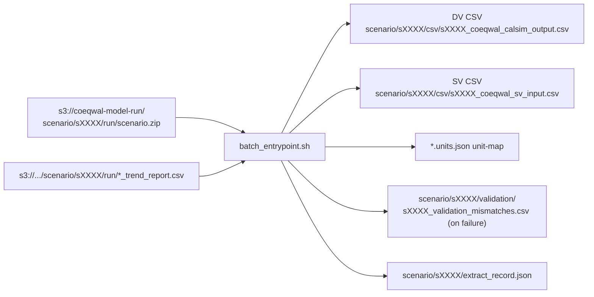

# Batch container: DSS to CSV

The Docker image AWS Batch runs in Fargate Spot to turn one CalSim ZIP into one set of CSVs in S3. Sits between the Lambda trigger and the statistics ETL.

| AWS resource | Value |
|---|---|
| ECR repository | `coeqwal-etl` |
| Image tag in use | `coeqwal-etl:latest` (always points at the last `main` build) |
| Batch compute env | `coeqwal-dss-ce` (Fargate Spot, `minvCpus=0`) |
| Batch job queue | `coeqwal-dss-queue` |
| Job definition | `coeqwal-dss-jobdef:3` (Fargate, 2 vCPU, 16 GiB) |
| Built and pushed by | [.github/workflows/etl.yml](../../.github/workflows/etl.yml) |

## What lives here

| File / dir | Role |
|---|---|
| [`Dockerfile`](Dockerfile) | Linux/amd64 image with Python 3.10, `pydsstools` built against `heclib.a`, AWS CLI v2, unzip. |
| [`batch_entrypoint.sh`](batch_entrypoint.sh) | Runtime entrypoint inside the container. Downloads the ZIP from S3, unzips, runs `dss_to_csv.py`, uploads CSVs + `extract_record.json`. |
| [`heclib/heclib.a`](heclib/) | Linux static library required by `pydsstools`. Built externally and checked in to avoid a long rebuild on every Docker build. |
| [`python-code/`](python-code/) | The actual extraction code. |

### `python-code/` contents

| File | Role |
|---|---|
| `classify_dss.py` | Walks the DSS files in a ZIP and picks the SV (state-variable / input) and DV (CalSim output) DSS files. Excludes `archive/`, `discard/`, `old/`, `backup/`. Has a small overrides table for hand-fixed scenarios (e.g. `s0023`, `s0024`). |
| `dss_to_csv.py` | The DSS reader. Opens a DSS file via `pydsstools`, iterates pathnames, writes a CSV with row-6 unit header. Supports `--verify-units` to write a `.units.json` unit-map alongside the CSV from DSS ground-truth. |
| `verify_dss_csv_units.py` | Standalone verifier. Re-opens any scenario's DSS from S3 and compares every column's unit against the CSV header. Runs inside this Docker image. |
| `validate_csvs.py` | Compares the extracted CSV against the modeling team's trend report CSV with configurable absolute and relative tolerances. Emits a per-scenario validation summary as nested JSON, plus an optional per-row mismatches CSV for triage. |

## How it gets built and deployed

`.github/workflows/etl.yml` builds and pushes on every push to `main` that touches `etl/batch-container/**`:

1. Checkout
2. Configure AWS credentials (IAM user `coeqwal-etl-github-actions-user`, to be migrated to OIDC. See [INFRASTRUCTURE.md §11/§14](../../docs/INFRASTRUCTURE.md))
3. ECR login
4. `cd etl/batch-container && docker build`
5. `docker push` to `ECR_REGISTRY/coeqwal-etl:latest` and `:<github-sha>`

The Batch job definition references the bare name `coeqwal-dss-jobdef`, which resolves to the active revision (currently 3). Batch then pulls `coeqwal-etl:latest` from ECR on each job start, so a successful `main` push is enough. There is no separate deploy step.

```bash
# Verify the latest image push
aws ecr describe-images --repository-name coeqwal-etl \
  --query 'imageDetails | sort_by(@, &imagePushedAt) | [-1].{pushed: imagePushedAt, tags: imageTags}' \
  --output table
```

## What the container does at runtime



The extract record is the per-scenario summary. Validation pass/fail and mismatch counts (`mismatch_columns`, `mismatch_cells`) are inlined into its `validation` block. The per-row mismatches CSV is the only artifact rich enough to debug a failure and is written separately under `validation/` only when mismatches were found. `etl/ingestion/tools/audit.py` reads the extract record across every scenario and projects it into `etl/ingestion/audit.md` alongside the per-scenario ingest record.

### Runtime env vars

| Env var | Default | Purpose |
|---|---|---|
| `ZIP_BUCKET`, `ZIP_KEY` | required | S3 location of the input scenario ZIP. |
| `SCENARIO_ID` | inferred | Overrides the short_code parsed from the ZIP basename. |
| `VALIDATION_REF_CSV_KEY` | empty | When set, the container downloads this reference CSV and runs `validate_csvs.py` against the produced output. |
| `EXTRACT_TARGETS` | `sv,dv` | Which DSS sides to extract. Set to `sv` to skip the DV (CalSim output), `dv` to skip the SV input. `reextract_all_scenarios.py --sv-only`/`--dv-only` flips this. |
| `ABS_TOL`, `REL_TOL` | `1e-06` | Validation tolerances. |

### Swapping the validation reference CSV

`VALIDATION_REF_CSV_KEY` points the container at whatever CSV you want validation to compare against. The Lambda sets it from the peer CSV alongside the ZIP (normally the modeling team's trend report), but any DSS-style CSV with a compatible header layout works. Useful for re-exports from the modeling team, hand-curated subset CSVs for debugging, or any one-off reference you stage under `ready/` next to the ZIP.

What the validator (`validate_csvs.py`) requires of the reference:

- **7-row DSS header** (A, B, C, E, F, TYPE, UNITS) with date in column 0 and numeric series in the remaining columns. Anything else raises `ValueError: not enough rows for DSS header` and validation aborts.
- **Column matching is on the `(B-part, C-part)` tuple**, so renaming A/E/F parts is harmless.
- **Date matching is on the calendar overlap** between the two files. Non-overlapping rows are ignored.

Behavior when the reference and the extracted CSV diverge:

| Change in the reference | Validator behavior |
|---|---|
| Columns added (new `(B, C)` pairs) | Logged in `sample_only_in_ref`, not compared |
| Columns removed | Logged in `sample_only_in_file`, not compared |
| Same `(B, C)` keys, different values upstream | Treated as the same column, values compared. `trend_csv_sha256` in `ingest_record.json` is the forensic trail if you suspect the reference itself drifted. |
| Header structure changes (not 7 rows) | Hard `ValueError`, validation aborts |
| Date range changes | Clipped to the overlapping window |
| Zero overlap on `(B, C)` keys | Validation reports `FAILED` (no false PASS). Read `file_comparison.columns_common` in the summary to confirm. |

The `file_comparison.columns_common` and `validation_summary.total_cells_compared` fields in the validation summary are the source of truth for how much was actually compared. A small intersection means partial coverage, even when the top-line status is `PASSED`.

If the reference or the extracted CSV has rows whose first-column timestamp cannot be parsed, the validator drops those rows and prints a `[WARN]` line to stderr that the Batch wrapper captures into the run log. Comparison runs only over the surviving rows. A `PASSED` status alongside a `[WARN]` in the log is the signal to investigate the upstream extractor or the reference exporter.

## Local development (build and run on your laptop)

Useful for one-off DSS conversions or debugging `dss_to_csv.py` without the AWS round trip. Requires Docker.

### 1. Build the image

```bash
cd etl/batch-container/
docker build -t coeqwal-dss .
```

### 2. Prepare local directories

```bash
mkdir -p ~/dss_processing/input ~/dss_processing/output
cp /path/to/your/file.dss ~/dss_processing/input/
```

### 3. Convert one DSS to CSV

```bash
# DV (CalSim decision-variable output) conversion
docker run \
  -v ~/dss_processing/input:/input \
  -v ~/dss_processing/output:/output \
  --entrypoint python coeqwal-dss \
  /app/python-code/dss_to_csv.py \
    --dss /input/your_file.dss --csv /output/result.csv --type dv

# SV input conversion
docker run \
  -v ~/dss_processing/input:/input \
  -v ~/dss_processing/output:/output \
  --entrypoint python coeqwal-dss \
  /app/python-code/dss_to_csv.py \
    --dss /input/your_sv_file.dss --csv /output/sv_result.csv --type sv
```

### 4. (Optional) Validate against a reference CSV

```bash
docker run --platform linux/amd64 \
  -v ./dss_processing:/data \
  --entrypoint python coeqwal-dss \
  /app/python-code/validate_csvs.py \
    --ref /data/output/coeqwal_s0011_adjBL_wTUCP_DV_v0.0.csv \
    --file /data/output/result.csv \
    --abs-tol 1e-6 --rel-tol 1e-6 \
    --verbose \
    --out-csv /data/output/detailed_mismatches.csv \
    --out-json /data/output/validation_summary.json
```

## Layer 1b: DSS-vs-CSV unit verification

Every extraction job runs `verify_dss_csv_units.py` automatically via `--verify-units` wired into `batch_entrypoint.sh`. It:

1. Re-opens the DSS file with `pydsstools`
2. Reads the unit from DSS metadata for every pathname
3. Compares against the CSV header row 6 for the same `(B-part, C-part)`
4. Writes a `.units.json` unit-map listing DSS unit ground truth per variable
5. Uploads the unit-map to S3: `scenario/{id}/csv/{id}_coeqwal_calsim_output.csv.units.json` (the CSV file basename is unchanged)
6. Records `unit_verification.dv_unit_mismatches` in the extract record

Unit-map format:

```json
{"AW_01_PA": {"c_part": "APPLIED-WATER", "unit": "CFS"},
 "S_SHSTA": {"c_part": "STORAGE", "unit": "TAF"}}
```

A `UNIT_MAP` line is also emitted in CloudWatch for every extraction, so there is a permanent audit trail without needing to re-open the DSS.

To re-run unit verification on-demand for any scenario (or all of them) from Cloud9:

```bash
cd ~/environment/coeqwal-backend/etl/batch-container
docker build -t coeqwal-etl:test .

# Single scenario smoke test
docker run --rm --entrypoint "" coeqwal-etl:test \
  python /app/python-code/verify_dss_csv_units.py --scenario s0025 \
  2>&1 | tee verify_units_s0025.log

# All scenarios (auto-discovered from S3 bucket)
docker run --rm --entrypoint "" coeqwal-etl:test \
  python /app/python-code/verify_dss_csv_units.py --scenarios-from-s3 --workers 6 \
  2>&1 | tee verify_units_all_$(date +%Y%m%d_%H%M%S).log

# Save mismatch report to CSV
docker run --rm --entrypoint "" coeqwal-etl:test \
  python /app/python-code/verify_dss_csv_units.py --scenarios-from-s3 --output report.csv
```

All ~75 scenarios take ~50 minutes with 6 workers. Use `tmux` so SSO drops do not kill the run.

## Duplicate B-part detection

`dss_to_csv.py` detects when multiple DSS pathnames share the same B-part but have different C-parts (e.g., `SHRTG_PCWA3/SHORTAGE` vs `SHRTG_PCWA3/DELIVERY-SHORTAGE`). These are logged as warnings and counted in the extract record under `duplicate_b_parts`. The statistics ETL resolves duplicates using C-part-aware deduplication (preferring the expected C-part, e.g., `SHORTAGE` over `DELIVERY-SHORTAGE` for `SHRTG_*` variables).

A non-Docker scan for duplicates across all scenarios:

```bash
cd ~/environment/coeqwal-backend/etl/statistics
python scan_dupes.py --compare-values --audit-units --workers 4
```

## Operating notes

- **Job definition revisions:** Only revision 3 is ACTIVE as of 2026-05-11 (Fargate, 2 vCPU, 16 GiB, image `coeqwal-etl:latest`). Revisions 1 and 2 (8 GiB each) were deregistered. The Lambda submits the bare name `coeqwal-dss-jobdef`, so Batch resolves to revision 3 automatically. Do not deregister revision 3 without updating the Lambda.
- **OOM:** ~326 MB CalSim output CSVs from the DWRadapt25 / DCP group (e.g. `s0065`, `s0085`, `s0105`) used to OOM-kill the 8 GiB revisions. With 16 GiB they pass. If they ever start failing again, re-extract those specific scenarios with `etl/ingestion/tools/reextract_all_scenarios.py --scenarios s0065 --memory 32768`.
- **Spend:** `minvCpus=0` on the compute env means $0 idle. Cost is purely Fargate Spot time during jobs.
- **Verifying a successful build landed:** see the `aws ecr describe-images` snippet above.

## Related

- The Lambda that fires extraction jobs: [../lambda/README.md](../lambda/README.md)
- The developer scripts that put ZIPs into `ready/`: [../README.md](../README.md) (see "How to process raw scenario model run data" and "Developer scripts in `etl/ingestion/`")
- End-to-end accuracy verification (Layer 1-4): [../verification/README.md](../verification/README.md)
- AWS-side resource details: [../../docs/INFRASTRUCTURE.md](../../docs/INFRASTRUCTURE.md)
