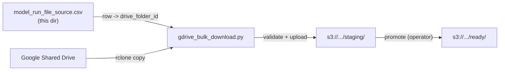

# Ingestion: Google Drive to S3 ready/

The first stage of the pipeline. Operator-driven scripts that pull CalSim model run ZIPs and trend report CSVs from the COEQWAL Shared Drive, validate them, stage to S3, and promote into `s3://coeqwal-model-run/ready/` where the Lambda + Batch path takes over.

The source of truth for "which scenarios exist and where their files live on Drive" is the CSV in this directory: [`model_run_file_source.csv`](model_run_file_source.csv).



## Contents of this directory

| File | Role |
|---|---|
| [`model_run_file_source.csv`](model_run_file_source.csv) | Canonical scenario -> Drive folder mapping. Edit this when adding scenarios. |
| [`gdrive_bulk_download.py`](gdrive_bulk_download.py) | The main operator script: `scan`, `download`, `promote` subcommands. |
| [`check_extraction_results.py`](check_extraction_results.py) | Post-extraction audit: reads manifests and validation summaries from S3 across all scenarios and produces a console table + CSV. |
| [`reextract_all_scenarios.py`](reextract_all_scenarios.py) | Re-submit Batch jobs against ZIPs already in S3 without re-downloading from Drive. Use when the ETL container code changed. |
| [`retrigger_extraction.sh`](retrigger_extraction.sh) | Re-upload one ZIP to `ready/` to re-trigger its extraction. Used for one-offs. |
| [`inspect_sv_dss.py`](inspect_sv_dss.py) | Operator diagnostic for inspecting state-variable DSS files. |
| [`requirements.txt`](requirements.txt) | `boto3`, `openpyxl`. Install with `pip install -r etl/ingestion/requirements.txt`. |

## How to load new scenarios

This is the runbook. Each scenario is a CalSim3 model run packaged as a ZIP file on Google Drive, with a companion Trend Report CSV for validation.

### 1. Update [`model_run_file_source.csv`](model_run_file_source.csv)

Google Drive paths and file selections for every scenario are tracked here. Add or update one row per scenario.

| Column | Purpose | Example |
|---|---|---|
| `short_code` | Scenario identifier | `s0070` |
| `drive_folder_id` | Google Drive folder ID (from folder URL) | `1AxM4DmuTuoX...` |
| `drive_folder_name` | Folder name on the Shared Drive | `s0070_DCRadjHist_cc50_2020LU_eflowsV1` |
| `pinned_model_run_zip` | Exact ZIP filename to download (blank = auto-select single file) | `s0023_..._v2_20260217.zip` |
| `pinned_trend_csv` | Exact trend report CSV to download (blank = auto-select) | `s0023_..._DV_v2_20260217.csv` |
| `download_status` | `ready`, `needs_review`, or `skip` | `ready` |
| `notes` | Any issues or disambiguation notes | |

**How to get the `drive_folder_id`:**
1. Navigate to the scenario's top-level folder on the Shared Drive (e.g., `s0070_DCRadjHist_cc50_2020LU_eflowsV1`)
2. Copy the URL from the browser address bar: `https://drive.google.com/drive/folders/1AxM4DmuTuoX...`
3. The folder ID is the part after `/folders/` (before any `?` query string)

**When to pin filenames:**
- If a Drive folder contains multiple ZIPs (old + new versions), set `pinned_model_run_zip` to the correct one. Use the version/date suffix from the modeling team's DV_Path to identify it.
- If there are multiple trend CSVs, set `pinned_trend_csv` similarly.
- If there is only one file, leave the column blank. The script auto-selects it.

**`download_status` values:**
- `ready` - folder ID verified, files confirmed by scan, ready to download
- `needs_review` - known issue (missing files, wrong folder ID, etc.)
- `skip` - intentionally excluded from download

### 2. Add scenario metadata to the database

Before loading data, each scenario needs a row in the `scenario` table. Write a migration SQL script (see `database/scripts/sql/52_add_s0070_s0090.sql` for an example) that:
- Inserts the scenario with `short_code`, `run_name`, `is_active`, `hydroclimate_id`, `hydroclimate_sibling`, `scenario_version_id`, `scenario_author_id`, `model_source_id`
- Disables the audit trigger, sets `created_by=2` and `updated_by=2` (developer attribution), then re-enables the trigger
- Run with `psql $SUPERUSER_URL -f database/scripts/sql/<migration>.sql` on Cloud9

If the scenario belongs to an existing sibling group (same operational configuration, different hydroclimate), set `hydroclimate_sibling` to the group's reference short code. If it is a new operational configuration, also add a row to `scenario_hydroclimate_sibling`.

### 3. Scan Google Drive

Before downloading, validate that all files are accessible.

```bash
python etl/ingestion/gdrive_bulk_download.py scan \
  --listing-csv etl/ingestion/model_run_file_source.csv \
  --workers 4 2>&1 | tee scan_$(date +%Y%m%d).log
```

By default, only scenarios with `download_status=ready` are scanned. Use `--include-all` to scan everything, or `--scenarios s0070 s0090` to scan specific ones.

The scan lists `Model_Files/` for ZIPs and `Data_Extraction/Variables_From_trend_report_variables_v5/` for trend report CSVs. It reports:
- How many ZIPs and trend CSVs exist per scenario
- Which file it would select (pinned filename if specified, otherwise most recent by date)
- `OK` = exactly one file found (or pinned file found among multiples)
- `ALERT_MULTIPLE_ZIP` / `ALERT_MULTIPLE_TREND` = multiple files, no pinned filename set. Add one to the CSV
- `MISSING_ZIP` / `MISSING_TREND` = file not found on Drive
- `PINNED_ZIP_NOT_FOUND` / `PINNED_TREND_NOT_FOUND` = pinned filename does not match any file on Drive

Review `etl/ingestion/output/scan_audit.csv` before proceeding (override location with `--output-dir`). All scenarios should show `OK` (except known missing trend reports like s0011).

### 4. Download and stage to S3

```bash
# Dry run first (lists files, validates ZIPs, no S3 upload):
python etl/ingestion/gdrive_bulk_download.py download \
  --listing-csv etl/ingestion/model_run_file_source.csv \
  --s3-bucket coeqwal-model-run \
  --dry-run \
  --workers 4 2>&1 | tee download_dryrun_$(date +%Y%m%d).log

# Real download:
python etl/ingestion/gdrive_bulk_download.py download \
  --listing-csv etl/ingestion/model_run_file_source.csv \
  --s3-bucket coeqwal-model-run \
  --workers 4 2>&1 | tee download_$(date +%Y%m%d).log
```

For each scenario, the download command:
1. Lists `Model_Files/` on Drive and selects the ZIP (pinned or auto-selected)
2. Lists `Data_Extraction/.../` and selects the trend report CSV
3. Downloads the ZIP, validates it (classifies DSS files inside)
4. Uploads both the ZIP and trend CSV to `s3://coeqwal-model-run/staging/<shortcode>/`

Use `--scenarios s0070 s0090` to download specific scenarios only. Use `--include-all` to include non-ready scenarios.

### 5. Promote to trigger extraction

```bash
# Promote one scenario first (recommended smoke test):
python etl/ingestion/gdrive_bulk_download.py promote \
  --s3-bucket coeqwal-model-run --scenarios s0020

# Promote all staged scenarios:
python etl/ingestion/gdrive_bulk_download.py promote \
  --s3-bucket coeqwal-model-run
```

Copies files from `staging/` to `ready/`. The Lambda trigger detects the ZIP upload and submits an AWS Batch extraction job. The promote command lists what will be copied and asks for confirmation.

### 6. Monitor extraction and handle failures

After promoting, Lambda triggers Batch extraction jobs automatically. Monitor progress:

```bash
# Check how many jobs are running/pending/done
aws batch list-jobs --job-queue coeqwal-dss-queue --job-status RUNNING --query 'length(jobSummaryList)'
aws batch list-jobs --job-queue coeqwal-dss-queue --job-status SUCCEEDED --query 'length(jobSummaryList)'
aws batch list-jobs --job-queue coeqwal-dss-queue --job-status FAILED --query 'length(jobSummaryList)'

# Check extraction results across all scenarios
python etl/ingestion/check_extraction_results.py --bucket coeqwal-model-run
```

If any jobs fail with `OutOfMemoryError`, re-extract them with more memory:

```bash
# Check what failed
python etl/ingestion/check_extraction_results.py --bucket coeqwal-model-run --scenarios s0065

# Re-extract with 16 GB (default is 8 GB)
python etl/ingestion/reextract_all_scenarios.py --scenarios s0065,s0085,s0105 --memory 16384
```

Known large scenarios that need 16 GB: the DWRadapt25 group (DCP operation) produces ~326 MB CalSim output CSVs vs ~200 MB for typical scenarios. These are the `*_DWRadapt25_*_DCP` ZIPs. If your new batch includes DCP scenarios, expect to re-extract those with `--memory 16384`.

### 7. Run statistics ETL and verify

```bash
cd etl/statistics
python run_all.py --scenario s0070
python verify_all_sections.py --scenario s0070
python verify_api.py --scenario s0070
```

See [etl/statistics/README.md](../statistics/README.md) for the full statistics-ETL runbook.

## File layout on Google Drive

Each scenario folder on the COEQWAL Shared Drive follows this structure:

```
<scenario_folder_name>/
├── Model_Files/
│   ├── <scenario>.zip          # the model run ZIP (contains DSS files)
│   └── DSS/
│       ├── output/
│       │   └── <scenario>_DV_<version>.dss
│       └── input/
│           └── coeqwal_s9999_SV_<version>.dss
└── Data_Extraction/
    └── Variables_From_trend_report_variables_v5/
        └── <scenario>_trend_report_<version>.csv   # validation reference
```

The ZIP in `Model_Files/` is what gets downloaded. The trend report CSV is used for post-extraction validation. Both are authored by the modeling team (Dino Bellugi).

## Prerequisites (one-time setup on Cloud9)

| Requirement | Where | Notes |
|---|---|---|
| **rclone** | Cloud9 (or local Mac) | Handles Google Drive auth. No GCP project needed |
| **rclone config** (`~/.config/rclone/rclone.conf`) | Cloud9 | Must be configured with a `gdrive` remote pointing to the COEQWAL Shared Drive |
| **Python 3.9+** | Cloud9 | Already available on Cloud9 |
| **boto3, openpyxl** | Cloud9 | `pip install -r etl/ingestion/requirements.txt` |
| **AWS credentials** | Cloud9 | Already configured on Cloud9 (IAM role) |

### Check and increase Cloud9 storage (if needed)

Cloud9 instances default to 10 GB EBS, which is tight when downloading ~200 MB ZIPs for 24 scenarios. The script streams files through `/tmp/` and uploads to S3 immediately, so you only need space for one ZIP at a time per worker, but it is still good practice to check.

```bash
df -h /
```

If usage is above ~70%, resize the EBS volume:

1. AWS Console -> EC2 -> Volumes
2. Find the volume attached to your Cloud9 instance: `curl -s http://169.254.169.254/latest/meta-data/instance-id`
3. Select the volume -> Actions -> Modify Volume
4. Change the size (e.g., 10 GB to 20 GB) -> Modify
5. Wait ~30 seconds, then grow the filesystem in Cloud9 terminal:

```bash
lsblk                            # confirm device name (usually /dev/xvda or /dev/nvme0n1)
sudo growpart /dev/xvda 1
sudo resize2fs /dev/xvda1
df -h /
```

Alternative: skip local storage entirely. The script uses `/tmp/` as a transient staging area and uploads to S3 immediately. With `--workers 1` you only need ~200 MB free.

### Install rclone

```bash
curl https://rclone.org/install.sh | sudo bash
rclone version
```

### Set up rclone config (the `gdrive` remote)

rclone must be authenticated on a machine with a web browser (your Mac) because Google OAuth requires a browser redirect. Once authenticated, copy the config to Cloud9.

**If you already authenticated on your Mac:**

```bash
# On your Mac, display the config:
cat ~/.config/rclone/rclone.conf

# On Cloud9, paste it:
mkdir -p ~/.config/rclone
nano ~/.config/rclone/rclone.conf
# Paste, save with Ctrl+O, exit with Ctrl+X
```

**If you need to set up rclone from scratch:**

```bash
# On your Mac (which has a browser):
rclone config

# Choose:
#   n) New remote
#   name> gdrive
#   Storage> drive (Google Drive)
#   client_id> (leave blank - uses rclone's built-in OAuth client)
#   client_secret> (leave blank)
#   scope> 2 (drive.readonly)
#   service_account_file> (leave blank)
#   Edit advanced config> n
#   Use web browser to authenticate> y
#   Browser opens. Authenticate with your UC Berkeley Google account (2FA required)
#   Configure as Shared Drive> y
#   Select: COEQWAL
#   Keep this remote> y
```

**Verify it works on Cloud9:**

```bash
rclone lsd gdrive:   # Should list top-level Shared Drive folders
```

**Token refresh:** The rclone config contains a refresh token. It should auto-renew, but if you get 401 errors after weeks of inactivity, re-run `rclone config reconnect gdrive:` on your Mac and re-copy the config.

### Install Python dependencies

```bash
cd ~/environment/coeqwal-backend
pip install -r etl/ingestion/requirements.txt
```

## Monitoring and logging

### Download/scan logs (Cloud9 terminal)

The `gdrive_bulk_download.py` script logs to stderr. To capture logs to a file while still seeing output:

```bash
python etl/ingestion/gdrive_bulk_download.py scan \
  --listing-csv etl/ingestion/model_run_file_source.csv \
  --workers 4 2>&1 | tee scan_$(date +%Y%m%d).log
```

**What to look for:** `MISSING_ZIP`, `MISSING_TREND`, `ALERT_MULTIPLE_ZIP`, `ALERT_MULTIPLE_TREND`, `FOLDER_MISMATCH` in the scan audit summary. All scenarios should show `OK`.

### Lambda logs (CloudWatch)

```bash
# Tail recent Lambda logs
aws logs tail /aws/lambda/coeqwalEtlTrigger --since 30m

# Follow in real time (useful during promote)
aws logs tail /aws/lambda/coeqwalEtlTrigger --follow
```

**What to look for:**
- `Submitted Batch job <job-id> for scenario <id>` -- confirms the trigger fired
- `Moved ZIP to scenario/<id>/run/` -- confirms file reorganization
- `Found peer CSV` -- confirms trend report was paired with the ZIP
- Any `ERROR` lines indicating the Lambda failed to submit the Batch job

See [../lambda/README.md](../lambda/README.md) for the Lambda's full behavior.

### Batch extraction logs (CloudWatch)

```bash
# Find the log group
aws logs describe-log-groups \
  --query "logGroups[?contains(logGroupName, 'batch') || contains(logGroupName, 'coeqwal-etl')].logGroupName" \
  --output table

# Check Batch job status
aws batch list-jobs --job-queue coeqwal-dss-queue --job-status SUCCEEDED
aws batch list-jobs --job-queue coeqwal-dss-queue --job-status FAILED
```

**What to look for:**
- `DSS classification` output -- confirms SV and DV files were identified
- `Extraction complete` -- CSVs were generated
- `Validation: PASS` or `Validation: FAIL` -- comparison against trend report
- The `_manifest.json` in S3 summarizes the job result

See [../batch-container/README.md](../batch-container/README.md) for the container's full behavior.

### Post-extraction audit

After Batch jobs finish, run `check_extraction_results.py` to produce a single summary across all scenarios. It auto-discovers scenario folders in S3, reads each manifest and validation summary, and outputs a console table plus a CSV audit file.

```bash
# Check all scenarios (auto-discovers from S3)
python etl/ingestion/check_extraction_results.py \
  --bucket coeqwal-model-run 2>&1 | tee extraction_audit_$(date +%Y%m%d).log

# Check specific scenarios
python etl/ingestion/check_extraction_results.py \
  --bucket coeqwal-model-run --scenarios s0021,s0022

# Include cross-scenario mismatch pattern analysis for failed validations
python etl/ingestion/check_extraction_results.py \
  --bucket coeqwal-model-run --mismatches --mismatch-output mismatches.csv
```

**What to look for in the output:**
- `extraction_status`: `SUCCEEDED` (both SV and DV), `SUCCEEDED_PARTIAL`, or `NO_MANIFEST` (pending)
- `validation_result`: `passed`, `failed`, or `skipped`
- `unit_verification.calsim_unit_mismatches`: `0` means all CSV units match DSS. Non-zero requires investigation
- The `SCENARIOS REQUIRING ATTENTION` section lists anything that needs investigation
- With `--mismatches`: shows which variables (C parts) and locations (B parts) fail most often

**Inspecting a single scenario manually:**

```bash
# Read one manifest
aws s3 cp s3://coeqwal-model-run/scenario/s0021/s0021_manifest.json - | python -m json.tool

# Check validation reports
aws s3 ls s3://coeqwal-model-run/scenario/s0021/validation/
```

## Re-extract without re-downloading

When you change the ETL container code (or just need to regenerate CSVs from existing ZIPs), use `reextract_all_scenarios.py`. It bypasses Drive and the Lambda. It submits Batch jobs directly against ZIPs already in `s3://coeqwal-model-run/scenario/<id>/run/`.

```bash
# Dry run: list what would be submitted
python etl/ingestion/reextract_all_scenarios.py --dry-run

# Re-extract all scenarios
python etl/ingestion/reextract_all_scenarios.py

# Re-extract specific scenarios
python etl/ingestion/reextract_all_scenarios.py --scenarios s0020,s0028

# Re-extract only the SV input (skip CalSim output)
python etl/ingestion/reextract_all_scenarios.py --sv-only

# Include validation against reference CSVs in scenario/{id}/verify/
python etl/ingestion/reextract_all_scenarios.py --validate

# Override per-job memory
python etl/ingestion/reextract_all_scenarios.py --scenarios s0065 --memory 32768
```

## Re-trigger one scenario by re-upload

If you just want to re-run extraction on a single scenario by re-uploading its ZIP to `ready/`, use [`retrigger_extraction.sh`](retrigger_extraction.sh). The Lambda will fire again as if the ZIP were newly uploaded.

## Troubleshooting

| Problem | Solution |
|---|---|
| `rclone: command not found` | Run `curl https://rclone.org/install.sh \| sudo bash` |
| `Failed to create file system: google drive: didn't find section in config file` | rclone config is missing. Copy from Mac (see rclone setup above). |
| `rclone lsjson` returns empty | Check the Drive folder ID in `model_run_file_source.csv`. Try manually: `rclone lsjson --drive-root-folder-id=<ID> gdrive:` |
| `401 Unauthorized` | Token expired. Re-authenticate on Mac: `rclone config reconnect gdrive:` and re-copy config. |
| `ALERT_MULTIPLE_SV` or `ALERT_MULTIPLE_DV` | ZIP contains extra DSS files. Check `sv_all_candidates` / `dv_all_candidates` in audit report. May need to add override in `SCENARIO_OVERRIDES` inside `gdrive_bulk_download.py`. |
| `ALERT_NO_SV` or `ALERT_NO_DV` | ZIP is missing expected DSS type. Check the ZIP contents manually. |
| `MISSING_ZIP` | `Model_Files/` in Drive folder has no ZIPs. Check the Drive folder link. |
| `MISSING_TREND_REPORT` | No CSV starting with scenario shortcode in `Variables_From_trend_report_variables_v5/`. |
| `No space left on device` | Reduce `--workers` to 1, or resize EBS volume (see prereqs above). |
| Manifest shows `calsim_csv_written: false`, `OutOfMemoryError` in Batch logs | Re-extract with `--memory 16384` (or 32768). Common with the `*_DWRadapt25_*_DCP` group. |

## Legacy input formats (still accepted, but deprecated)

`gdrive_bulk_download.py` was originally driven by an Excel file with hyperlinks to Drive folders. Two legacy formats are still readable for backward compatibility but should be migrated off:

| Legacy file | Status |
|---|---|
| `reference/COEQWAL_Completed_Scenario_Listing.xlsx` (repo root) | Read via `openpyxl` (`read_scenario_listing`). Hyperlinks extracted from cells. Marked `legacy Excel listing format` at runtime. |
| `database/reference/coeqwal_cs3_scenario_listing - scenario_list.csv` | Read via `read_scenario_listing_csv`. Marked `legacy v6 CSV listing format` at runtime. |

The format is auto-detected. If the input has a `short_code` column header, it is treated as the modern source CSV. Otherwise it falls back to the v6 reader. `.xlsx` always uses the Excel path. New work should use [`model_run_file_source.csv`](model_run_file_source.csv).
