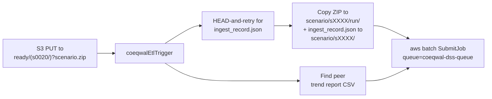

# Lambda: S3 PUT to Batch SubmitJob

The bridge between developer-driven ingestion and the automatic DSS extraction pipeline. One Lambda function, one file.

| AWS resource | Value |
|---|---|
| Function name | `coeqwalEtlTrigger` |
| Runtime | Node.js 20.x (uses built-in AWS SDK v3, no `node_modules` needed) |
| Trigger | S3 `ObjectCreated:*` on `coeqwal-model-run/ready/` |
| Action | Wait for `ingest_record.json` (HEAD-and-retry), move ZIP to `scenario/<id>/run/`, place ingest record at `scenario/<id>/ingest_record.json`, locate peer trend CSV, `aws batch SubmitJob` |
| Source | [`index.mjs`](index.mjs) (single file) |
| Log group | `/aws/lambda/coeqwalEtlTrigger` |

## What it does on each PUT



Two upload patterns are supported:

| Upload pattern | How it works |
|---|---|
| `ready/scenario.zip` | Flat pattern. Lambda finds peer CSV and `ingest_record.json` in `ready/`. |
| `ready/s0020/scenario.zip` | Subfolder pattern. Lambda finds peer CSV and `ingest_record.json` in `ready/s0020/`. After submitting the Batch job, cleans up the subfolder. |

The companion trend report CSV (uploaded alongside the ZIP in the same subfolder by `gdrive_bulk_download.py promote`) is passed to the extraction job as the validation reference. The companion `ingest_record.json` is moved to `scenario/<id>/ingest_record.json` and passed to the Batch container via the `INGEST_RECORD_KEY` env var.

## Deploy updates

The Lambda is a single `index.mjs` file with no external dependencies, so deployment does not need a build step.

**Via AWS Console:**
1. AWS Console -> Lambda -> Functions -> `coeqwalEtlTrigger`
2. Click the **Code** tab
3. Select all in the inline editor, paste the full contents of [`index.mjs`](index.mjs)
4. Click **Deploy**

**Via Cloud9 / CLI:**

```bash
cd ~/environment/coeqwal-backend/etl/lambda
zip lambda.zip index.mjs
aws lambda update-function-code --function-name coeqwalEtlTrigger --zip-file fileb://lambda.zip
rm lambda.zip
```

## Monitor

```bash
# Tail recent logs
aws logs tail /aws/lambda/coeqwalEtlTrigger --since 30m

# Follow in real time (useful right after running `promote`)
aws logs tail /aws/lambda/coeqwalEtlTrigger --follow

# All COEQWAL Lambda log groups
aws logs describe-log-groups --query "logGroups[?contains(logGroupName, 'coeqwal')].logGroupName" --output table
```

Other log groups you may want at the same time:

| Log group | Service |
|---|---|
| `/aws/lambda/coeqwalEtlTrigger` | This Lambda |
| `/aws/lambda/coeqwal-database-audit` | DB audit Lambda |
| `/aws/lambda/coeqwalPresignDownload` | Download presigner Lambda |
| `/ecs/coeqwal-api` | API server |
| `/aws/rds/cluster/coeqwal-scenario-db-v1/postgresql` | RDS PostgreSQL |

## What to look for

| Log line | Meaning |
|---|---|
| `Submitted Batch job <job-id> for scenario <id>` | Trigger fired and Batch accepted the job |
| `Ingest record found at ...` | The promote-uploaded `ingest_record.json` was waiting; Lambda moved it to the scenario prefix |
| `No ingest record after ...; inferring a minimal one for <id>` | Drag-and-drop path: no record arrived in the grace window, Lambda wrote one with `ingestion.path = "manual_inferred"` |
| `Copying ZIP ... -> scenario/<id>/run/...` | File reorganization succeeded |
| `Selected newest peer CSV` / `No peer CSV found` | Whether a trend report was paired with the ZIP |
| Any `ERROR` line | Lambda failed to submit the Batch job. Investigate before re-running |

## Related

- The downstream extraction code: [../batch-container/README.md](../batch-container/README.md)
- The developer scripts that put files into `ready/`: [../README.md](../README.md) (see "How to process raw scenario model run data" and "Developer scripts in `etl/ingestion/`")
- AWS-side resource details (job definition, queue, IAM): [../../docs/INFRASTRUCTURE.md](../../docs/INFRASTRUCTURE.md)
