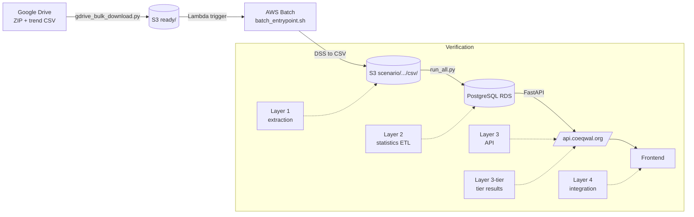

# Verification (ETL)

How we make sure the COEQWAL pipeline produces correct data, and what
record we leave behind when it does. This is the single canonical
verification doc for the backend: orientation for new hires, layered
walkthrough for ETL developers, paste-ready commands for operators, and
the audit-artifact index. (`docs/VERIFICATION.md` and
`docs/AUDITS_AND_VERIFICATION.md` previously held subsets of this
content. They were folded in here so there is one place to read.)

---

## 1. Verification vs auditing

Two related but distinct activities:

- **Verification** answers "is this data correct right now?" by
  re-deriving a value through an independent path and comparing.
  Examples: re-opening a HEC-DSS file and comparing its units to the
  extracted CSV, recomputing a reservoir percentile from S3 CSVs and
  comparing to the database, hitting the public API and comparing its
  response to a direct database query.
- **Auditing** answers "what happened, when, and to which bytes?" by
  leaving a tamper-evident paper trail. Examples: SHA-256 hashes on
  every ZIP, sidecar JSON records on every uploaded artifact, the
  monthly database snapshot, the per-orchestrator-run `pipeline_state.json`,
  the `audit.md` that summarizes a download / upload pass.

Verification is the active check. Auditing is the passive record.
Together they give forensic traceability from a number on the website
back to the modeling team's original DSS file.

---

## 2. Pipeline at a glance



---

## 3. Verification layers (overview)

Six layers, each independent. Each can run alone. Together they answer
"is everything correct end-to-end?"

| Layer | What it verifies | Where it runs | Command |
|---|---|---|---|
| **1** | DSS extraction: extracted CSV vs modeling team's trend report CSV (column-by-column, with tolerances) | Inside every Batch job (automatic) | `validate_csvs.py` in `etl/batch-container/python-code/` |
| **2** | Statistics in PostgreSQL vs values recomputed from reference CSVs | Cloud9 (developer) | `python etl/statistics/verify_all_sections.py --scenario <id>` |
| **3** | Public API responses vs direct database queries | Cloud9 (developer) | `python etl/statistics/verify_api.py --scenario <id>` |
| **3-tier** | Tier results in DB / API vs the team-supplied staging CSVs | Cloud9 (developer) | `python etl/tier_data/scripts/verify_tiers.py` |
| **4** | Frontend status page at `/verification` shows the per-scenario PASS / FAIL grid | Browser | n/a (visualization of layer 2 + 3 reports) |

Layer 1 runs automatically on every ingest. Layers 2, 3, and
3-tier are developer-driven today and are the typical bottleneck for
releasing a new scenario.

---

## 4. Verify one scenario end-to-end

Paste-able block for Cloud9 (or any machine with `DATABASE_URL` and AWS
credentials). Runs Layer 2, Layer 3, and Layer 3-tier in sequence for a
single scenario. Each script writes a JSON report under
`audits/verification_reports/` and prints a one-line PASS / FAIL summary.

```bash
SCENARIO=s0020

# Layer 2: statistics in DB vs values recomputed from reference CSVs
python etl/statistics/verify_all_sections.py --scenario "$SCENARIO"

# Layer 3: API responses vs direct DB queries
python etl/statistics/verify_api.py --scenario "$SCENARIO"

# Layer 3-tier: tier results in DB / API vs staging CSVs
python etl/tier_data/scripts/verify_tiers.py --scenario "$SCENARIO"
```

Useful variants:

```bash
# Layer 2 without a DB connection (uses reference CSVs only, fastest)
python etl/statistics/verify_all_sections.py --scenario s0020 --csv-only

# Layer 2 / 3 against every active scenario, with per-scenario JSON reports
python etl/statistics/verify_all_sections.py --all-scenarios \
    --report-dir audits/verification_reports
python etl/statistics/verify_api.py --all-scenarios \
    --report-dir audits/verification_reports

# Pre-flight a scenario that is NOT yet in ACTIVE_SCENARIOS (between
# the statistics load and the public-activation step)
python etl/statistics/verify_api.py --scenarios-override s0070
python etl/tier_data/scripts/verify_tiers.py --scenarios-override s0070
```

The orchestrator wraps Layers 2 and 3 (see [§7](#7-orchestrator-where-run_full_pipelinepy---verify-fits)).

---

## 5. Each layer in detail

### Layer 1: Extraction (DSS to CSV)

Validates that `dss_to_csv.py` extracts data correctly from HEC-DSS
files. Uses `validate_csvs.py` to compare extracted CSVs against the
modeling team's trend report CSVs with configurable tolerances. Extract
records stored in `audits/validation_mismatches/{scenario_id}_extract_record.json`.

Runs automatically inside every Batch job. See
[`etl/batch-container/README.md`](../batch-container/README.md).

### Layer 2: ETL Statistics (CSV to DB)

Computes expected values from reference CSVs and compares against
database values.

```bash
python etl/statistics/verify_all_sections.py --scenario s0020
python etl/statistics/verify_all_sections.py --all-scenarios --report-dir audits/verification_reports
python etl/statistics/verify_all_sections.py --scenario s0020 --csv-only  # no DB needed
```

**Sections verified:**

- **Reservoirs**: April/Sept storage (TAF + % capacity), annual
  average, spill frequency
- **CWS Aggregates**: Annual delivery (TAF), shortage, reliability
- **CWS Demand Units**: Per-DU annual delivery (TAF) for sample DUs
- **AG Demand Units**: SW delivery, GW pumping, demand, reliability for
  sample DUs
- **AG Aggregates**: Annual delivery (TAF)
- **M&I Contractors**: Delivery, shortage, reliability, % demand met
- **Env Flows**: Average CFS, Pearson r, % unimpaired, % functional
  flows
- **Refuge**: Delivery, shortage, reliability
- **Tiers**: All 9 tier codes verified against staging CSVs and DB

**Tolerances**: `abs_tol = 0.5`, `rel_tol = 0.01` (configurable per
check). Output: `audits/verification_reports/{scenario_id}_layer2.json`.

### Layer 3: API verification (DB to API)

Queries API endpoints and compares responses to direct database
queries.

```bash
python etl/statistics/verify_api.py --scenario s0020
python etl/statistics/verify_api.py --scenario s0020 --api-url http://localhost:8000
python etl/statistics/verify_api.py --all-scenarios
```

**Endpoints verified:**

- `GET /api/statistics/batch` (storage, CWS, AG)
- `GET /api/tiers/scenarios/{id}/tiers` (all 9 tier codes)
- `GET /api/statistics/scenarios/{id}/channels/period-summary` (env
  flow)

Output: `audits/verification_reports/{scenario_id}_layer3.json`.

### Layer 3-tier: tier data verification

Compares staging CSVs against live API responses for every tier code.

```bash
python etl/tier_data/scripts/verify_tiers.py
python etl/tier_data/scripts/verify_tiers.py --scenario s0020
python etl/tier_data/scripts/verify_tiers.py --tier CWS_DEL
```

Output: stdout / exit code. (See known-gaps below for stamping
follow-up.)

### Layer 4: Public status page

Verification results are served by `GET /api/verification/status` and
displayed at `/verification` on the frontend. Shows a per-scenario
pass/fail grid with drill-down to individual checks.

---

## 6. Validation framework

### Tolerance parameters

- **Absolute tolerance (`abs_tol`)**: Maximum allowed absolute
  difference between values. Used for values close to zero where
  relative comparison is not meaningful. Example: `abs_tol = 1e-6`
  means values must be within +/-0.000001 units.
- **Relative tolerance (`rel_tol`)**: Maximum allowed relative
  difference as a fraction. Used for larger values where proportional
  differences matter more. Example: `rel_tol = 1e-6` means values must
  be within 0.0001% of each other.

### Validation logic

Values are considered equal if both are NaN OR within tolerances:

```python
np.isclose(value1, value2, atol=abs_tol, rtol=rel_tol, equal_nan=True)
```

Default tolerances: `1e-6` absolute and relative for unit-checked
passthroughs, `0.5` absolute / `0.01` relative for human-scale
magnitudes. Compares all common variables between reference and
extracted data. Reports mismatches with exact differences. Status: PASS
/ FAIL with per-section summaries.

---

## 7. Orchestrator: where `run_full_pipeline.py --verify` fits

[`etl/run_full_pipeline.py`](../run_full_pipeline.py) is the end-to-end
driver. It scans the working CSV, downloads from Drive, promotes to S3
`ready/`, polls Batch, loads statistics into RDS, then runs
verification. Each stage is independent and can be skipped or resumed.

The preset flags make the common cases one line:

```bash
python etl/run_full_pipeline.py --scenarios s0107 s0108           # end-to-end
python etl/run_full_pipeline.py --gdrive-to-s3 --scenarios s0107  # stop after S3 staging
python etl/run_full_pipeline.py --verify --resume --report-dir <dir>  # only run verification
```

When `--verify` runs, it invokes Layer 2 under the hood and feeds its
scorecard back into the run's `pipeline_summary.md`. The detailed JSON
lands in `audits/verification_reports/` so it can be diffed across
runs.

For a read-only snapshot of where every stage stands right now ("how
stale is my latest stats audit? are there active Batch jobs? does
psql connect?"), run `python etl/status.py`.

---

## 8. Audit artifacts per stage

Every stage leaves something on disk or in S3 that a later reader can
use to reconstruct what happened. The table groups artifacts by stage
in pipeline order. S3-resident records survive a fresh Cloud9 checkout.
Local files under `audit_reports/` and `audits/` are gitignored on
purpose because they grow per run, with `etl/ingestion/audit.md` as the
one tracked exception.

| Stage | Artifact | Location | What it contains |
|---|---|---|---|
| Ingestion (Drive -> S3) | `ingest_state.json` | `etl/ingestion/audit_reports/` (gitignored) | Per-row scan and download outcomes for the most recent `gdrive_bulk_download.py` run |
| Ingestion (Drive -> S3) | `ingest_record.json` | `s3://<bucket>/scenario/<id>/` | Per-scenario provenance: source spreadsheet row, Drive file IDs, SHA-256 hashes on the ZIP / SV / DV / trend CSV, spreadsheet row, ingest timestamp |
| Ingestion (Drive -> S3) | Trend report CSV | `s3://<bucket>/scenario/<id>/verify/*.csv` | Modeling-team reference used as the Layer 1 validation source. SHA-256 recorded in `ingest_record.json` |
| Ingestion (developer-facing audit) | `audit.md` | `etl/ingestion/` (tracked) | Cross-references `ingest_state.json` against S3 evidence. "What needs your attention" is empty when everything succeeded |
| Batch extraction | `extract_record.json` | `s3://<bucket>/scenario/<id>/` | Per-scenario extraction provenance: DSS basenames, extracted CSV sizes, `validate_csvs.py` summary |
| Batch extraction | `<id>_validation_mismatches.csv` | `s3://<bucket>/scenario/<id>/validation/` | Per-row Layer 1 mismatches between extracted CSV and trend report. Written only on validation failure |
| Batch extraction | `validation_mismatches/<scenario>_extract_record.json` | `audits/validation_mismatches/` (gitignored) | Local mirror of `extract_record.json` for developer review |
| Batch extraction | CloudWatch and Batch logs | `/aws/batch/job/...`, `/aws/lambda/coeqwalEtlTrigger` | Runtime trace for the trigger Lambda, DSS-to-CSV conversion, and `validate_csvs.py`. First place to look when a job fails |
| Orchestrator | `pipeline_state.json` | `etl/ingestion/audit_reports/pipeline_runs/<ts>/` | Stage outcomes per scenario for one `run_full_pipeline.py` invocation. Used for `--resume` |
| Orchestrator | `pipeline_summary.md` | `etl/ingestion/audit_reports/pipeline_runs/<ts>/` | Human-readable end-of-run summary for that pipeline invocation |
| Statistics | `stats_audit_<ts>.csv` | `etl/statistics/audit_reports/` (gitignored) | Per-scenario row counts written by `run_all.py` |
| Statistics | `duplicate_scan_results.csv`, `duplicate_scan_results_units.csv` | `etl/statistics/audit_reports/` (gitignored) | Cross-scenario duplicate B-part scan and unit-declaration consistency from `scan_dupes.py` |
| Tier data load | `tier_upload_manifest.csv` | `etl/tier_data/staging/` (tracked) | Per-row manifest of the tier data the last `load_all_tier_results.py` run intends to write. Consumed by `--verify` |
| Tier data geometry audit | `audit_tier_location_geometry` JSON | path passed to `--json` | Coverage check for tier-location geometry against entity attributes. Non-zero exit when gaps are found |
| Verification (Layer 2) | `<scenario>_layer2.json` | `audits/verification_reports/` (gitignored) | Per-check pass / fail / skip from `verify_all_sections.py` |
| Verification (Layer 3) | `<scenario>_layer3.json` | `audits/verification_reports/` (gitignored) | Per-endpoint pass / fail from `verify_api.py` |
| Verification (tiers) | `tiers_<ts>.json` | `audits/verification_reports/` (gitignored) | Per-tier-code OK / mismatch / missing from `verify_tiers.py` |
| Monthly DB audit | `audits/monthly_YYYYMMDD_HHMMSS/` | `audits/` (tracked, except tarballs) | Container directory for one full database snapshot. See [§10](#10-monthly-database-audit) |
| Monthly DB audit | `report.md`, `schema_snapshot.json`, `tables_summary.csv`, `layer_exports/**/*.csv`, `results_samples/*_{head,tail}.csv` | inside each `audits/monthly_*/` directory | Markdown report, full schema, per-table row counts, full reference and entity exports, head/tail samples of layer-10+ result tables |

S3-resident records (`ingest_record.json`, `extract_record.json`, trend
report CSV, per-row mismatches CSV) survive a fresh Cloud9 checkout.
Local artifacts under `audit_reports/` and `audits/` are gitignored on
purpose because they grow per run. `etl/ingestion/audit.md` is the
exception. It is tracked intentionally as the human-facing state of the
system.

### Receipt vs scoreboard: `ingest_record.json` vs `ingest_state.json`

Both files are written by `gdrive_bulk_download.py` and both record
hashes plus per-scenario outcomes. They look similar from a distance and
trip up new readers. They solve different problems.

**`ingest_record.json` is the per-scenario receipt.** One file per
scenario at `s3://<bucket>/scenario/<id>/ingest_record.json`. Write-once,
kept forever. Travels with the ZIP and carries the five SHA-256 hashes
(see [§9](#9-hashes-and-provenance)), the expected SV/DV filenames and
in-zip paths, the filesizes, and an `ingestion.path` field of
`"automatic"` (normal flow) or `"manual_inferred"` (Lambda fallback when
no upstream record was found). Read by the Batch container at extract
time and by `etl/ingestion/tools/audit.py` from S3 when rendering
`audit.md` across all scenarios.

**`ingest_state.json` is the per-run scoreboard.** Single file at
`etl/ingestion/audit_reports/ingest_state.json` on the developer's
machine. Gitignored. Overwritten in place every run. Two top-level
blocks: `scan` (rewritten by `gdrive_bulk_download.py scan`) and
`download` (rewritten by `gdrive_bulk_download.py download`). Inside
each block, scenarios are keyed by `short_code` for O(1) lookup. Read
by `audit.py` (download block, as one of three inputs to `audit.md`),
by `etl/ingestion/tools/show_last_run.py` (terminal summary), by
`etl/status.py` (freshness probe), and by `etl/run_full_pipeline.py`
(resume logic).

**One-sentence framing.** `ingest_record.json` is the durable
per-artifact provenance in S3. `ingest_state.json` is the
developer-machine record of the most recent `gdrive_bulk_download.py`
invocation.

### After a run: what to read

The artifact table above is the full menu. You do not read all of it
after every run. Each kind of run has a headline artifact that tells
you whether to drill deeper. Read in the listed order. Stop at the
first level that gives a clean answer.

**After `gdrive_bulk_download.py download` or `run_full_pipeline.py`:**

1. The terminal output. The audit runs at the end by default and prints
   "what needs attention" inline.
2. `etl/ingestion/audit.md` if step 1 scrolled by or you missed it.
   Same content, tracked in git, surfaces in `git pull` for the rest of
   the team.
3. Drill down only on a flagged scenario:
   `s3://<bucket>/scenario/<id>/extract_record.json` for the validation
   summary, and `s3://<bucket>/scenario/<id>/validation/<id>_validation_mismatches.csv`
   for per-row detail. CloudWatch and Batch logs at `/aws/batch/job/...`
   and `/aws/lambda/coeqwalEtlTrigger` for runtime traces when a job
   fails outright.

**After `etl/statistics/run_all.py`:**

1. The terminal output (errors and totals printed at the end).
2. `etl/statistics/audit_reports/stats_audit_<ts>.csv` for the
   per-(scenario, module) scorecard. The error column carries the
   failure reason when a row fails.

**After `etl/tier_data/scripts/load_all_tier_results.py`:**

1. The terminal output (idempotent UPSERT counts).
2. `etl/tier_data/staging/tier_upload_manifest.csv` if you passed
   `--verify`.

**After `verify_all_sections.py`, `verify_api.py`, or `verify_tiers.py`:**

1. The terminal output. One-line PASS / FAIL summary per scenario.
2. The `/verification` page on the website for the stakeholder-facing
   view of the same JSON reports.
3. Drill down only on FAIL: `audits/verification_reports/<scenario>_layer{2,3}.json`
   or `audits/verification_reports/tiers_<ts>.json` for per-check
   detail.

**After `database/audit/run_monthly_audit.py`:**

1. `audits/monthly_<ts>/report.md`. Top-level summary, row counts, ERD
   diff, audit-field checks.
2. Drill down only if `report.md` flags a discrepancy: per-table CSVs
   under `audits/monthly_<ts>/layer_exports/` and
   `audits/monthly_<ts>/results_samples/`.

**Anytime ("when did X last run?"):** `python etl/status.py` reports
freshness for ingest, batch, and stats.

**Rule of thumb.** Trust the headline at each level (terminal output,
then `audit.md`, then `stats_audit_<ts>.csv` or `report.md`). The
forensic artifacts in the §8 table exist for triage. Read them only
when the headline says to.

---

## 9. Hashes and provenance

Every ingested scenario produces five SHA-256 hashes, recorded in
`ingest_record.json` and the spreadsheet-row block. These answer "is the
byte stream on the website still the byte stream the modeling team
delivered?"

| Hash | Hashed bytes | What it verifies |
|---|---|---|
| `zip` | The entire downloaded ZIP from Drive | The ZIP we stored matches what Drive had at download time |
| `sv` | The state-variable DSS file inside the ZIP | The SV input we extracted from matches the upstream SV |
| `dv` | The decision-variable DSS file inside the ZIP | The DV output we extracted from matches the upstream DV |
| `trend_csv` | The modeling team's trend report CSV | The reference we compare against in Layer 1 has not drifted |
| `spreadsheet_row` | The full row from the WAM working spreadsheet at ingest time | The provenance metadata (Drive folder ID, basenames, notes) is pinned to a specific spreadsheet snapshot |

Practical uses:

- **Spot drift**: re-hash a ZIP from S3 today and compare to the `zip`
  hash in `ingest_record.json`. A mismatch means the S3 object was
  overwritten without a fresh ingest.
- **Re-extract safely**: a Batch re-extraction never overwrites the
  source DSS files. If the new `extract_record.json` references the
  same `sv` / `dv` hashes, the inputs are unchanged.
- **Cite a scenario**: when a downstream consumer asks "which
  spreadsheet row produced this scenario?", `spreadsheet_row` is the
  answer that survives spreadsheet edits.

---

## 10. Monthly database audit

The schema + content snapshot, captured periodically as a checkpoint
against the live database.

| | |
|---|---|
| **Script** | [`database/audit/run_monthly_audit.py`](../../database/audit/run_monthly_audit.py) |
| **When** | Manual. Run before major data changes. |
| **Output** | `audits/monthly_YYYYMMDD_HHMMSS/` |

Contents:

- `report.md` - row counts, ERD diff, index sizes, audit-field checks
- `tables_summary.csv` - per-table inventory
- `schema_snapshot.json` - full schema
- `layer_exports/` - full CSV export of reference / entity / lookup
  tables
- `results_samples/` - head / tail samples of statistics result tables

```bash
cd ~/environment/coeqwal-backend
python database/audit/run_monthly_audit.py
```

**Use for:** grounding documentation, cross-checking seed CSVs against
live RDS, ERD verification, before-and-after for any seed reload or
schema change.

---

## 11. Related audit scripts

### Tier location geometry audit

| | |
|---|---|
| **Script** | [`etl/tier_data/scripts/audit_tier_location_geometry.py`](../tier_data/scripts/audit_tier_location_geometry.py) |
| **When** | Before / after tier load, when entity tables change |
| **Checks** | `tier_location` ids resolve to entity attributes and polygons |

### gw / sw classification reconciliation

| | |
|---|---|
| **Script** | [`etl/tier_data/scripts/reconcile_gw_sw_sources.py`](../tier_data/scripts/reconcile_gw_sw_sources.py) |
| **Walkthrough** | [`docs/gw_sw_reconciliation.md`](../../docs/gw_sw_reconciliation.md) |
| **When** | Before updating `du_urban_entity` gw / sw seed or any BOOL migration |

---

## 12. Automated vs developer-driven checks

```
   automatic                              developer-driven
   in-pipeline                            on Cloud9 / locally
        |                                          |
   +----+----+    +----+----+    +-----+-----+    +-----+-----+    +-----+-----+
   | Lambda  |    | Batch   |    | Layer 2   |    | Layer 3   |    | Layer 4   |
   | ingest  |--->| extract |    | stats vs  |    | API vs    |    | frontend  |
   | hashes  |    | + L1 +  |    | CSV       |    | DB        |    | grid      |
   +---------+    | L1b     |    +-----------+    +-----------+    +-----------+
                  +---------+
                  CSV uploaded                run python                run python              browser at
                  with extract_record.json    verify_all_sections.py    verify_api.py           /verification
```

Today's split:

- **Automatic** (no developer in the loop): hashes on ingest,
  `validate_csvs.py` inside every Batch job.
- **Developer-driven** (run on Cloud9 after a scenario lands): Layer 2
  (`verify_all_sections.py`), Layer 3 (`verify_api.py`), tier
  verification (`verify_tiers.py`).
- **Visual** (stakeholder review): the `/verification` page on the
  frontend, which surfaces the JSON reports from Layers 2 and 3.

The developer-driven set is the typical bottleneck for releasing a new
scenario. The orchestrator ([§7](#7-orchestrator-where-run_full_pipelinepy---verify-fits))
bundles them.

---

## 13. Metric coverage (what is verified end-to-end vs not)

**Implemented and loaded (ETL + DB):**

| Module | Metrics | Entities | Tables |
|---|---|---|---|
| **Reservoirs** | Storage (TAF, % capacity), flood / dead pool probability, spill volume / frequency | 10 reservoirs (Shasta, Oroville, Folsom, Trinity, New Melones, Millerton, San Luis CVP / SWP / combined, Eastside Bypass) | `reservoir_storage_monthly`, `reservoir_period_summary` |
| **Urban DU** | Delivery, shortage, % demand met, reliability | 81 demand units | `du_delivery_monthly`, `du_shortage_monthly`, `du_period_summary` |
| **M&I Contractors** | Delivery, shortage, % demand met (via PERDV), reliability | 16 SWP contractors + MWD aggregate | `mi_delivery_monthly`, `mi_shortage_monthly`, `mi_contractor_period_summary` |
| **CWS Aggregates** | Delivery, shortage, reliability by project / region | 6 aggregates (SWP total / N / S, CVP total / N / S) | `cws_aggregate_monthly`, `cws_aggregate_period_summary` |
| **AG** | Demand (AW), SW delivery (DN), GW pumping (GP), shortage, reliability, GW restriction shortage | 131 demand units + 9 regional aggregates | `ag_du_demand_monthly`, `ag_du_sw_delivery_monthly`, `ag_du_gw_pumping_monthly`, `ag_du_shortage_monthly`, `ag_du_period_summary`, `ag_aggregate_monthly`, `ag_aggregate_period_summary` |
| **Refuge** | Delivery, derived shortage (demand - delivery), reliability | 18 wildlife refuge demand units | `refuge_du_delivery_monthly`, `refuge_du_shortage_monthly`, `refuge_du_period_summary` |
| **Env Flows** | Flow volume (CFS, TAF), % unimpaired, % functional flows, alteration index (Pearson r), CEFF seasonal metrics | 59 channels (20 with MIF, 17 with EFLOWS) | `env_flow_channel_monthly`, `env_flow_channel_seasonal`, `env_flow_channel_period_summary` |
| **Delta** | Net Delta Outflow (NDO), X2 position (spring / fall), salinity at Emmaton, Jersey Point, Rock Slough, Collinsville, Banks and Tracy pumping plant EC | 8 variables | `delta_monthly`, `delta_period_summary` |
| **Sensitivity** | Climate sensitivity (hist / CC50 / CC95 comparison), operational sensitivity (cross-scenario spread) | All entities from above modules | `sensitivity_climate`, `sensitivity_operational` |
| **Tiers** | CWS_DEL, AG_REV, ENV_FLOWS, RES_STOR, GW_STOR, DELTA_ECO, FW_DELTA_USES, FW_EXP, WRC_SALMON_AB | 9 tier codes | `tier_location_result` |

**Verified end-to-end (ETL + DB + API):**

- CWS: delivery volume, % of demand, absolute shortage
- AG: SW delivery, GW pumping, total shortage, shortage %, reliability
- Env Flows: volume, % unimpaired, % functional flows, alteration
  index
- Refuge: delivery, shortage, reliability
- Reservoirs: April / Sept storage (TAF + %), spill frequency
- Delta: NDO, X2, EC at 4 stations, pumping plant EC
- Tiers: all 9 tier codes

**Not yet implemented:**

- Groundwater level, storage volume, level / storage change (no CalSim
  variable mapping established)
- Salmon abundance as a continuous / raw metric (`WRC_SALMON_AB` is
  currently stored only as the categorical tier level parsed from the
  data team's CSV. `tier_score_cont` is passed through but not
  persisted)

---

## 14. Known notes

### SLUIS reservoir monthly-average discrepancy (carried forward)

The previous reservoir-only comparison against the COEQWAL research
notebook (`coeqwal/notebooks/Metrics.ipynb`) flagged four metrics where
the notebook output constant values that differ from the ETL
calculations:

| Metric | ETL value (s0020) | Notebook value | Status |
|---|---|---|---|
| `Apr_Avg_S_SLUIS_SWPTAF` | 710.54 | 1067.0 | Disagrees |
| `Sep_Avg_S_SLUIS_SWPTAF` | 442.29 | 1067.0 | Disagrees |
| `Apr_Avg_S_SLUIS_CVPTAF` | 746.59 | 972.0 | Disagrees |
| `Sep_Avg_S_SLUIS_CVPTAF` | 262.42 | 972.0 | Disagrees |

Evidence the ETL values are correct: the CV values for the same
underlying storage data match exactly (`Apr_S_SLUIS_SWPCV` = 0.3692 in
both), the seasonal pattern is hydrologically plausible (September draws
down below April for both SLUIS_CVP and SLUIS_SWP), and the notebook's
"constant" output (same value for April and September) is hydrologically
impossible for storage reservoirs. The leading hypothesis is that the
notebook outputs threshold constants instead of calculated averages for
these two variables.

Open with the modeling team. Carried forward here so the discrepancy is
not re-discovered every time someone diffs ETL output against the
notebook.

---

## 15. Git tracking policy

- `audits/` is **tracked** (except `audits/*.tar.gz`, which duplicate
  the unzipped directories)
- `data/raw/pdf_tables_from_CalSim_report/` is **tracked** (whitelisted
  in `.gitignore`)
- Reference xlsx files under `data/reference/cws/` are **tracked**
- All `audit_reports/` directories under `etl/` are **gitignored** (run
  artifacts, regrowable)

---

## 16. Known gaps and improvement candidates

Worth naming so they do not silently rot. See
[`docs/statistics_roadmap.md`](../../docs/statistics_roadmap.md) for the
scheduled-or-deferred list.

- **Layer 2 and Layer 3 are developer-driven, not CI-driven.** A
  failing verification today blocks a release only when a developer
  runs the script. A CI workflow that runs Layer 3 on every PR is a
  natural next step.
- **No automatic hash re-verification on the S3 side.** We trust
  `ingest_record.json` once written. A periodic job that re-hashes the
  ZIP in `ready/` and compares would catch silent corruption.
- **Batch container does not re-hash the downloaded ZIP** against the
  `zip_sha256` recorded in `ingest_record.json`. The hashes are
  forensic-only at extract time today. Wiring a compare-on-download
  into `batch_entrypoint.sh` would catch in-transit corruption between
  S3 and the Batch worker without needing a periodic S3 job.
- **`tiers_<ts>.json` lacks per-scenario stamping in its filename.**
  Easy fix when we start wanting per-scenario tier reports.
- **No `verify_release.py` orchestrator** that gates a release on
  Layers 2 + 3 + tiers in one go. The orchestrator's `--verify` preset
  is the closest equivalent today.
- **Layer 4 has no automated check.** The status page is a
  human-readable surface, not a tested one. A Playwright smoke test
  that asserts the grid renders would close this.

---

## 17. Cross-references

- [`etl/README.md`](../README.md) - full pipeline orchestrator runbook,
  including the `--verify` preset and the end-to-end how-to sections
  for loading scenario data and tier data
- [`etl/batch-container/README.md`](../batch-container/README.md) -
  Layer 1 details, including how to swap the validation reference CSV
- [`etl/statistics/README.md`](../statistics/README.md) - Layer 2 /
  statistics ETL, including the per-module table
- [`etl/tier_data/README.md`](../tier_data/README.md) - tier data
  ingest plus the `verify_tiers.py` flow
- [`docs/TEAM_RUNBOOK.md`](../../docs/TEAM_RUNBOOK.md) - operational
  dashboard for in-flight work
- [`docs/statistics_roadmap.md`](../../docs/statistics_roadmap.md) -
  deferred work, including verification streamlining
- [`docs/INFRASTRUCTURE.md`](../../docs/INFRASTRUCTURE.md) - Lambda,
  Batch, RDS layout
