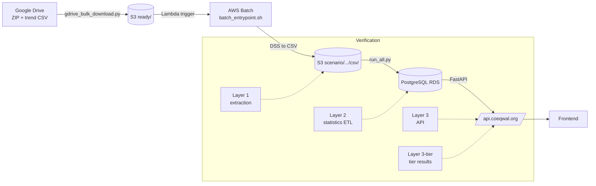

# Verification (ETL)

How we make sure the COEQWAL pipeline produces correct data, and what
record we leave behind when it does. This is the source-of-truth
verification doc for the backend: orientation for new hires, layered
walkthrough for ETL developers, paste-ready commands, and
the audit-artifact index. (`docs/VERIFICATION.md` and
`docs/AUDITS_AND_VERIFICATION.md` previously held subsets of this
content. They were folded in here so there is one place to read.)

---

## 1. Verification vs auditing

Two related but distinct activities:

- **Verification** answers "is this data correct right now?" by
  re-deriving a value through an independent path and comparing.
  Examples: re-opening a HEC-DSS file and comparing its units to the
  extracted CSV, recomputing a reservoir percentile from S3 CSVs and
  comparing to the database, hitting the public API and comparing its
  response to a direct database query.
- **Auditing** answers "what happened, when, and to which bytes?" by
  leaving a tamper-evident paper trail. Examples: SHA-256 hashes on
  every ZIP, sidecar JSON records on every uploaded artifact, the
  monthly database snapshot, the per-orchestrator-run `pipeline_state.json`,
  the `audit.md` that summarizes a download / upload pass.

Verification is the active check. Auditing is the passive record.
Together they give forensic traceability from a number on the website
back to the modeling team's original DSS file.

---

## Four checks, in plain English

Four correctness checks live in the codebase, one per place the
pipeline can go wrong. The same four are referenced later in this
document as Layers 1, 2, 3, and 3-tier (see [§3](#3-verification-layers-overview)),
but the layer numbering is just a lookup index. The plain-English
version is what to read first.

1. **Did the DSS file convert to CSV correctly?** Inside every Batch
   job, the container runs
   [`validate_csvs.py`](../batch-container/python-code/validate_csvs.py)
   to compare each extracted CSV against the modeling team's "trend
   report" reference CSV, column by column with tolerances. Automatic,
   runs on every ingest.
2. **Did the statistics get loaded into Postgres correctly?**
   (experimental, under development)
   [`verify_all_sections.py`](../statistics/verify_all_sections.py)
   is a developer diagnostic, not an automated pipeline step. It
   re-reads the reference DV / SV CSVs that
   [`run_all.py`](../statistics/run_all.py) consumed, independently
   recomputes the headline statistics in plain pandas, and compares
   the result against what the ETL wrote to the database. Spot check:
   every per-scenario module that
   [`run_all.py`](../statistics/run_all.py) runs has a matching
   `verify_*` function (reservoirs, urban demand units, M&I
   contractors, CWS aggregates, AG, refuge, env flows, delta). Tier
   results and a unit-conversion sanity check are also covered. Each
   function checks only a hand-curated subset of entities within that
   domain. The cross-scenario sensitivity post-processing step
   (`run_all.py --with-sensitivity`, itself experimental) is the one
   ETL output not covered. Reference CSVs must be copied to
   `etl/reference/` before running. See
   [Layer 2](#layer-2-etl-statistics-csv-to-db) below for the
   spot-check scope and the maintenance tax that comes with an
   independent verifier.
3. **Does the public API return those same numbers?**
   [`verify_api.py`](../statistics/verify_api.py) hits
   `api.coeqwal.org` over HTTP and compares the API responses against
   direct database queries.
4. **For tier data (the other pipeline): does the database match what
   the team handed us?**
   [`verify_tiers.py`](../tier_data/scripts/verify_tiers.py) compares
   rows in the `tier_result` table against the staging CSVs the team
   delivered.

Checks 2 and 3 belong to the model-run pipeline (scenario data flowing
from Google Drive through Batch into Postgres). Check 4 belongs to the
tier-data pipeline (team-delivered tier CSVs loaded straight into
Postgres). They share an output directory
(`audits/verification_reports/`) but otherwise do not depend on each
other.

---

## 2. Pipeline at a glance



---

## 3. Verification layers (overview)

Four layers, each independent. Each can run alone. Together they answer
"is everything correct end-to-end?"

| Layer | Pipeline | What it verifies | Where it runs | Command |
|---|---|---|---|---|
| **1** | Model-run | DSS extraction: extracted CSV vs modeling team's trend report CSV (column-by-column, with tolerances) | Inside every Batch job (automatic) | `validate_csvs.py` in `etl/batch-container/python-code/` |
| **2** | Model-run | Statistics in PostgreSQL vs values recomputed from reference CSVs. **Experimental, under development**: spot check on hand-curated entities, no auto-download of reference CSVs, manual invocation only. See [§5 Layer 2](#layer-2-etl-statistics-csv-to-db). | Cloud9 (developer) | `python etl/statistics/verify_all_sections.py --scenario <id>` |
| **3** | Model-run | Public API responses vs direct database queries | Cloud9 (developer) | `python etl/statistics/verify_api.py --scenario <id>` |
| **3-tier** [^tier] | Tier data | Tier results in DB / API vs the team-supplied staging CSVs | Cloud9 (developer) | `python etl/tier_data/scripts/verify_tiers.py` |

[^tier]: Layer 3-tier is the tier-data pipeline's verification step, listed here alongside the model-run layers for completeness. The model-run ETL never calls `verify_tiers.py`. See [`etl/tier_data/README.md`](../tier_data/README.md) for the tier-data workflow.

Layer 1 runs automatically on every ingest. Layers 2, 3, and
3-tier are developer-driven today and are the typical bottleneck for
releasing a new scenario. Each writes a per-scenario JSON report to
`audits/verification_reports/` (gitignored). There is no stakeholder
UI for those reports yet, see [§16 Known gaps](#16-known-gaps-and-improvement-candidates)
and the [`/verification` page](../../docs/statistics_roadmap.md#v7-layer-4-smoke-test-verification-page-renders)
roadmap item.

---

## 4. Verify one scenario end-to-end

Paste-able block for Cloud9 (or any machine with `DATABASE_URL` and AWS
credentials). Runs Layer 2, Layer 3, and Layer 3-tier in sequence for a
single scenario. Each script writes a JSON report under
`audits/verification_reports/` and prints a one-line PASS / FAIL summary.

```bash
SCENARIO=s0020

# Layer 2 (experimental, under development): statistics in DB vs values
# recomputed from reference CSVs. Requires the DV + SV CSVs to be in
# etl/reference/ first. See Layer 2 section below.
python etl/statistics/verify_all_sections.py --scenario "$SCENARIO"

# Layer 3: API responses vs direct DB queries
python etl/statistics/verify_api.py --scenario "$SCENARIO"

# Layer 3-tier: tier results in DB / API vs staging CSVs
python etl/tier_data/scripts/verify_tiers.py --scenario "$SCENARIO"
```

Useful variants:

```bash
# Layer 2 without a DB connection (uses reference CSVs only, fastest)
python etl/statistics/verify_all_sections.py --scenario s0020 --csv-only

# Layer 2 / 3 against every active scenario, with per-scenario JSON reports
python etl/statistics/verify_all_sections.py --all-scenarios \
    --report-dir audits/verification_reports
python etl/statistics/verify_api.py --all-scenarios \
    --report-dir audits/verification_reports

# Pre-flight a scenario that is NOT yet in ACTIVE_SCENARIOS (between
# the statistics load and the public-activation step)
python etl/statistics/verify_api.py --scenarios-override s0070
python etl/tier_data/scripts/verify_tiers.py --scenarios-override s0070
```

The [experimental orchestrator](#7-experimental-orchestrator) runs the database-vs-CSV check (Layer 2) on each scenario after stats load. API verification (Layer 3) and tier verification (Layer 3-tier) are separate release-gating concerns and live outside the orchestrator.

---

## 5. Each layer in detail

### Layer 1: Extraction (DSS to CSV)

Validates that `dss_to_csv.py` extracts data correctly from HEC-DSS
files. Uses `validate_csvs.py` to compare extracted CSVs against the
modeling team's trend report CSVs with configurable tolerances. Extract
records stored in `audits/validation_mismatches/{scenario_id}_extract_record.json`.

Runs automatically inside every Batch job. See
[`etl/batch-container/README.md`](../batch-container/README.md).

### Layer 2: ETL Statistics (CSV to DB)

**Status: experimental, under development.** This is a developer
diagnostic, not an automated pipeline step. It does not run after
`run_all.py`, it is not wired into CI, and the only automated caller
is the untested
[experimental orchestrator](#7-experimental-orchestrator). A developer
runs it on Cloud9 when they want an independent cross-check on the
numbers `run_all.py` wrote.

Computes expected values from reference CSVs and compares against
database values.

```bash
python etl/statistics/verify_all_sections.py --scenario s0020
python etl/statistics/verify_all_sections.py --all-scenarios --report-dir audits/verification_reports
python etl/statistics/verify_all_sections.py --scenario s0020 --csv-only  # no DB needed
```

**Sections verified.** Every per-scenario module that
[`run_all.py`](../statistics/run_all.py) runs has a matching
`verify_*` function. Each function checks only a hand-curated subset
of entities within its domain (spot check at the entity level, not a
row-by-row diff of the DB). Tier results and a unit-conversion sanity
check are also covered, listed below for completeness.

Per-scenario `run_all.py` modules (one `verify_*` function each):

- **Reservoirs** (`reservoirs`): April / Sept storage (TAF + %
  capacity), annual average, spill frequency. 8 entities listed in
  `RESERVOIR_VARS`.
- **Urban Demand Units** (`du_urban`, also called "CWS DUs" inside the
  verifier): Per-DU annual delivery (TAF) for sample DUs.
- **CWS Aggregates** (`cws_aggregate`): Annual delivery (TAF),
  shortage, reliability.
- **AG** (`ag`): SW delivery, GW pumping, demand, reliability for
  sample DUs, plus annual delivery (TAF) for aggregates.
- **M&I Contractors** (`mi`): Delivery, shortage, reliability,
  % demand met.
- **Env Flows** (`env_flows`): Average CFS, Pearson r, % unimpaired,
  % functional flows.
- **Refuge** (`refuge`): Delivery, shortage, reliability.
- **Delta** (`delta`): NDO, X2, salinity (EM / JP / RS / CO monthly
  + 14-day max).

Other sections (covered but not part of `run_all.py`'s per-scenario
loop):

- **Tiers** (tier-data pipeline, separate from the model-run ETL):
  All 9 tier codes verified against staging CSVs and DB.
- **Unit conversion**: Sanity check on CFS to TAF and similar
  conversions.

**Not covered**: cross-scenario sensitivity output written by
`run_all.py --with-sensitivity` (itself an experimental analysis
step). There is no `verify_sensitivity` function. See
[§18 Roadmap](#18-roadmap) item 6.

**Tolerances**: `abs_tol = 0.5`, `rel_tol = 0.01` (configurable per
check). Output: `audits/verification_reports/{scenario_id}_layer2.json`.

**Reference CSV requirement.** The verifier reads DV and SV CSVs from
`etl/reference/` (gitignored). Populate it manually before running:

```bash
aws s3 cp s3://coeqwal-model-run/scenario/s0020/csv/s0020_coeqwal_calsim_output.csv etl/reference/
aws s3 cp s3://coeqwal-model-run/scenario/s0020/csv/s0020_coeqwal_sv_input.csv etl/reference/
```

For an all-scenarios sweep, copy both CSVs for each scenario. The
verifier does not auto-download missing files. Two production ETL
modules ([`du_urban/calculate_du_statistics_v2.py`](../statistics/du_urban/calculate_du_statistics_v2.py)
and [`mi/calculate_mi_statistics.py`](../statistics/mi/calculate_mi_statistics.py))
also accept a `use_local` flag that reads from this same directory,
but the other calculators stream from S3 only. That asymmetry is a
known gap.

#### Maintenance tax

Because the verifier is an independent reimplementation rather than a
re-run of `run_all.py`'s code path, it has to be updated when the ETL
changes in two cases:

1. **New entity or new variable added to the ETL.** The verifier's
   hand-curated lists (`RESERVOIR_VARS`, `FLOW_VARS`, the per-section
   coverage tuples) need a matching entry. If you skip this step the
   verifier silently under-covers the new addition: it still passes,
   but it never actually checks the new rows.
2. **Existing metric's definition changes** (water-year vs
   calendar-year window, units, included months, multi-arc summing,
   percentile method, ...). The verifier's plain-pandas recomputation
   has to be updated to match. If you skip this step the verifier
   fails every scenario legitimately, even though the ETL and the
   recomputation are each internally correct, just disagreeing about
   the metric definition.

This is the price of an independent verifier. It catches bugs in
either code path that an in-place re-run of the same code could not
catch, but it has to be kept in sync by hand. The roadmap comment at
the top of [`verify_all_sections.py`](../statistics/verify_all_sections.py)
lines 70 to 79 proposes auto-deriving coverage from `domain_family_map`
or the seed CSVs so case 1 above becomes automatic. That work has not
happened.

### Layer 3: API verification (DB to API)

Queries API endpoints and compares responses to direct database
queries.

```bash
python etl/statistics/verify_api.py --scenario s0020
python etl/statistics/verify_api.py --scenario s0020 --api-url http://localhost:8000
python etl/statistics/verify_api.py --all-scenarios
```

**Endpoints verified:**

- `GET /api/statistics/batch` (storage, CWS, AG)
- `GET /api/tiers/scenarios/{id}/tiers` (all 9 tier codes)
- `GET /api/statistics/scenarios/{id}/channels/period-summary` (env
  flow)

Output: `audits/verification_reports/{scenario_id}_layer3.json`.

### Layer 3-tier: tier data verification

Compares staging CSVs against live API responses for every tier code.

```bash
python etl/tier_data/scripts/verify_tiers.py
python etl/tier_data/scripts/verify_tiers.py --scenario s0020
python etl/tier_data/scripts/verify_tiers.py --tier CWS_DEL
```

Output: stdout / exit code. (See known-gaps below for stamping
follow-up.)

### Layer 4: Public status page (not built)

Reading the Layer 2 / Layer 3 / Layer 3-tier JSON reports under
`audits/verification_reports/` is the only stakeholder-facing surface
today. A `/verification` page on the frontend, backed by an
`/api/verification/status` endpoint, is on the roadmap, see
[`docs/statistics_roadmap.md` V7](../../docs/statistics_roadmap.md#v7-layer-4-smoke-test-verification-page-renders).

---

## 6. Validation framework

### Tolerance parameters

- **Absolute tolerance (`abs_tol`)**: Maximum allowed absolute
  difference between values. Used for values close to zero where
  relative comparison is not meaningful. Example: `abs_tol = 1e-6`
  means values must be within +/-0.000001 units.
- **Relative tolerance (`rel_tol`)**: Maximum allowed relative
  difference as a fraction. Used for larger values where proportional
  differences matter more. Example: `rel_tol = 1e-6` means values must
  be within 0.0001% of each other.

### Validation logic

Values are considered equal if both are NaN OR within tolerances:

```python
np.isclose(value1, value2, atol=abs_tol, rtol=rel_tol, equal_nan=True)
```

Default tolerances: `1e-6` absolute and relative for unit-checked
passthroughs, `0.5` absolute / `0.01` relative for human-scale
magnitudes. Compares all common variables between reference and
extracted data. Reports mismatches with exact differences. Status: PASS
/ FAIL with per-section summaries.

---

## 7. Experimental orchestrator

[`etl/run_full_pipeline.py`](../run_full_pipeline.py) wires the scan,
download, promote, Batch poll, statistics, and verification stages
into one subprocess driver, resumable via `--resume`. The `--verify`
flag runs [`verify_all_sections.py`](../statistics/verify_all_sections.py)
per scenario, which is the database-vs-CSV check appropriate for the
model-run pipeline (Layer 2 in the table above). API verification
(Layer 3, `verify_api.py`) is a separate release-gating step the
developer runs after the orchestrator finishes. Tier verification
(Layer 3-tier, `verify_tiers.py`) belongs to the tier-data pipeline.

The orchestrator has not been exercised end-to-end against AWS at
handoff time, and a few real caveats matter before reaching for it
(untested status, `--batch-timeout` budget, serial stats stage, no
`audit.md` regen, no automatic activation). Those caveats live in
[`etl/README.md` Experimental orchestrator](../README.md#experimental-orchestrator).
The recommended direct-script workflow is the
[`etl/README.md` Pipeline stage roadmap](../README.md#pipeline-stage-roadmap).

For a read-only snapshot of where every stage stands right now ("how
stale is my latest stats audit? are there active Batch jobs? does
psql connect?"), run `python etl/status.py`.

---

## 8. Audit artifacts per stage

Every stage leaves something on disk or in S3 that a later reader can
use to reconstruct what happened. The table groups artifacts by stage
in pipeline order. S3-resident records survive a fresh Cloud9 checkout.
Local files under `audit_reports/` and `audits/` are gitignored on
purpose because they grow per run, with `etl/ingestion/audit.md` as the
one tracked exception.

| Stage | Artifact | Location | What it contains |
|---|---|---|---|
| Ingestion (Drive -> S3) | `ingest_state.json` | `etl/ingestion/audit_reports/` (gitignored) | Per-row scan and download outcomes for the most recent `gdrive_bulk_download.py` run |
| Ingestion (Drive -> S3) | `ingest_record.json` | `s3://<bucket>/scenario/<id>/` | Per-scenario provenance: source spreadsheet row, Drive file IDs, SHA-256 hashes on the ZIP / SV / DV / trend CSV, spreadsheet row, ingest timestamp |
| Ingestion (Drive -> S3) | Trend report CSV | `s3://<bucket>/scenario/<id>/verify/*.csv` | Modeling-team reference used as the Layer 1 validation source. SHA-256 recorded in `ingest_record.json` |
| Ingestion (developer-facing audit) | `audit.md` | `etl/ingestion/` (tracked once a developer commits it) | Cross-references `ingest_state.json` against S3 evidence. "What needs your attention" is empty when everything succeeded |
| Batch extraction | `extract_record.json` | `s3://<bucket>/scenario/<id>/` | Per-scenario extraction provenance: DSS basenames, extracted CSV sizes, `validate_csvs.py` summary |
| Batch extraction | `<id>_validation_mismatches.csv` | `s3://<bucket>/scenario/<id>/validation/` | Per-row Layer 1 mismatches between extracted CSV and trend report. Written only on validation failure |
| Batch extraction | `validation_mismatches/<scenario>_extract_record.json` | `audits/validation_mismatches/` (gitignored) | Local mirror of `extract_record.json` for developer review |
| Batch extraction | CloudWatch and Batch logs | `/aws/batch/job/...`, `/aws/lambda/coeqwalEtlTrigger` | Runtime trace for the trigger Lambda, DSS-to-CSV conversion, and `validate_csvs.py`. First place to look when a job fails |
| Orchestrator | `pipeline_state.json` | `etl/ingestion/audit_reports/pipeline_runs/<ts>/` | Stage outcomes per scenario for one `run_full_pipeline.py` invocation. Used for `--resume` |
| Orchestrator | `pipeline_summary.md` | `etl/ingestion/audit_reports/pipeline_runs/<ts>/` | Human-readable end-of-run summary for that pipeline invocation |
| Statistics | `stats_audit_<ts>.csv` | `etl/statistics/audit_reports/` (gitignored) | Per-scenario row counts written by `run_all.py` |
| Statistics | `duplicate_scan_results.csv`, `duplicate_scan_results_units.csv` | `etl/statistics/audit_reports/` (gitignored) | Cross-scenario duplicate B-part scan and unit-declaration consistency from `scan_dupes.py` |
| Tier data load | `tier_upload_manifest.csv` | `etl/tier_data/staging/` (tracked) | Per-row manifest of the tier data the last `load_all_tier_results.py` run intends to write. Consumed by `--verify` |
| Tier data geometry audit | `audit_tier_location_geometry` JSON | path passed to `--json` | Coverage check for tier-location geometry against entity attributes. Non-zero exit when gaps are found |
| Verification (Layer 2) | `<scenario>_layer2.json` | `audits/verification_reports/` (gitignored) | Per-check pass / fail / skip from `verify_all_sections.py` |
| Verification (Layer 3) | `<scenario>_layer3.json` | `audits/verification_reports/` (gitignored) | Per-endpoint pass / fail from `verify_api.py` |
| Verification (tiers) | `tiers_<ts>.json` | `audits/verification_reports/` (gitignored) | Per-tier-code OK / mismatch / missing from `verify_tiers.py` |
| Monthly DB audit | `audits/monthly_YYYYMMDD_HHMMSS/` | `audits/` (tracked, except tarballs) | Container directory for one full database snapshot. See [§10](#10-monthly-database-audit) |
| Monthly DB audit | `report.md`, `schema_snapshot.json`, `tables_summary.csv`, `layer_exports/**/*.csv`, `results_samples/*_{head,tail}.csv` | inside each `audits/monthly_*/` directory | Markdown report, full schema, per-table row counts, full reference and entity exports, head/tail samples of layer-10+ result tables |

**What survives a fresh checkout.** S3-resident records
(`ingest_record.json`, `extract_record.json`, trend report CSV, per-row
mismatches CSV) survive because they live in S3, not the repo. The
tracked `audits/monthly_*/` directories survive because they are in
git. Everything under `etl/**/audit_reports/`,
`audits/verification_reports/`, and `audits/validation_mismatches/` is
gitignored and grows per run, so a fresh clone has none of it.

**`etl/ingestion/audit.md` is in a third category.** Tracked once a
developer generates and commits it, not present in a fresh clone.
See [§15 Git tracking policy](#15-git-tracking-policy) for the full
rule.

### Receipt vs scoreboard: `ingest_record.json` vs `ingest_state.json`

Both files are written by `gdrive_bulk_download.py` and both record
hashes plus per-scenario outcomes. They look similar from a distance and
trip up new readers. They solve different problems.

**`ingest_record.json` is the per-scenario receipt.** One file per
scenario at `s3://<bucket>/scenario/<id>/ingest_record.json`. Write-once,
kept forever. Travels with the ZIP and carries the five SHA-256 hashes
(see [§9](#9-hashes-and-provenance)), the expected SV/DV filenames and
in-zip paths, the filesizes, and an `ingestion.path` field of
`"automatic"` (normal flow) or `"manual_inferred"` (Lambda fallback when
no upstream record was found). Read by the Batch container at extract
time and by `etl/ingestion/tools/audit.py` from S3 when rendering
`audit.md` across all scenarios.

**`ingest_state.json` is the per-run scoreboard.** Single file at
`etl/ingestion/audit_reports/ingest_state.json` on the developer's
machine. Gitignored. Overwritten in place every run. Two top-level
blocks: `scan` (rewritten by `gdrive_bulk_download.py scan`) and
`download` (rewritten by `gdrive_bulk_download.py download`). Inside
each block, scenarios are keyed by `short_code` for O(1) lookup. Read
by `audit.py` (download block, as one of three inputs to `audit.md`),
by `etl/ingestion/tools/show_last_run.py` (terminal summary), by
`etl/status.py` (freshness probe), and by `etl/run_full_pipeline.py`
(resume logic).

**One-sentence framing.** `ingest_record.json` is the durable
per-artifact provenance in S3. `ingest_state.json` is the
developer-machine record of the most recent `gdrive_bulk_download.py`
invocation.

### Two pipelines, same audit pattern

The ingest pipeline and the statistics pipeline are structured to follow
the same audit shape. Once the pattern is in your head, you do not need
a separate playbook for each one.

```
       INGEST PIPELINE                    STATISTICS PIPELINE
       ===============                    ===================

       gdrive_bulk_download.py            etl/statistics/run_all.py
             |                                   |
             v                                   v
       console output                      console output
       (per-scenario progress              (per-(scenario, module) progress
       + end-of-run audit summary)         + totals + errors at the end)
             |                                   |
             v                                   v
       [local, gitignored]                 [local, gitignored]
       audit_reports/                      audit_reports/
       ingest_state.json                   stats_audit_<ts>.csv
       (per-run scoreboard)                (per-run scoreboard)
             |
             v
       [tracked]                           (no tracked digest today,
       etl/ingestion/audit.md               see Known gaps below)
       (cross-scenario digest,
       "what needs attention")
             |
             v
       teammates see it on `git pull`
```

**The pattern in one sentence.** Console logs show what just happened.
The per-run scoreboard lets you re-read the console once it scrolls.
The cross-scenario digest is what other developers see. Drill into
forensic artifacts (per-row mismatches, CloudWatch traces, error
columns) only when one of the levels above flags something.

**One asymmetry.** Ingest has a tracked digest,
`etl/ingestion/audit.md`, that surfaces to the whole team on `git
pull`. Statistics has no equivalent today. If a teammate did not run
`run_all.py` themselves, they have to re-run it or open the gitignored
scorecard. Closing that gap is called out in
[§16](#16-known-gaps-and-improvement-candidates).

### Reading the scan summary

`gdrive_bulk_download.py scan` walks each scenario's Drive folder
without touching S3 and closes with a `SCAN AUDIT SUMMARY` block.
The block has three parts in this order: a totals header, a
per-scenario table, and (only when needed) a `SCENARIOS REQUIRING
ATTENTION` block.

**The status counters.** Each scenario's `status` field is built
from the checks in
[`scan_scenario`](../ingestion/lib/commands.py) and bucketed in
[`write_scan_audit`](../ingestion/lib/commands.py). The six totals
mean:

| Counter | What it counts | What to do about it |
|---|---|---|
| `OK (clean)` | Scenarios whose status came out exactly `"OK"`. The Drive folder is reachable, exactly one ZIP exists in `Model_Files/` (or a pinned ZIP matches), exactly one trend CSV exists (or a pinned trend CSV matches), and the Drive folder name matches the `DV_Path` root. | Nothing. Ready to download as-is. |
| `Missing files` | Scenarios whose status includes `MISSING_ZIP` or `NO_TREND_REPORT`. The Drive folder is reachable but expected files are absent. | Ask the WAM team to upload the missing ZIP or trend CSV, or correct the `drive_folder_url` in the working CSV if it points at the wrong folder. |
| `Multiple (need pin)` | Scenarios whose status includes `MULTIPLE_ZIPS_NO_PIN` or `MULTIPLE_TREND_REPORTS`. More than one candidate file exists and no pin is set. | Set `pinned_model_run_zip` or `pinned_trend_csv` in the working CSV (see [Where to set pins](#where-to-set-pins) below). The console log line names every candidate, so you can pick the right one by inspection. |
| `Folder mismatches` | Scenarios whose status includes `FOLDER_MISMATCH`. The Drive folder name is not the same as the `DV_Path` root segment, which is the convention every model run is supposed to follow. | Confirm the right Drive folder is linked. If yes, either rename the folder upstream or update `DV_Path` in the working CSV so they agree. |
| `No drive access` | Scenarios whose status is `NO_DRIVE_ACCESS`. Neither `drive_folder_id` nor a folder-name path is set. | Add `ModelFilesLink` (a Drive URL) or `GoogleDriveFolderName` to the working CSV row. |
| `Local-only entries` | Scenarios scanned with `--local-only`. Drive is bypassed entirely and a stub row is written. The line only prints when this count is non-zero. | Nothing. Used when the developer has no Drive access but wants to record the scenarios in the listing for the next person. |

**The per-scenario table.** One row per scenario, with six columns.

| Column | What it shows |
|---|---|
| `Scenario` | The scenario `short_code` from the working CSV (e.g. `s0042`). Same id used throughout the codebase (S3 prefixes `scenario/<id>/`, database `scenario.short_code`, `audit.md` headings, `ACTIVE_SCENARIOS`). |
| `Via` | How the scan reached the Drive folder, resolved in [`_resolve_drive_access`](../ingestion/lib/worker.py). `id` = `ModelFilesLink` parsed cleanly to a Drive folder ID. Preferred, robust to upstream folder renames. `path` = fell back to walking the Shared Drive by `GoogleDriveFolderName` or the `DV_Path` root. Fragile: an upstream rename silently breaks the lookup. `none` = neither was usable. Status becomes `NO_DRIVE_ACCESS`. |
| `Zips` | Count of `.zip` files in the scenario's `Model_Files/` folder. `0` fires `MISSING_ZIP`. `1` is the happy path. `2+` without `pinned_model_run_zip` fires `MULTIPLE_ZIPS_NO_PIN`. The full list of candidate filenames prints to the log just above the summary block. |
| `CSVs` | Count of trend report CSV files in `Data_Extraction/Variables_From_trend_report_variables_v5/`. The trend report is the Layer 1 reference for Batch validation. `0` fires `NO_TREND_REPORT`. `1` is the happy path. `2+` without `pinned_trend_csv` fires `MULTIPLE_TREND_REPORTS`. |
| `Match` | Folder-name convention check. `OK` = the Drive folder name equals the `DV_Path` root segment from the working CSV. `MISMATCH` = they disagree, and the row's `Status` will also include `FOLDER_MISMATCH`. `NO_DV_PATH` = the working CSV row has no `DV_Path` to compare against, so the check is skipped (not failed). |
| `Status` | Pipe-delimited list of failure codes for the row, or `OK` if nothing fired. Composable. Example: `MULTIPLE_ZIPS_NO_PIN\|FOLDER_MISMATCH` means two ZIPs without a pin AND the folder name has drifted from `DV_Path`. The totals header buckets by substring (`"MISSING" in status`, `"MULTIPLE" in status`, etc.), so a composite row counts in more than one totals bucket. |

#### Why there is no `NO_SV_PATH`

The `Match` check compares the Drive folder name against the
`DV_Path` root only, not the `SV_Path` root. The two are siblings
inside the same scenario folder by convention
(`<short_code>_<descriptive>/DV/...` and
`<short_code>_<descriptive>/SV/...`), so checking one root segment
is enough to flag a folder-name drift. The DV side is anchored
because the DV file is the conventional primary deliverable for a
run, but the same check would work against SV. SV path correctness
is enforced later, at the download stage, as `MISSING_EXPECTED_SV`
or `EXPECTED_SV_NOT_IN_ZIP` (see [Reading the download
summary](#reading-the-download-summary)).

**The attention block.** Printed only when at least one row is
non-OK and non-LOCAL_ONLY. Each entry repeats the scenario id and
its status, then carries the candidate ZIP names, candidate trend
CSV names, and the Drive folder name versus the `DV_Path` root if
the mismatch fired.

**Clean-run signal.** `OK (clean)` equals `Total scenarios` and no
attention block follows.

**Re-inspect later.** `python etl/ingestion/tools/show_last_run.py
--stage scan` reads the saved scan block out of
`ingest_state.json` and re-prints the per-scenario table. It does
not call Drive or S3, so it is the cheap replay option when the
terminal has scrolled or you ran the scan a while ago.

#### Where to set pins

The Drive folder for a scenario sometimes contains more than one
candidate ZIP or trend CSV (older versions left in place,
intermediate exports, etc.). The pipeline never guesses. Pinning
tells `gdrive_bulk_download.py` which exact filename to pick.

The pin columns live in the working CSV at
[`etl/ingestion/scenario_listing/model_run_file_source_working.csv`](../ingestion/scenario_listing/model_run_file_source_working.csv):

- `pinned_model_run_zip` (column 13): exact filename of the ZIP to
  download, e.g. `Run_DCRadjBL_2020LU_wTUCP_v2.zip`.
- `pinned_trend_csv` (column 14): exact filename of the trend
  report CSV to use as the Layer 1 reference, e.g.
  `s0020_trend_report.csv`.

Both are matched as literal strings against the names the scan
logged. If the pinned filename is not present in Drive, the row
fails with `PINNED_ZIP_NOT_FOUND` or `PINNED_TREND_NOT_FOUND` and
the scenario shows up in `Skipped (review)` on the next download.

### Reading the download summary

`gdrive_bulk_download.py download` writes each scenario through
the `IngestionError`-aware
[`process_scenario`](../ingestion/lib/worker.py) and closes with a
`DOWNLOAD & VALIDATION SUMMARY` block. `Skipped (review)` counts
any row whose `validation_status` is not `OK`, `DRY_RUN`, or empty.
Skipped rows do not stage to S3 and do not promote. They survive
in `ingest_state.json::download` for `audit.py` to surface in
`audit.md`.

**Why a scenario gets skipped.** The error codes are raised as
`IngestionError(code, message)` from
[`etl/ingestion/lib/worker.py`](../ingestion/lib/worker.py) and
[`etl/ingestion/lib/zip_validation.py`](../ingestion/lib/zip_validation.py).
Each is captured in the audit row's `error_code` and `error_message`
fields. Grouped by where the fix lives:

| Error code | What it means | Where to fix |
|---|---|---|
| `NO_DRIVE_ACCESS` | No Drive folder ID and no folder-name path was provided | Working CSV: set `ModelFilesLink` (Drive URL) or `GoogleDriveFolderName` |
| `MISSING_ZIP` | Drive folder reachable, no `.zip` files inside | Upstream (ask the WAM team to upload), or fix the folder URL in the working CSV if it points at the wrong place |
| `MULTIPLE_ZIPS_NO_PIN` | More than one ZIP in `Model_Files/` and no pin set | Working CSV: set `pinned_model_run_zip` (see [Where to set pins](#where-to-set-pins)) |
| `PINNED_ZIP_NOT_FOUND` | The pinned ZIP name does not match any file in Drive | Working CSV: fix the spelling of `pinned_model_run_zip`, or remove it if Drive only has one ZIP now |
| `DOWNLOAD_FAILED` | rclone could not pull the ZIP to local disk | Re-run (transient), check rclone remote / credentials, check disk space |
| `BAD_ZIP` | The downloaded ZIP is corrupt | Upstream re-upload, or re-run if you suspect a partial download |
| `NO_DSS_IN_ZIP` | The ZIP contains no `.dss` files | Upstream (wrong file packaged) |
| `MISSING_EXPECTED_SV`, `MISSING_EXPECTED_DV` | `SV_Path` or `DV_Path` is empty in the working CSV | Working CSV: fill in the path |
| `EXPECTED_SV_NOT_IN_ZIP`, `EXPECTED_DV_NOT_IN_ZIP` | The basename the working CSV declared is not present in the ZIP | Working CSV: correct `SV_Path` / `DV_Path` to match what the ZIP actually contains, OR ask upstream to repackage the ZIP |
| `MULTI_MATCH_SV`, `MULTI_MATCH_DV` | The expected SV / DV basename matched more than one non-excluded path inside the ZIP | Upstream repackage (extra copies of the DSS file in the ZIP), or extend the exclude list if it is a known archival pattern |
| `WORKER_ERROR` | Unhandled exception in the per-scenario worker thread | Inspect the printed traceback. Re-run after fixing. If it reproduces, file an issue |

**Clean-run signal.** `OK: N`, `Skipped (review): 0`, no
follow-up block. The auto-run audit that follows reports
`M = 0` need developer action with all parenthesized counts at
zero.

**Re-inspect later.** `python etl/ingestion/tools/show_last_run.py
--stage download` re-prints the saved download block with per-row
status and SHA-256 hashes.

### Reading the ingestion audit

The top-level README asserts what the developer reads. This is the
function-level wiring that produces it. The whole file comes from one
call to `_render` ([`etl/ingestion/tools/audit.py:604`](../ingestion/tools/audit.py)),
which walks every `scenario/<id>/` prefix in S3, loads `ingest_record.json`
and `extract_record.json` for each, and appends three sections to
`audit.md` in order.

**Section 1: `## Run summary` (counts).** Built by `_render_summary`
([`audit.py:306-326`](../ingestion/tools/audit.py)). One small markdown
table. The `Validation failures` row is `len(validation_failures)`,
computed at `audit.py:633-637` by filtering every loaded
`extract_record.json` for `validation.result == "failed"`. A value of
`0` means the audit walked every `extract_record.json` in S3 and none
of them reported a Trend-Report mismatch.

**Section 2: `## What needs your attention` (named drill-down).** Built
by `_render_attention` ([`audit.py:357-446`](../ingestion/tools/audit.py)).
This is the section that answers "which scenarios?". For every entry in
the `validation_failures` list it emits a subsection of the form:

```text
#### s0042 - VALIDATION_FAILED

s0042: validation failed against the trend report
(<N> cell(s) across <M> column(s) in <DV_basename>).
Either the trend report or the extracted CSV is wrong.
Pull the mismatches CSV and triage:
aws s3 cp s3://<bucket>/scenario/s0042/validation/s0042_validation_mismatches.csv -
```

The action message comes from `_action_for_validation_failure`
([`audit.py:252-275`](../ingestion/tools/audit.py)), which reads
`extract_record.validation.{mismatch_cells, mismatch_columns, target,
mismatches_csv_key}` and assembles the `aws s3 cp` line from the
recorded S3 key.

**Section 3: `## Active scenarios` (per-scenario detail).** Built by
`_render_active_table` ([`audit.py:493`](../ingestion/tools/audit.py)).
By default this section hides rows whose status is `OK`, so a
100-scenario run with three validation failures renders three blocks
plus any other non-OK rows. Each block shows:

```text
### s0042 - VALIDATION_FAILED

- Ingestion path: standard
- Trend CSV: `s0042_dv_trend.csv`
- Batch status: SUCCEEDED
- Batch job id: <aws-job-id>
- Validation: failed (<N> cell(s) across <M> column(s) in <DV_basename>)
- Mismatches CSV: s3://<bucket>/scenario/s0042/validation/s0042_validation_mismatches.csv
```

(Fields composed at `audit.py:557-577`.) This is where the Batch job id
lives, for CloudWatch lookup, alongside the same S3 mismatches CSV key
the attention block already surfaced.

**Other failure modes share the same shape.** `_render_attention`
groups by failure category, so a single run with both validation and
extraction problems emits one `### Validation failed` subsection and
one `### Batch extraction failed or partial` subsection, each with
named per-scenario blocks. Convention warnings, scenarios missing an
ingest record, and locally-skipped rows each get their own subsection.
The `Run summary` count above each category is the headline integer
for that category.

**When `audit.md` is stale.** `_render` runs against whatever is in S3
at the moment the script is invoked. If Batch jobs are still in flight
when `gdrive_bulk_download.py download` auto-renders the audit, the
`Validation failures` count reflects only the jobs that have written an
`extract_record.json` so far. Re-run `python etl/ingestion/tools/audit.py`
once Batch wraps to pick up the late writes. `etl/status.py` (the
`batch` section) reports the modification time of every
`extract_record.json` it can find, which is the cheap way to confirm
the audit is current before reading it.

---

### Checking that Batch finished cleanly

After `gdrive_bulk_download.py promote`, Batch runs asynchronously,
roughly 5-30 minutes wall time per scenario (~20 minutes for a large
CalSim run). Parallelism comes from Batch's compute environment
auto-scaling Fargate Spot containers up to its max-vCPU cap, not from
threading inside a job. To find out whether every promoted scenario
landed cleanly, run one command:

```bash
python etl/ingestion/tools/audit.py
```

It walks S3, rewrites
[`etl/ingestion/audit.md`](../ingestion/audit.md), and prints two
console lines. The first is the headline action count:
`Summary: N active scenarios in S3, M need developer action
(extraction failures: X, validation failures: Y, convention
warnings: Z).` The second is the symmetric breakdown:
`Validation: K passed, F failed, S skipped, W awaiting extraction.`
If `M` is zero, Batch finished cleanly and the digest is up to date. If `M` is non-zero, the named scenarios are in the
digest's "What needs your attention" section with the per-scenario
action attached (Batch job id, mismatches CSV key, retrigger
command).

**When validation flags a scenario, you must open
`s3://<bucket>/scenario/<id>/validation/<id>_validation_mismatches.csv`.**
This is the per-row diff between the extracted CSV and the WAM
team's trend report (Layer 1 check, written by `validate_csvs.py`
inside the Batch container, uploaded only on failure). The audit's
"What needs your attention" block prints the exact `aws s3 cp`
command for each flagged scenario. Open the CSV, decide whether the
trend report or the extracted CSV is the stale one, update whichever
is wrong, then re-extract with
`bash etl/ingestion/tools/retrigger_extraction.sh --go sXXX`.

For a stubbornly slow or OOM-prone scenario, bump per-job resources
with `python etl/ingestion/tools/reextract_all_scenarios.py
--scenarios sXXX --memory 32768 --vcpus 4`. See
[`etl/batch-container/README.md`](../batch-container/README.md) for
the job-definition defaults (currently 2 vCPU, 16 GiB) and the OOM
history that led to those values.

**What `audit.md` looks like after Batch.** Three sections in this
order: `## Run summary` (the `Validation failures` count is the
headline), `## What needs your attention` (each flagged scenario by
`short_code` with the mismatch count, the diverging DV basename, and
the exact `aws s3 cp` command for the per-row CSV), and
`## Active scenarios` (per-scenario blocks for non-OK rows with
Batch job id and mismatches CSV key). See
[Reading the ingestion audit](#reading-the-ingestion-audit) for the
function-level wiring.

**Optional probes (not extra steps).** While Batch is still running,
tail the Lambda dispatch log to confirm each ZIP fired a job:
`aws logs tail /aws/lambda/coeqwalEtlTrigger --follow` (look for
`Submitted Batch job ...`). For raw Batch job logs, use CloudWatch
under `/aws/batch/job/...`. For a fast "is anything still running"
probe with no S3 walk and no digest update, `python etl/status.py`
reports active and recently-terminated job counts from the queue.
For per-scenario drill-down on something the audit flagged, fetch
the extract record directly:
`aws s3 cp s3://coeqwal-model-run/scenario/<id>/extract_record.json - | python -m json.tool`.

**Validation indicators, in triage order.** Four signals answer
four questions:

1. **Did anything fail, and what was the breakdown?** The `audit.py`
   console prints two lines. The first is the headline action
   count: `Summary: N active scenarios in S3, M need developer
   action (extraction failures: X, validation failures: Y,
   convention warnings: Z).` The second is the symmetric breakdown:
   `Validation: K passed, F failed, S skipped, W awaiting
   extraction.` The same numbers appear in `audit.md`'s `## Run
   summary` table under `Validation failures` (the count) and
   `Validation breakdown` (the symmetric line).
2. **Which scenarios failed and what do I run?** `audit.md`
   `## What needs your attention`. Each failed scenario gets an
   action block naming the diverging file, the mismatch counts, and
   the exact `aws s3 cp` and `retrigger_extraction.sh` commands.
3. **What about every other scenario?** `audit.md` `## Active
   scenarios` table, `status` column. One row per active scenario
   in S3, with values `OK`, `VALIDATION_FAILED`, `FAILED`,
   `PARTIAL`, `AWAITING_EXTRACTION`, or `NO_INGEST_RECORD`.
4. **What rows mismatched and by how much?**
   `s3://<bucket>/scenario/<id>/validation/<id>_validation_mismatches.csv`.
   Per-cell diff (date, B, C, ref value, file value, abs diff,
   mismatch type). Uploaded whenever validation ran, header-only on
   pass, populated on fail. The audit hands you the `aws s3 cp`
   command for it in step 2.

---

### After a run: what to read

The artifact table above is the full menu. You do not read all of it
after every run. Each kind of run follows the same shape: **console
first, then the scoreboard or digest if the console scrolled, then
forensic detail only if something was flagged.** Stop at the first
level that gives a clean answer.

**After `gdrive_bulk_download.py download`:**

1. **Console.** `gdrive_bulk_download.py` prints per-scenario progress
   during the run, then closes with a `DOWNLOAD & VALIDATION SUMMARY`
   block (`Total scenarios`, `OK`, `Skipped (review)`). If `Skipped
   (review)` is non-zero, a `SCENARIOS REQUIRING REVIEW` block lists
   each flagged scenario. The auto-run audit then prints two lines:
   `Audit written to etl/ingestion/audit.md. Review and commit it
   manually when ready.`, then `Summary: N active scenarios in S3,
   M need developer action (extraction failures: ..., validation
   failures: ..., convention warnings: ...).`, then `Validation: K
   passed, F failed, S skipped, W awaiting extraction.` A clean run
   reads `M = 0`, all parenthesized counts at zero, and `W` equal to
   the number of scenarios just staged (still waiting for Batch).
2. **Open `etl/ingestion/audit.md`.** Top to bottom: `## Run summary`
   (counts including `Validation failures`), `## What needs your
   attention` (each flagged scenario by `short_code` with mismatch
   counts and the `aws s3 cp` command for its per-row CSV), then
   `## Active scenarios` (per-scenario block for each non-OK row with
   Batch job id). See
   [Reading the ingestion audit](#reading-the-ingestion-audit)
   above for the function-level wiring.
3. **If a scenario is flagged.** Follow the `aws s3 cp` command from
   step 2 to read the per-row mismatches CSV in S3. Drill into
   `s3://<bucket>/scenario/<id>/extract_record.json` for the full
   validation summary. CloudWatch and Batch logs at `/aws/batch/job/...`
   and `/aws/lambda/coeqwalEtlTrigger` for runtime traces when a job
   fails outright.

**After `etl/statistics/run_all.py`:**

1. **Console.** An `ETL PROCESSING SCORECARD` prints at the end with
   per-scenario rows (✅ / ❌ / ⏭️ / ⚪ markers), a `SUMMARY` block
   with task totals, and a `FAILURES (need attention)` block if any
   row failed.
2. **If the console scrolled.** Open
   `etl/statistics/audit_reports/stats_audit_<ts>.csv` for the
   per-(scenario, module) scorecard. Columns: `module, scenario,
   success, wall_time_sec, rows_written, error`. The `error` column
   carries the failure reason when a row fails. This file is the
   scoreboard *and* the forensic detail because statistics has no
   separate digest yet (see
   [§18 Roadmap](#18-roadmap) item 1).

**After `etl/tier_data/scripts/load_all_tier_results.py`:**

1. **Console.** Per-tier row-count lines (e.g. `CWS_DEL: N location
   records, M scenario aggregates`), then `Manifest written:
   etl/tier_data/staging/tier_upload_manifest.csv` with totals. The
   manifest is regenerated on every normal run. The actual UPSERT
   row counts come from the `psql -f` step that applies the generated
   SQL, not from this Python script.
2. **Confirm the load.** Re-run `load_all_tier_results.py --verify` to
   compare the database against the manifest. This *compares*, it
   does not regenerate the manifest.

**After `verify_all_sections.py`, `verify_api.py`, or `verify_tiers.py`:**

1. **Console.** A multi-line `VERIFICATION SUMMARY` block per scenario
   with check counts (`PASS`, `FAIL`, `Skipped`, `No DB data`). Any
   failures get a `FAILED CHECKS` list under each scenario. A final
   scorecard summarizes per-section PASS / FAIL.
2. **If a scenario has any FAIL.** Open the JSON report it wrote:
   `audits/verification_reports/<scenario>_layer2.json` from
   `verify_all_sections.py`, `<scenario>_layer3.json` from
   `verify_api.py`, `tiers_<ts>.json` from `verify_tiers.py`. Each
   has per-check detail.

**After `database/audit/run_monthly_audit.py`:**

1. **Console.** A `MONTHLY AUDIT COMPLETE` block prints with elapsed
   time, the output directory path, and the report filename. Open the
   named `audits/monthly_<ts>/report.md` for the top-level summary
   (row counts, ERD diff, audit-field checks). If nothing is flagged,
   you are done.
2. **If a section is flagged.** Drill into per-table CSVs under
   `audits/monthly_<ts>/layer_exports/` and
   `audits/monthly_<ts>/results_samples/`.

**Anytime ("when did X last run?"):** `python etl/status.py` reports
freshness across six sections: ingestion, batch, statistics, tiers,
verification, and database connectivity.

**Rule of thumb.** Trust the headline at each level (terminal output,
then `audit.md`, then `stats_audit_<ts>.csv` or `report.md`). The
forensic artifacts in the §8 table exist for triage. Read them only
when the headline says to.

---

## 9. Hashes and provenance

Every ingested scenario produces five SHA-256 hashes, recorded in
`ingest_record.json` and the spreadsheet-row block. These answer "is the
byte stream on the website still the byte stream the modeling team
delivered?"

| Hash | Hashed bytes | What it verifies |
|---|---|---|
| `zip` | The entire downloaded ZIP from Drive | The ZIP we stored matches what Drive had at download time |
| `sv` | The state-variable DSS file inside the ZIP | The SV input we extracted from matches the upstream SV |
| `dv` | The decision-variable DSS file inside the ZIP | The DV output we extracted from matches the upstream DV |
| `trend_csv` | The modeling team's trend report CSV | The reference we compare against in Layer 1 has not drifted |
| `spreadsheet_row` | The full row from the WAM working spreadsheet at ingest time | The provenance metadata (Drive folder ID, basenames, notes) is pinned to a specific spreadsheet snapshot |

Practical uses:

- **Spot drift**: re-hash a ZIP from S3 today and compare to the `zip`
  hash in `ingest_record.json`. A mismatch means the S3 object was
  overwritten without a fresh ingest.
- **Re-extract safely**: a Batch re-extraction never overwrites the
  source DSS files. If the new `extract_record.json` references the
  same `sv` / `dv` hashes, the inputs are unchanged.
- **Cite a scenario**: when a downstream consumer asks "which
  spreadsheet row produced this scenario?", `spreadsheet_row` is the
  answer that survives spreadsheet edits.

---

## 10. Monthly database audit

The schema + content snapshot, captured periodically as a checkpoint
against the live database.

| | |
|---|---|
| **Script** | [`database/audit/run_monthly_audit.py`](../../database/audit/run_monthly_audit.py) |
| **When** | Manual. Run before major data changes. |
| **Output** | `audits/monthly_YYYYMMDD_HHMMSS/` |

Contents:

- `report.md` - row counts, ERD diff, index sizes, audit-field checks
- `tables_summary.csv` - per-table inventory
- `schema_snapshot.json` - full schema
- `layer_exports/` - full CSV export of reference / entity / lookup
  tables
- `results_samples/` - head / tail samples of statistics result tables

```bash
cd ~/environment/coeqwal-backend
python database/audit/run_monthly_audit.py
```

**Use for:** grounding documentation, cross-checking seed CSVs against
live RDS, ERD verification, before-and-after for any seed reload or
schema change.

---

## 11. Related audit scripts

### Tier location geometry audit

| | |
|---|---|
| **Script** | [`etl/tier_data/scripts/audit_tier_location_geometry.py`](../tier_data/scripts/audit_tier_location_geometry.py) |
| **When** | Before / after tier load, when entity tables change |
| **Checks** | `tier_location` ids resolve to entity attributes and polygons |

### gw / sw classification reconciliation

| | |
|---|---|
| **Script** | [`etl/tier_data/scripts/reconcile_gw_sw_sources.py`](../tier_data/scripts/reconcile_gw_sw_sources.py) |
| **Walkthrough** | [`docs/gw_sw_reconciliation.md`](../../docs/gw_sw_reconciliation.md) |
| **When** | Before updating `du_urban_entity` gw / sw seed or any BOOL migration |

---

## 12. Automated vs developer-driven checks

```
   automatic                              developer-driven
   in-pipeline                            on Cloud9 / locally
        |                                          |
   +----+----+    +----+----+    +-----+-----+    +-----+-----+
   | Lambda  |    | Batch   |    | Layer 2   |    | Layer 3   |
   | ingest  |--->| extract |    | stats vs  |    | API vs    |
   | hashes  |    | + L1    |    | CSV       |    | DB        |
   +---------+    +---------+    +-----------+    +-----------+
                  CSV uploaded                run python                run python
                  with extract_record.json    verify_all_sections.py    verify_api.py
```

Today's split:

- **Automatic** (no developer in the loop): hashes on ingest,
  `validate_csvs.py` inside every Batch job.
- **Developer-driven** (run on Cloud9 after a scenario lands): Layer 2
  (`verify_all_sections.py`), Layer 3 (`verify_api.py`), tier
  verification (`verify_tiers.py`). Each writes a JSON report to
  `audits/verification_reports/` (gitignored).

There is no stakeholder-facing UI on top of those JSON reports yet, see
[§16 Known gaps](#16-known-gaps-and-improvement-candidates).

The developer-driven set is the typical bottleneck for releasing a new
scenario. The [experimental orchestrator](#7-experimental-orchestrator)
covers the model-run pipeline's post-ETL check (Layer 2). API
verification (Layer 3) and tier verification (Layer 3-tier) are
separate release-gating concerns the developer runs by hand.

---

## 13. Metric coverage (what is verified end-to-end vs not)

**Implemented and loaded (ETL + DB):**

| Module | Metrics | Entities | Tables |
|---|---|---|---|
| **Reservoirs** | Storage (TAF, % capacity), flood / dead pool probability, spill volume / frequency | 10 reservoirs (Shasta, Oroville, Folsom, Trinity, New Melones, Millerton, San Luis CVP / SWP / combined, Eastside Bypass) | `reservoir_storage_monthly`, `reservoir_period_summary` |
| **Urban DU** | Delivery, shortage, % demand met, reliability | 81 demand units | `du_delivery_monthly`, `du_shortage_monthly`, `du_period_summary` |
| **M&I Contractors** | Delivery, shortage, % demand met (via PERDV), reliability | 16 SWP contractors + MWD aggregate | `mi_delivery_monthly`, `mi_shortage_monthly`, `mi_contractor_period_summary` |
| **CWS Aggregates** | Delivery, shortage, reliability by project / region | 6 aggregates (SWP total / N / S, CVP total / N / S) | `cws_aggregate_monthly`, `cws_aggregate_period_summary` |
| **AG** | Demand (AW), SW delivery (DN), GW pumping (GP), shortage, reliability, GW restriction shortage | 131 demand units + 9 regional aggregates | `ag_du_demand_monthly`, `ag_du_sw_delivery_monthly`, `ag_du_gw_pumping_monthly`, `ag_du_shortage_monthly`, `ag_du_period_summary`, `ag_aggregate_monthly`, `ag_aggregate_period_summary` |
| **Refuge** | Delivery, derived shortage (demand - delivery), reliability | 18 wildlife refuge demand units | `refuge_du_delivery_monthly`, `refuge_du_shortage_monthly`, `refuge_du_period_summary` |
| **Env Flows** | Flow volume (CFS, TAF), % unimpaired, % functional flows, alteration index (Pearson r), CEFF seasonal metrics | 59 channels (20 with MIF, 17 with EFLOWS) | `env_flow_channel_monthly`, `env_flow_channel_seasonal`, `env_flow_channel_period_summary` |
| **Delta** | Net Delta Outflow (NDO), X2 position (spring / fall), salinity at Emmaton, Jersey Point, Rock Slough, Collinsville, Banks and Tracy pumping plant EC | 8 variables | `delta_monthly`, `delta_period_summary` |
| **Sensitivity** (*experimental, under development*) | Climate sensitivity (hist / CC50 / CC95 comparison), operational sensitivity (cross-scenario spread). Cross-scenario post-step, no `verify_*` coverage. | All entities from above modules | `sensitivity_climate`, `sensitivity_operational` |
| **Tiers** | CWS_DEL, AG_REV, ENV_FLOWS, RES_STOR, GW_STOR, DELTA_ECO, FW_DELTA_USES, FW_EXP, WRC_SALMON_AB | 9 tier codes | `tier_location_result` |

**Verified end-to-end (ETL + DB + API):**

- CWS: delivery volume, % of demand, absolute shortage
- AG: SW delivery, GW pumping, total shortage, shortage %, reliability
- Env Flows: volume, % unimpaired, % functional flows, alteration
  index
- Refuge: delivery, shortage, reliability
- Reservoirs: April / Sept storage (TAF + %), spill frequency
- Delta: NDO, X2, EC at 4 stations, pumping plant EC
- Tiers: all 9 tier codes

**Not yet implemented:**

- Groundwater level, storage volume, level / storage change (no CalSim
  variable mapping established)
- Salmon abundance as a continuous / raw metric (`WRC_SALMON_AB` is
  currently stored only as the categorical tier level parsed from the
  data team's CSV. `tier_score_cont` is passed through but not
  persisted)

---

## 14. Known notes

### SLUIS reservoir monthly-average discrepancy (carried forward)

The previous reservoir-only comparison against the COEQWAL research
notebook (`coeqwal/notebooks/Metrics.ipynb`) flagged four metrics where
the notebook output constant values that differ from the ETL
calculations:

| Metric | ETL value (s0020) | Notebook value | Status |
|---|---|---|---|
| `Apr_Avg_S_SLUIS_SWPTAF` | 710.54 | 1067.0 | Disagrees |
| `Sep_Avg_S_SLUIS_SWPTAF` | 442.29 | 1067.0 | Disagrees |
| `Apr_Avg_S_SLUIS_CVPTAF` | 746.59 | 972.0 | Disagrees |
| `Sep_Avg_S_SLUIS_CVPTAF` | 262.42 | 972.0 | Disagrees |

Evidence the ETL values are correct: the CV values for the same
underlying storage data match exactly (`Apr_S_SLUIS_SWPCV` = 0.3692 in
both), the seasonal pattern is hydrologically plausible (September draws
down below April for both SLUIS_CVP and SLUIS_SWP), and the notebook's
"constant" output (same value for April and September) is hydrologically
impossible for storage reservoirs. The leading hypothesis is that the
notebook outputs threshold constants instead of calculated averages for
these two variables.

Open with the modeling team. Carried forward here so the discrepancy is
not re-discovered every time someone diffs ETL output against the
notebook.

---

## 15. Git tracking policy

The handoff-friendly rule: tracked artifacts are the small,
human-readable digests that the team needs to see on `git pull`.
Everything regenerable per-run stays out of git.

**Tracked:**

- `audits/monthly_*/` - full directory contents of every monthly
  database snapshot (the `report.md`, schema dump, layer exports, and
  result-table samples). The corresponding `audits/monthly_*.tar.gz` and
  `audits/monthly_*/*.tar.gz` are blocked because they duplicate the
  unzipped contents.
- `audits/README.md` - the entry-point note.
- `etl/ingestion/audit.md` - the digest of ingestion state. Tracked
  **once generated**. Not present in a fresh clone. A developer
  generates it by running `gdrive_bulk_download.py download` (auto-call
  at the end) or `python etl/ingestion/tools/audit.py`, then commits
  it.   The script prints three lines as a reminder: `Audit written to
  etl/ingestion/audit.md. Review and commit it manually when ready.`,
  then `Summary: N active scenarios in S3, M need developer action
  (extraction failures: ..., validation failures: ..., convention
  warnings: ...)`, then `Validation: K passed, F failed, S skipped,
  W awaiting extraction.`
- `data/raw/pdf_tables_from_CalSim_report/` and reference xlsx files
  under `data/reference/cws/`.

**Gitignored** (regenerable, growing, per-run):

- Everything else under `audits/`. The `.gitignore` enforces this with
  a default-block plus whitelist pattern (mirrors the `/data/` block).
  In particular this covers `audits/verification_reports/` (the Layer
  2 / Layer 3 / Layer 3-tier JSON reports) and
  `audits/validation_mismatches/` (local mirrors of S3 records).
- All `etl/**/audit_reports/` directories. Covers `ingest_state.json`,
  `stats_audit_<ts>.csv`, `duplicate_scan_results.csv`, and pipeline
  run logs.
- `etl/tier_data/staging/tier_upload_manifest.csv`. Regenerated by
  `load_all_tier_results.py` on every run.

**Source of truth.** `.gitignore` is the source of truth. This section
describes it. If the two disagree, `.gitignore` wins and this section
needs an update. Confirm any specific path with
`git check-ignore -v <path>`.

---

## 16. Known gaps and improvement candidates

Worth naming so they do not silently rot. See
[`docs/statistics_roadmap.md`](../../docs/statistics_roadmap.md) for the
scheduled-or-deferred list.

- **Statistics has no tracked digest analogous to
  `etl/ingestion/audit.md`.** See [§18 Roadmap](#18-roadmap), item 1.
- **Layer 2 is experimental and under development.** Spot-check
  coverage on hand-curated entities, no auto-download of reference
  CSVs, manual invocation only. Treat it as a developer diagnostic,
  not a release gate. See [§5 Layer 2](#layer-2-etl-statistics-csv-to-db).
- **Layer 2 does not cover cross-scenario sensitivity.** `run_all.py
  --with-sensitivity` writes sensitivity output that the verifier has
  no `verify_sensitivity` function for.
- **`etl/reference/` is loaded asymmetrically across the ETL.** Two
  production calculators
  ([`du_urban/calculate_du_statistics_v2.py`](../statistics/du_urban/calculate_du_statistics_v2.py),
  [`mi/calculate_mi_statistics.py`](../statistics/mi/calculate_mi_statistics.py))
  accept a `use_local` flag that reads from this directory. The other
  calculators stream from S3 only. The verifier is local-only. Worth
  normalising eventually.
- **Layer 2 and Layer 3 are developer-driven, not CI-driven.** A
  failing verification today blocks a release only when a developer
  runs the script. A CI workflow that runs Layer 3 on every PR is a
  natural next step.
- **No automatic hash re-verification on the S3 side.** We trust
  `ingest_record.json` once written. A periodic job that re-hashes the
  ZIP in `ready/` and compares would catch silent corruption.
- **Batch container does not re-hash the downloaded ZIP** against the
  `zip_sha256` recorded in `ingest_record.json`. The hashes are
  forensic-only at extract time today. Wiring a compare-on-download
  into `batch_entrypoint.sh` would catch in-transit corruption between
  S3 and the Batch worker without needing a periodic S3 job.
- **`tiers_<ts>.json` lacks per-scenario stamping in its filename.**
  Easy fix when we start wanting per-scenario tier reports.
- **No `verify_release.py` orchestrator** that gates a release on
  Layers 2 + 3 + tiers in one go. The orchestrator's `--verify` preset
  is the closest equivalent today.
- **No stakeholder-facing verification UI.** Layer 2 / Layer 3 /
  Layer 3-tier write JSON reports to `audits/verification_reports/`,
  but those reports are not surfaced outside the developer console.
  A `/verification` page on the frontend, backed by an
  `/api/verification/status` endpoint, is scoped in
  [`docs/statistics_roadmap.md` V7](../../docs/statistics_roadmap.md#v7-layer-4-smoke-test-verification-page-renders).

---

## 17. Cross-references

- [`etl/README.md`](../README.md) - full pipeline orchestrator runbook,
  including the `--verify` preset and the end-to-end how-to sections
  for loading scenario data and tier data
- [`etl/batch-container/README.md`](../batch-container/README.md) -
  Layer 1 details, including how to swap the validation reference CSV
- [`etl/statistics/README.md`](../statistics/README.md) - Layer 2 /
  statistics ETL, including the per-module table
- [`etl/tier_data/README.md`](../tier_data/README.md) - tier data
  ingest plus the `verify_tiers.py` flow
- [`docs/TEAM_RUNBOOK.md`](../../docs/TEAM_RUNBOOK.md) - operational
  dashboard for in-flight work
- [`docs/statistics_roadmap.md`](../../docs/statistics_roadmap.md) -
  deferred work, including verification streamlining
- [`docs/INFRASTRUCTURE.md`](../../docs/INFRASTRUCTURE.md) - Lambda,
  Batch, RDS layout

---

## 18. Roadmap

In priority order for handoff.

1. **Mirror the ingest digest to statistics.**
   `etl/statistics/tools/audit.py` walks recent `stats_audit_*.csv` and
   renders a tracked `etl/statistics/audit.md`. Closes the asymmetry in
   [§8 Two pipelines, same audit pattern](#two-pipelines-same-audit-pattern).
   One afternoon, no new infrastructure.
2. **Push alerts on Batch validation failures.** SNS or Slack wired
   into the Lambda or a follow-on watcher of `extract_record.json`.
   Replaces today's pull-based discovery with push.
3. **CI-driven Layer 2 and Layer 3.** Run `verify_all_sections.py` on
   PRs touching `etl/statistics/`, `verify_api.py` on PRs touching the
   API. Needs a CI runner with database access.
4. **`verify_release.py` orchestrator.** One command that gates a
   release on Layers 2 + 3 + tiers. The
   [experimental orchestrator](#7-experimental-orchestrator)'s
   `--verify` flag covers Layer 2 today (which is the right model-run
   scope, but a release gate would still need to chain Layer 3 and
   Layer 3-tier).
5. **Normalize the `etl/reference/` story across the statistics
   layer.** Two of the ~eight production calculator modules
   ([`du_urban/calculate_du_statistics_v2.py`](../statistics/du_urban/calculate_du_statistics_v2.py),
   [`mi/calculate_mi_statistics.py`](../statistics/mi/calculate_mi_statistics.py))
   opted into a `use_local` flag that reads DV / SV CSVs from
   `etl/reference/`. The other calculators stream from S3 only. The
   verifier itself is local-only with no S3 fallback. Asymmetric but
   does not affect correctness. Two paths to a fix: (a) extend
   `use_local` (or equivalent) to every calculator so the local cache
   is consistent across the layer, or (b) add an auto-download
   fallback to the verifier so a developer never has to pre-stage
   CSVs by hand. Either path lifts the foot-gun where a first-time
   `verify_all_sections.py` run errors out with "CSV not found".
6. **`verify_sensitivity`.** Add coverage for the cross-scenario
   sensitivity analysis written by `run_all.py --with-sensitivity`,
   itself an experimental analysis step. Today the verifier has no
   `verify_sensitivity` function, so the only correctness signal for
   `sensitivity_climate` and `sensitivity_operational` is "the code
   ran without raising".

Pick item 1 for the first handoff sprint. Smallest concrete change
that closes a documented gap and follows an existing pattern.
